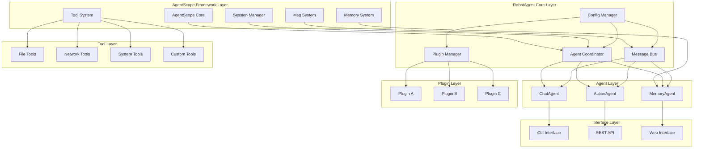
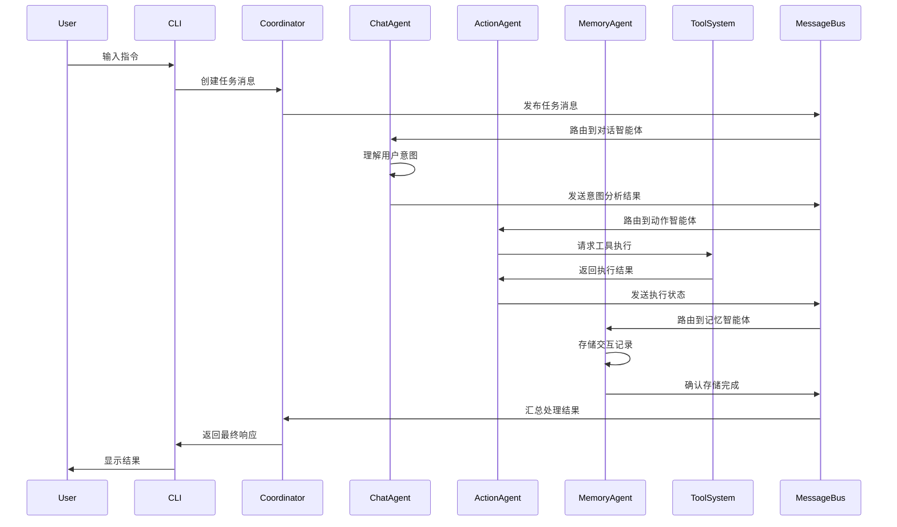
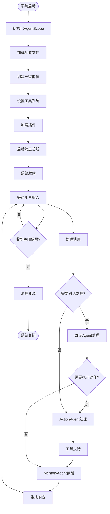

# -*- coding: utf-8 -*-

# RobotAgent MVP 0.2.1 (RobotAgent MVP 0.2.1)
# 基于AgentScope框架重新设计的智能机器人代理系统，提供完整的多智能体协作、工具管理和状态同步解决方案
# 版本: 0.2.1
# 更新时间: 2025-09-10

# RobotAgent MVP 0.2.1

## 🚀 版本特性概述

**RobotAgent MVP 0.2.1** 是基于 **AgentScope框架** 重新设计的智能机器人代理系统，相比0.2.0版本实现了架构的全面升级和功能的显著增强。

### 🔄 从CAMEL到AgentScope的架构升级

#### 核心变化
- **框架迁移**: 从CAMEL框架迁移到AgentScope框架，获得更强的扩展性和稳定性
- **消息系统重构**: 采用AgentScope的Msg消息体系，实现更高效的智能体间通信
- **工具系统升级**: 基于AgentScope的ToolBase重新设计工具架构，支持更丰富的工具类型
- **状态管理优化**: 利用AgentScope的SessionManager实现更可靠的状态同步
- **插件架构增强**: 全新的插件管理系统，支持动态加载和热更新

#### 技术优势
- **更好的兼容性**: AgentScope提供更广泛的模型和平台支持
- **增强的稳定性**: 成熟的框架架构确保系统稳定运行
- **丰富的生态**: 可直接使用AgentScope生态中的组件和工具
- **简化的开发**: 标准化的开发模式降低学习成本

### 🎯 核心功能特性

#### 1. 三智能体协作架构
- **ChatAgent**: 基于AgentScope.AgentBase的对话智能体，负责自然语言理解和生成
- **ActionAgent**: 任务执行智能体，集成AgentScope工具系统进行动作规划和执行
- **MemoryAgent**: 记忆管理智能体，利用AgentScope记忆系统进行知识存储和检索

#### 2. 统一消息通信系统
- 基于AgentScope.Msg的标准化消息格式
- 支持同步/异步消息传递模式
- 内置消息路由和负载均衡机制
- 完整的消息生命周期管理

#### 3. 智能工具管理系统
- 基于AgentScope.ToolBase的工具基础架构
- 支持文件操作、网络请求、系统调用等多种工具类型
- 动态工具注册和发现机制
- 工具执行安全沙箱环境

#### 4. 插件化扩展架构
- 热插拔插件系统，支持运行时加载/卸载
- 标准化插件接口和生命周期管理
- 插件依赖解析和版本管理
- 插件安全隔离和权限控制

#### 5. 状态同步与会话管理
- 基于AgentScope.SessionManager的会话管理
- 分布式状态同步机制
- 智能体状态监控和健康检查
- 故障恢复和状态回滚支持

## 🏗️ 系统架构设计

### 整体架构图



### 数据流架构图



### 组件交互流程图



## 📁 项目结构详解

### 目录结构

```
RobotAgent_MVP_0.2.1/
├── README.md                    # 项目说明文档
├── requirements.txt             # Python依赖包列表
├── setup.py                     # 项目安装配置
├── .env.example                 # 环境变量示例
├── .gitignore                   # Git忽略文件配置
│
├── config/                      # 配置文件目录
│   ├── __init__.py
│   ├── system_config.yaml       # 系统核心配置
│   ├── agents_config.yaml       # 智能体配置
│   ├── tools_config.yaml        # 工具系统配置
│   ├── plugins_config.yaml      # 插件系统配置
│   └── deployment_config.yaml   # 部署配置
│
├── src/                         # 源代码目录
│   ├── __init__.py
│   │
│   ├── core/                    # 核心组件
│   │   ├── __init__.py
│   │   ├── agent_coordinator.py # 智能体协调器
│   │   ├── message_bus.py       # 消息总线
│   │   ├── session_manager.py   # 会话管理器
│   │   └── state_manager.py     # 状态管理器
│   │
│   ├── agents/                  # 智能体实现
│   │   ├── __init__.py
│   │   ├── base_agent.py        # 智能体基类
│   │   ├── chat_agent.py        # 对话智能体
│   │   ├── action_agent.py      # 动作智能体
│   │   └── memory_agent.py      # 记忆智能体
│   │
│   ├── tools/                   # 工具系统
│   │   ├── __init__.py
│   │   ├── base_tool.py         # 工具基类
│   │   ├── file_tools.py        # 文件操作工具
│   │   ├── network_tools.py     # 网络请求工具
│   │   ├── system_tools.py      # 系统调用工具
│   │   └── tool_manager.py      # 工具管理器
│   │
│   ├── plugins/                 # 插件系统
│   │   ├── __init__.py
│   │   ├── plugin_base.py       # 插件基类
│   │   ├── plugin_manager.py    # 插件管理器
│   │   └── builtin_plugins/     # 内置插件
│   │       ├── __init__.py
│   │       ├── weather_plugin.py
│   │       └── calculator_plugin.py
│   │
│   ├── communication/           # 通信协议
│   │   ├── __init__.py
│   │   ├── protocols.py         # 通信协议定义
│   │   ├── message_types.py     # 消息类型定义
│   │   └── serialization.py    # 消息序列化
│   │
│   ├── memory/                  # 记忆系统
│   │   ├── __init__.py
│   │   ├── memory_base.py       # 记忆基类
│   │   ├── short_term_memory.py # 短期记忆
│   │   ├── long_term_memory.py  # 长期记忆
│   │   └── knowledge_graph.py   # 知识图谱
│   │
│   ├── utils/                   # 工具函数
│   │   ├── __init__.py
│   │   ├── config_loader.py     # 配置加载器
│   │   ├── logger.py            # 日志工具
│   │   ├── validators.py        # 数据验证器
│   │   └── helpers.py           # 辅助函数
│   │
│   └── interfaces/              # 用户接口
│       ├── __init__.py
│       ├── cli_interface.py     # 命令行接口
│       ├── rest_api.py          # REST API接口
│       └── web_interface.py     # Web界面接口
│
├── tests/                       # 测试代码
│   ├── __init__.py
│   ├── test_agents/             # 智能体测试
│   ├── test_tools/              # 工具测试
│   ├── test_plugins/            # 插件测试
│   └── test_integration/        # 集成测试
│
├── docs/                        # 文档目录
│   ├── api/                     # API文档
│   ├── guides/                  # 使用指南
│   ├── tutorials/               # 教程文档
│   └── architecture/            # 架构文档
│
├── examples/                    # 示例代码
│   ├── basic_usage.py           # 基础使用示例
│   ├── custom_agent.py          # 自定义智能体示例
│   ├── plugin_development.py    # 插件开发示例
│   └── advanced_scenarios/      # 高级场景示例
│
├── scripts/                     # 脚本工具
│   ├── setup.sh                 # 环境设置脚本
│   ├── deploy.py                # 部署脚本
│   └── maintenance.py           # 维护脚本
│
└── data/                        # 数据目录
    ├── models/                  # 模型文件
    ├── knowledge/               # 知识库
    ├── logs/                    # 日志文件
    └── temp/                    # 临时文件
```

### 核心组件说明

#### 1. AgentScope集成层
- **AgentBase继承**: 所有智能体继承自AgentScope.AgentBase
- **Msg消息系统**: 使用AgentScope标准消息格式
- **ToolBase工具**: 基于AgentScope工具基础架构
- **SessionManager**: 利用AgentScope会话管理能力

#### 2. 智能体协调层
- **AgentCoordinator**: 智能体间协调和任务分发
- **MessageBus**: 高性能消息路由和传递
- **StateManager**: 分布式状态同步管理
- **SessionManager**: 会话生命周期管理

#### 3. 工具管理层
- **ToolManager**: 工具注册、发现和生命周期管理
- **SecuritySandbox**: 工具执行安全隔离环境
- **ToolRegistry**: 工具元数据和版本管理
- **ExecutionEngine**: 工具执行引擎和结果处理

#### 4. 插件扩展层
- **PluginManager**: 插件加载、卸载和依赖管理
- **PluginRegistry**: 插件注册表和版本控制
- **PluginSandbox**: 插件安全隔离和权限控制
- **HotReload**: 插件热更新和动态加载

## 🔧 技术实现细节

### AgentScope框架集成

#### 智能体基类设计

```python
from agentscope.agents import AgentBase
from agentscope.message import Msg
from agentscope.models import ModelWrapperBase

class BaseRobotAgent(AgentBase):
    """基于AgentScope的机器人智能体基类"""
    
    def __init__(self, name: str, model_config: dict, **kwargs):
        super().__init__(name=name, model_config=model_config, **kwargs)
        self.agent_id = f"robot_{name}_{uuid.uuid4().hex[:8]}"
        self.state = AgentState.INITIALIZING
        self.message_bus = get_message_bus()
        
    def reply(self, x: Msg) -> Msg:
        """AgentScope标准回复接口"""
        # 处理消息并生成回复
        response = self.process_message(x)
        return Msg(
            name=self.name,
            content=response,
            role="assistant"
        )
```

#### 消息系统集成

```python
from agentscope.message import Msg

class RobotMessage:
    """基于AgentScope.Msg的机器人消息封装"""
    
    @staticmethod
    def create_task_message(task_id: str, content: str, sender: str) -> Msg:
        return Msg(
            name=sender,
            content={
                "type": "task",
                "task_id": task_id,
                "content": content,
                "timestamp": datetime.utcnow().isoformat()
            },
            role="user",
            metadata={
                "message_type": "task",
                "priority": "normal"
            }
        )
```

#### 工具系统集成

```python
from agentscope.tool import ToolBase

class FileOperationTool(ToolBase):
    """基于AgentScope.ToolBase的文件操作工具"""
    
    def __init__(self):
        super().__init__(
            name="file_operation",
            description="文件读写和管理工具"
        )
    
    def execute(self, operation: str, file_path: str, **kwargs) -> dict:
        """执行文件操作"""
        try:
            if operation == "read":
                return self._read_file(file_path)
            elif operation == "write":
                return self._write_file(file_path, kwargs.get("content", ""))
            else:
                raise ValueError(f"不支持的操作: {operation}")
        except Exception as e:
            return {"error": str(e), "success": False}
```

### 状态同步机制

#### 分布式状态管理

```python
from agentscope.session import SessionManager

class RobotStateManager:
    """基于AgentScope的状态管理器"""
    
    def __init__(self):
        self.session_manager = SessionManager()
        self.agent_states = {}
        self.global_state = {}
    
    def sync_agent_state(self, agent_id: str, state: dict):
        """同步智能体状态"""
        self.agent_states[agent_id] = {
            **state,
            "last_updated": datetime.utcnow().isoformat(),
            "session_id": self.session_manager.get_current_session_id()
        }
    
    def get_global_context(self) -> dict:
        """获取全局上下文"""
        return {
            "agents": self.agent_states,
            "global_state": self.global_state,
            "session_info": self.session_manager.get_session_info()
        }
```

## 🚀 快速开始

### 环境要求

- Python 3.8+
- AgentScope >= 0.0.3
- 其他依赖见 requirements.txt

### 安装步骤

1. **克隆项目**
```bash
git clone https://github.com/your-org/RobotAgent.git
cd RobotAgent
```

2. **创建虚拟环境**
```bash
python -m venv venv
source venv/bin/activate  # Linux/Mac
# 或
venv\Scripts\activate     # Windows
```

3. **安装依赖**
```bash
pip install -r requirements.txt
```

4. **配置环境**
```bash
cp .env.example .env
# 编辑 .env 文件，配置必要的环境变量
```

5. **运行系统**
```bash
python src/main.py
```

### 基础使用示例

```python
from src.core.agent_coordinator import AgentCoordinator
from src.agents.chat_agent import ChatAgent
from src.agents.action_agent import ActionAgent
from src.agents.memory_agent import MemoryAgent

# 创建智能体协调器
coordinator = AgentCoordinator()

# 初始化三智能体
chat_agent = ChatAgent(name="chat", model_config={})
action_agent = ActionAgent(name="action", model_config={})
memory_agent = MemoryAgent(name="memory", model_config={})

# 注册智能体
coordinator.register_agent(chat_agent)
coordinator.register_agent(action_agent)
coordinator.register_agent(memory_agent)

# 启动系统
await coordinator.start()

# 处理用户请求
response = await coordinator.process_user_input("帮我创建一个新文件")
print(response)
```

## 📋 开发任务清单

基于对MVP 0.2.0版本的分析和AgentScope框架的特性，以下是MVP 0.2.1版本的详细开发任务清单：

### 🏗️ 核心架构任务

1. **AgentScope框架集成**
   - [ ] 安装和配置AgentScope环境
   - [ ] 创建基于AgentBase的智能体基类
   - [ ] 实现Msg消息系统集成
   - [ ] 配置ModelWrapper和工具系统

2. **智能体重构**
   - [ ] 重构ChatAgent基于AgentScope.AgentBase
   - [ ] 重构ActionAgent集成AgentScope工具系统
   - [ ] 重构MemoryAgent利用AgentScope记忆系统
   - [ ] 实现智能体间协作协议

3. **消息系统升级**
   - [ ] 基于AgentScope.Msg重新设计消息格式
   - [ ] 实现消息路由和分发机制
   - [ ] 添加消息持久化和恢复功能
   - [ ] 实现消息优先级和队列管理

### 🛠️ 工具系统任务

4. **工具基础架构**
   - [ ] 基于AgentScope.ToolBase创建工具基类
   - [ ] 实现工具注册和发现机制
   - [ ] 创建工具执行安全沙箱
   - [ ] 实现工具结果验证和错误处理

5. **内置工具实现**
   - [ ] 文件操作工具 (读写、创建、删除)
   - [ ] 网络请求工具 (HTTP客户端)
   - [ ] 系统调用工具 (命令执行)
   - [ ] 数据处理工具 (JSON、CSV处理)

6. **工具管理系统**
   - [ ] 工具生命周期管理
   - [ ] 工具版本控制和更新
   - [ ] 工具使用统计和监控
   - [ ] 工具权限和访问控制

### 🔌 插件系统任务

7. **插件基础架构**
   - [ ] 设计插件接口和生命周期
   - [ ] 实现插件加载和卸载机制
   - [ ] 创建插件依赖解析系统
   - [ ] 实现插件安全隔离

8. **插件管理功能**
   - [ ] 插件注册表和元数据管理
   - [ ] 插件热更新和动态加载
   - [ ] 插件配置和参数管理
   - [ ] 插件错误处理和恢复

9. **内置插件开发**
   - [ ] 天气查询插件
   - [ ] 计算器插件
   - [ ] 文本处理插件
   - [ ] 数据可视化插件

### 🔄 状态管理任务

10. **会话管理系统**
    - [ ] 基于AgentScope.SessionManager的会话管理
    - [ ] 会话状态持久化和恢复
    - [ ] 多会话并发管理
    - [ ] 会话安全和权限控制

11. **状态同步机制**
    - [ ] 智能体状态实时同步
    - [ ] 分布式状态一致性保证
    - [ ] 状态变更通知和事件处理
    - [ ] 状态回滚和恢复机制

### 🖥️ 接口和部署任务

12. **用户接口开发**
    - [ ] 命令行接口 (CLI)
    - [ ] REST API接口
    - [ ] Web管理界面
    - [ ] WebSocket实时通信

13. **配置和部署**
    - [ ] 配置文件管理系统
    - [ ] 环境变量和密钥管理
    - [ ] Docker容器化部署
    - [ ] 监控和日志系统

### 🧪 测试和文档任务

14. **测试框架**
    - [ ] 单元测试覆盖
    - [ ] 集成测试套件
    - [ ] 性能测试和基准
    - [ ] 安全测试和漏洞扫描

15. **文档和示例**
    - [ ] API文档生成
    - [ ] 使用指南和教程
    - [ ] 开发者文档
    - [ ] 示例代码和最佳实践

## 🎯 下一步计划

1. **确认任务优先级**: 与项目负责人讨论任务清单，确定开发优先级
2. **环境准备**: 设置AgentScope开发环境和依赖
3. **核心架构**: 优先实现智能体基类和消息系统
4. **渐进开发**: 按模块逐步实现功能，确保每个阶段都可测试
5. **集成测试**: 完成核心功能后进行系统集成测试

---

**注意**: 本文档基于对MVP 0.2.0版本的深入分析和AgentScope框架的技术特性制定。所有任务都遵循"文档驱动开发"原则，确保实现与设计文档的一致性。