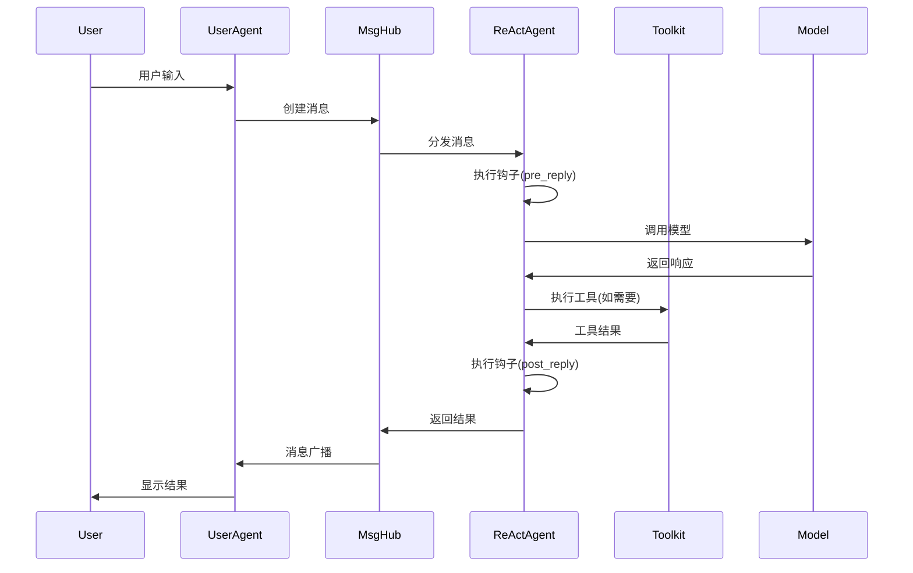
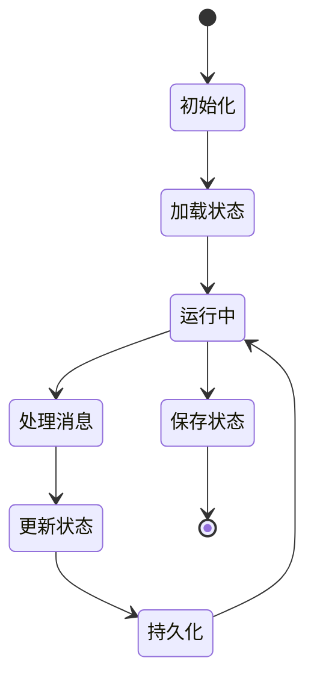

# -*- coding: utf-8 -*-

# 系统架构设计 (System Architecture Design)
# 基于AgentScope框架的RobotAgent MVP 0.2.0深度架构分析
# 版本: 0.2.0
# 更新时间: 2025-09-10

## 📋 概述

本文档基于对AgentScope源码的深度分析，重新定义了RobotAgent MVP 0.2.0的系统架构设计。通过深入研究AgentScope的核心实现机制，我们构建了一个更加精确和强大的多智能体系统架构。

## 🏗️ AgentScope核心架构分析

### AgentScope框架层次结构

基于源码分析，AgentScope采用了以下核心架构：

```
┌─────────────────────────────────────────────────────────────┐
│                   应用层 (Application Layer)                 │
│  ┌─────────────┐ ┌─────────────┐ ┌─────────────┐           │
│  │   ReAct     │ │  UserAgent  │ │ CustomAgent │           │
│  │   Agent     │ │             │ │             │           │
│  └─────────────┘ └─────────────┘ └─────────────┘           │
├─────────────────────────────────────────────────────────────┤
│                   管道层 (Pipeline Layer)                    │
│  ┌─────────────┐ ┌─────────────┐ ┌─────────────┐           │
│  │ Sequential  │ │   Fanout    │ │   MsgHub    │           │
│  │  Pipeline   │ │  Pipeline   │ │             │           │
│  └─────────────┘ └─────────────┘ └─────────────┘           │
├─────────────────────────────────────────────────────────────┤
│                   核心层 (Core Layer)                        │
│  ┌─────────────┐ ┌─────────────┐ ┌─────────────┐           │
│  │ AgentBase   │ │ MemoryBase  │ │ ModelBase   │           │
│  │             │ │             │ │             │           │
│  └─────────────┘ └─────────────┘ └─────────────┘           │
├─────────────────────────────────────────────────────────────┤
│                   基础设施层 (Infrastructure Layer)           │
│  ┌─────────────┐ ┌─────────────┐ ┌─────────────┐           │
│  │   Message   │ │    Tool     │ │  Formatter  │           │
│  │   System    │ │   System    │ │   System    │           │
│  └─────────────┘ └─────────────┘ └─────────────┘           │
└─────────────────────────────────────────────────────────────┘
```

### RobotAgent MVP 0.2.0 系统架构

基于AgentScope的架构模式，我们设计了以下系统架构：

```
┌─────────────────────────────────────────────────────────────┐
│                    用户交互层 (UI Layer)                      │
│  ┌─────────────┐ ┌─────────────┐ ┌─────────────┐           │
│  │  Web UI     │ │  CLI Tool   │ │  API Gateway│           │
│  │             │ │             │ │             │           │
│  └─────────────┘ └─────────────┘ └─────────────┘           │
├─────────────────────────────────────────────────────────────┤
│                  智能体编排层 (Agent Orchestration)           │
│  ┌─────────────┐ ┌─────────────┐ ┌─────────────┐           │
│  │ Task Agent  │ │ Tool Agent  │ │ Monitor     │           │
│  │             │ │             │ │ Agent       │           │
│  └─────────────┘ └─────────────┘ └─────────────┘           │
├─────────────────────────────────────────────────────────────┤
│                   核心服务层 (Core Services)                  │
│  ┌─────────────┐ ┌─────────────┐ ┌─────────────┐           │
│  │ Message     │ │ Pipeline    │ │ State       │           │
│  │ Router      │ │ Manager     │ │ Manager     │           │
│  └─────────────┘ └─────────────┘ └─────────────┘           │
├─────────────────────────────────────────────────────────────┤
│                   基础设施层 (Infrastructure)                 │
│  ┌─────────────┐ ┌─────────────┐ ┌─────────────┐           │
│  │ Model       │ │ Tool        │ │ Memory      │           │
│  │ Wrapper     │ │ Registry    │ │ System      │           │
│  └─────────────┘ └─────────────┘ └─────────────┘           │
├─────────────────────────────────────────────────────────────┤
│                   数据访问层 (Data Access)                    │
│  ┌─────────────┐ ┌─────────────┐ ┌─────────────┐           │
│  │ Session     │ │ Long-term   │ │ Embedding   │           │
│  │ Storage     │ │ Memory      │ │ Cache       │           │
│  └─────────────┘ └─────────────┘ └─────────────┘           │
└─────────────────────────────────────────────────────────────┘
```

## 🔍 核心组件深度分析

### 1. 消息系统 (Message System)

基于AgentScope的Msg类实现，具有以下特性：

```python
# 消息结构设计
class Msg:
    - id: str                    # 唯一标识符 (shortuuid)
    - name: str                  # 发送者名称
    - content: str | list[ContentBlock]  # 消息内容
    - role: Literal["user", "assistant", "system"]  # 角色类型
    - metadata: dict             # 元数据信息
    - timestamp: str             # 时间戳
    - invocation_id: str         # API调用ID
```

**核心特性**：
- **多模态内容支持**: 文本、图像、音频、视频、工具调用
- **内容块系统**: TextBlock, ToolUseBlock, ToolResultBlock等
- **序列化机制**: to_dict() / from_dict() 支持持久化
- **类型安全**: 强类型检查和验证

### 2. 智能体基类 (AgentBase)

基于源码分析的AgentBase设计模式：

```python
# 智能体基类架构
class AgentBase(StateModule):
    - id: str                    # 智能体唯一标识
    - _reply_task: Task          # 异步回复任务
    - _subscribers: dict         # 订阅者管理
    - _hooks: OrderedDict        # 钩子函数系统
    
    # 核心方法
    async def observe(msg)       # 观察消息
    async def reply(*args)       # 生成回复
    async def print(msg)         # 消息显示
```

**关键设计模式**：
- **钩子系统**: pre_reply, post_reply, pre_observe等
- **异步架构**: 基于asyncio的并发处理
- **状态管理**: 继承StateModule的状态持久化
- **订阅模式**: 支持消息广播和订阅

### 3. 管道系统 (Pipeline System)

 AgentScope提供了强大的管道编排能力：

```python
# 管道类型
- SequentialPipeline: 顺序执行管道
- FanoutPipeline: 扇出并行管道  
- MsgHub: 消息中心管道

# 函数式管道
- sequential_pipeline(): 函数式顺序管道
- fanout_pipeline(): 函数式扇出管道
```

**管道特性**：
- **异步执行**: 支持asyncio.gather()并发
- **消息传递**: 自动处理消息流转
- **错误处理**: 内置异常处理机制
- **可重用性**: 管道对象可多次调用

### 4. 模型抽象层 (Model Abstraction)

基于ChatModelBase的统一模型接口：

```python
# 模型基类设计
class ChatModelBase:
    - model_name: str            # 模型名称
    - stream: bool               # 流式输出支持
    
    async def __call__()         # 统一调用接口
    _validate_tool_choice()      # 工具选择验证
```

**支持的模型提供商**：
- OpenAI (GPT系列)
- DashScope (通义千问)
- Anthropic (Claude)
- Gemini (Google)
- Ollama (本地模型)

### 5. 工具系统 (Tool System)

 AgentScope的工具系统设计：

```python
# 工具类型
- 代码执行: execute_python_code, execute_shell_command
- 文件操作: view_text_file, write_text_file
- 多模态: text_to_image, image_to_text, audio_to_text
- 工具包: Toolkit (工具注册和管理)
```

**工具特性**：
- **函数注册**: 动态工具函数注册
- **异步包装**: _async_wrapper支持同步函数异步化
- **响应标准**: ToolResponse统一响应格式
- **MCP支持**: Model Context Protocol集成

## 🎯 设计原则深化

基于AgentScope的设计哲学，我们采用以下原则：

### 1. **异步优先 (Async-First)**
- 所有核心操作都是异步的
- 支持高并发智能体交互
- 基于asyncio的事件循环

### 2. **消息驱动 (Message-Driven)**
- 统一的消息格式和传递机制
- 支持多模态内容传递
- 消息路由和订阅模式

### 3. **可组合性 (Composability)**
- 管道系统支持复杂工作流编排
- 智能体可以灵活组合
- 工具和功能模块化设计

### 4. **可扩展性 (Extensibility)**
- 钩子系统支持行为定制
- 插件化的工具和模型支持
- 开放的接口设计

### 5. **状态管理 (State Management)**
- StateModule提供状态持久化
- 会话管理和长期记忆
- 分布式状态同步

## 📊 技术栈深化

### 核心依赖
- **AgentScope**: 多智能体框架基础
- **Python 3.8+**: 编程语言
- **asyncio**: 异步编程支持
- **shortuuid**: 唯一标识符生成
- **pydantic**: 数据验证和序列化

### 可选依赖
- **OpenTelemetry**: 分布式追踪
- **SQLite/PostgreSQL**: 会话存储
- **Redis**: 缓存和状态共享
- **Mem0**: 长期记忆管理

## 🔄 数据流向深化

### 消息流转机制



### 状态管理流程



## 🚀 部署架构深化

### 单机部署模式
```python
# 单进程部署示例
import agentscope

# 初始化框架
agentscope.init(
    project="RobotAgent",
    name="MVP_0.2.0",
    logging_level="INFO"
)

# 创建智能体
agent = ReActAgent(
    name="TaskAgent",
    model=model,
    formatter=formatter,
    toolkit=toolkit,
    memory=memory
)
```

### 分布式部署模式
```python
# 分布式部署示例
agentscope.init(
    project="RobotAgent",
    studio_url="http://studio.example.com",
    tracing_url="http://tracing.example.com"
)

# 支持远程智能体和追踪
```

## 🔧 扩展机制

### 自定义智能体
```python
class CustomAgent(AgentBase):
    async def reply(self, msg: Msg) -> Msg:
        # 自定义回复逻辑
        pass
    
    async def observe(self, msg: Msg) -> None:
        # 自定义观察逻辑
        pass
```

### 自定义工具
```python
def custom_tool(param: str) -> ToolResponse:
    """自定义工具函数"""
    # 工具实现逻辑
    return ToolResponse(success=True, data=result)

# 注册工具
toolkit.register_tool_function(custom_tool)
```

### 自定义钩子
```python
def custom_pre_reply_hook(self, kwargs):
    """自定义前置钩子"""
    # 修改输入参数
    return modified_kwargs

# 注册钩子
AgentBase.register_class_hook("pre_reply", custom_pre_reply_hook)
```
