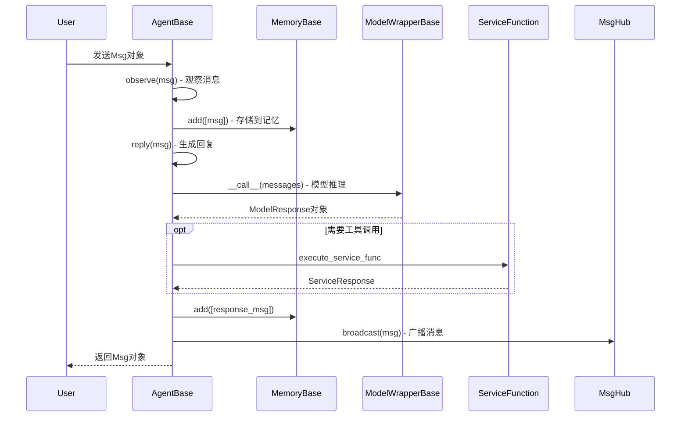
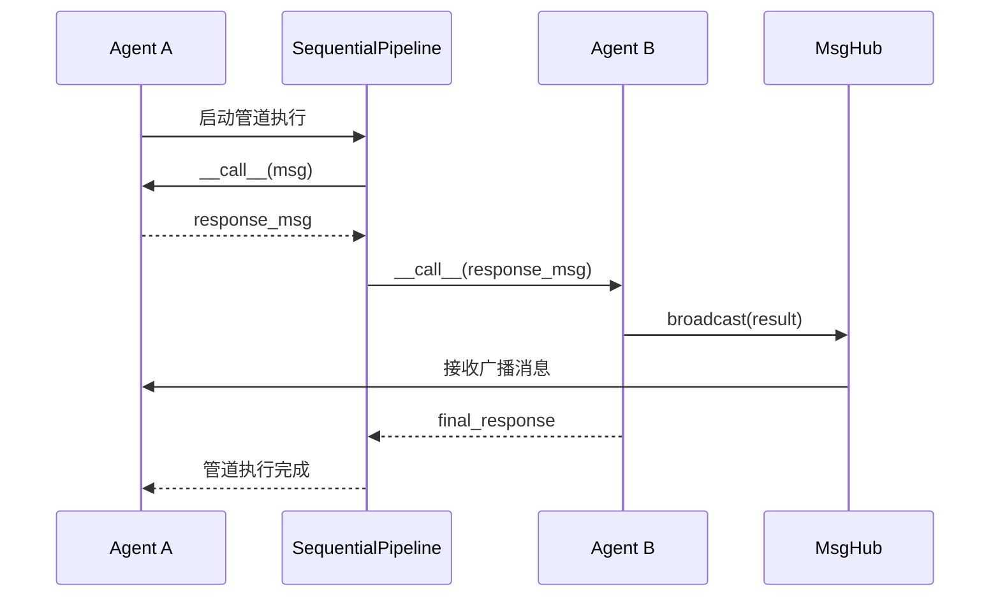
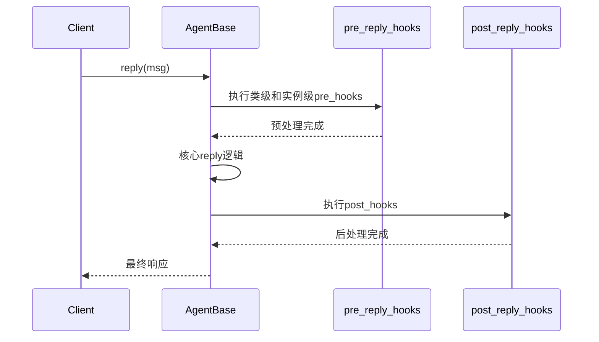
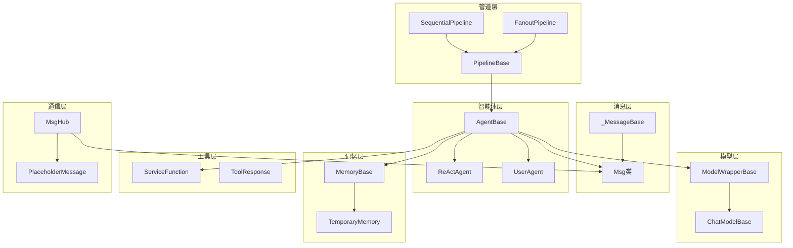

# 核心组件定义

## 1. 组件概述

### 1.1 组件分类
MVP_0.2.0系统包含以下核心组件：
- **Agent组件**: 智能体核心逻辑
- **Message组件**: 消息传递系统
- **Tool组件**: 工具集成系统
- **Memory组件**: 记忆管理系统
- **State组件**: 状态管理系统
- **Formatter组件**: 格式化处理系统

### 1.2 组件依赖关系
```
Agent ──┬── Message
        ├── Tool
        ├── Memory
        ├── State
        └── Formatter
```

## 2. Agent组件

### 2.1 基础定义
```python
class AgentBase:
    """智能体基础抽象类"""
    
    def __init__(self, name: str, config: Dict):
        self.name = name
        self.config = config
        self.state = StateManager()
        self.memory = MemoryManager()
        self.tools = ToolManager()
    
    async def reply(self, message: Message) -> Message:
        """处理输入消息并生成响应"""
        pass
    
    async def observe(self, message: Message) -> None:
        """观察消息但不生成响应"""
        pass
    
    def print(self, message: Message) -> None:
        """显示消息到目标终端"""
        pass
```

### 2.2 ReAct智能体
```python
class ReActAgent(AgentBase):
    """基于ReAct架构的智能体"""
    
    async def _reasoning(self, message: Message) -> List[ToolCall]:
        """推理阶段：分析并生成工具调用"""
        pass
    
    async def _acting(self, tool_calls: List[ToolCall]) -> List[ToolResult]:
        """行动阶段：执行工具函数"""
        pass
    
    async def handle_interrupt(self, interrupt: Interrupt) -> None:
        """处理用户中断"""
        pass
```

### 2.3 智能体类型
- **LLMAgent**: 基于大语言模型的智能体
- **WorkflowAgent**: 基于工作流的智能体
- **ToolAgent**: 专门处理工具调用的智能体
- **RAGAgent**: 集成检索增强生成的智能体

## 3. Message组件

### 3.1 消息结构
```python
@dataclass
class Message:
    """统一消息数据结构"""
    
    id: str
    content: Union[str, Dict, List]
    role: str  # user, assistant, system, tool
    timestamp: datetime
    metadata: Dict[str, Any]
    attachments: List[Attachment]
    
    def to_dict(self) -> Dict:
        """转换为字典格式"""
        pass
    
    @classmethod
    def from_dict(cls, data: Dict) -> 'Message':
        """从字典创建消息"""
        pass
```

### 3.2 消息类型
- **TextMessage**: 文本消息
- **MultiModalMessage**: 多模态消息
- **ToolMessage**: 工具调用消息
- **SystemMessage**: 系统消息
- **ErrorMessage**: 错误消息

### 3.3 消息路由
```python
class MessageRouter:
    """消息路由器"""
    
    def route(self, message: Message, target: str) -> None:
        """路由消息到目标智能体"""
        pass
    
    def broadcast(self, message: Message, targets: List[str]) -> None:
        """广播消息到多个目标"""
        pass
```

## 4. Tool组件

### 4.1 工具基础接口
```python
class ToolBase:
    """工具基础抽象类"""
    
    def __init__(self, name: str, description: str):
        self.name = name
        self.description = description
        self.schema = self._generate_schema()
    
    async def execute(self, **kwargs) -> ToolResult:
        """执行工具功能"""
        pass
    
    def _generate_schema(self) -> Dict:
        """生成工具模式定义"""
        pass
```

### 4.2 工具管理器
```python
class ToolManager:
    """工具管理器"""
    
    def __init__(self):
        self.tools: Dict[str, ToolBase] = {}
    
    def register_tool(self, tool: ToolBase) -> None:
        """注册工具"""
        pass
    
    def get_tool(self, name: str) -> ToolBase:
        """获取工具"""
        pass
    
    async def execute_tool(self, name: str, **kwargs) -> ToolResult:
        """执行工具"""
        pass
```

### 4.3 工具类型
- **SyncTool**: 同步工具
- **AsyncTool**: 异步工具
- **StreamingTool**: 流式工具
- **RemoteTool**: 远程工具

## 5. Memory组件

### 5.1 短期记忆
```python
class ShortTermMemory:
    """短期记忆管理"""
    
    def __init__(self, capacity: int = 100):
        self.capacity = capacity
        self.messages: List[Message] = []
    
    def add(self, message: Message) -> None:
        """添加消息到短期记忆"""
        pass
    
    def get_recent(self, count: int) -> List[Message]:
        """获取最近的消息"""
        pass
    
    def clear(self) -> None:
        """清空短期记忆"""
        pass
```

### 5.2 长期记忆
```python
class LongTermMemoryBase:
    """长期记忆基础抽象类"""
    
    async def record(self, messages: List[Message]) -> None:
        """记录消息序列"""
        pass
    
    async def retrieve(self, query: str, top_k: int = 5) -> List[Message]:
        """检索相关消息"""
        pass
    
    async def update(self, message_id: str, content: Dict) -> None:
        """更新记忆内容"""
        pass
    
    async def delete(self, message_id: str) -> None:
        """删除记忆"""
        pass
```

### 5.3 记忆类型
- **VectorMemory**: 向量化记忆
- **GraphMemory**: 图结构记忆
- **DatabaseMemory**: 数据库记忆
- **FileMemory**: 文件系统记忆

## 6. State组件

### 6.1 状态管理器
```python
class StateManager:
    """状态管理器"""
    
    def __init__(self):
        self.state: Dict[str, Any] = {}
        self.history: List[Dict] = []
    
    def get_state(self, key: str) -> Any:
        """获取状态值"""
        pass
    
    def set_state(self, key: str, value: Any) -> None:
        """设置状态值"""
        pass
    
    def state_dict(self) -> Dict:
        """获取完整状态字典"""
        pass
    
    def load_state_dict(self, state: Dict) -> None:
        """加载状态字典"""
        pass
```

### 6.2 状态持久化
```python
class StatePersistence:
    """状态持久化管理"""
    
    async def save_state(self, agent_id: str, state: Dict) -> None:
        """保存状态"""
        pass
    
    async def load_state(self, agent_id: str) -> Dict:
        """加载状态"""
        pass
    
    async def delete_state(self, agent_id: str) -> None:
        """删除状态"""
        pass
```

## 7. Formatter组件

### 7.1 格式化器基类
```python
class FormatterBase:
    """格式化器基础抽象类"""
    
    def format(self, messages: List[Message]) -> Dict:
        """格式化消息为LLM API格式"""
        pass
    
    def validate(self, data: Dict) -> bool:
        """验证格式化结果"""
        pass
```

### 7.2 格式化器类型
- **ChatFormatter**: 单智能体对话格式化
- **MultiAgentFormatter**: 多智能体对话格式化
- **ToolFormatter**: 工具调用格式化
- **MultiModalFormatter**: 多模态内容格式化

## 8. 组件集成

### 8.1 组件工厂
```python
class ComponentFactory:
    """组件工厂"""
    
    @staticmethod
    def create_agent(agent_type: str, config: Dict) -> AgentBase:
        """创建智能体"""
        pass
    
    @staticmethod
    def create_memory(memory_type: str, config: Dict) -> MemoryBase:
        """创建记忆组件"""
        pass
    
    @staticmethod
    def create_tool(tool_type: str, config: Dict) -> ToolBase:
        """创建工具组件"""
        pass
```

### 8.2 依赖注入
```python
class DependencyInjector:
    """依赖注入器"""
    
    def __init__(self):
        self.dependencies: Dict[str, Any] = {}
    
    def register(self, name: str, instance: Any) -> None:
        """注册依赖"""
        pass
    
    def inject(self, target: Any) -> None:
        """注入依赖"""
        pass
```

## 6. 组件交互流程

### 6.1 消息传递流程

基于AgentScope源码分析，消息传递遵循以下精确流程：



### 6.2 智能体协作流程



### 6.3 钩子函数执行流程



## 7. 依赖关系深度分析

### 7.1 核心依赖图谱

基于源码分析的精确依赖关系：



### 7.2 模块依赖层次

**第一层 - 基础抽象层**:
- `_MessageBase`: 消息系统基础
- `ModelWrapperBase`: 模型包装基础
- `MemoryBase`: 记忆系统基础
- `ServiceFunction`: 工具服务基础

**第二层 - 核心实现层**:
- `Msg`: 具体消息实现
- `ChatModelBase`: 聊天模型实现
- `AgentBase`: 智能体基类

**第三层 - 扩展功能层**:
- `ReActAgent`: 推理行动智能体
- `SequentialPipeline`: 顺序管道
- `MsgHub`: 消息中心

**第四层 - 应用组合层**:
- 具体业务智能体
- 复杂工作流管道
- 多智能体系统

## 8. 配置管理深化

### 8.1 AgentScope配置体系

基于源码分析，AgentScope使用以下配置结构：

```python
# 模型配置示例（基于源码中的配置格式）
model_configs = [
    {
        "config_name": "gpt-4-config",
        "model_type": "openai_chat",
        "model_name": "gpt-4",
        "api_key": "${OPENAI_API_KEY}",
        "organization": "${OPENAI_ORGANIZATION}",
        "generate_args": {
            "temperature": 0.7,
            "max_tokens": 2000,
            "top_p": 0.9,
            "frequency_penalty": 0.0,
            "presence_penalty": 0.0
        }
    }
]

# 智能体配置示例
agent_configs = {
    "react_agent": {
        "class": "ReActAgent",
        "args": {
            "name": "assistant",
            "model_config_name": "gpt-4-config",
            "tools": ["web_search", "calculator"],
            "max_iters": 10,
            "verbose": True
        }
    }
}
```

### 8.2 运行时配置管理

```python
import agentscope
from agentscope.agents import ReActAgent
from agentscope.service import web_search, execute_python_code

# 初始化AgentScope
agentscope.init(
    model_configs=model_configs,
    agent_configs=agent_configs,
    project="RobotAgent_MVP",
    name="core_components_demo"
)

# 注册工具函数
agentscope.service.register_service(web_search)
agentscope.service.register_service(execute_python_code)

# 创建智能体实例
agent = ReActAgent(
    name="assistant",
    model_config_name="gpt-4-config",
    tools=[web_search, execute_python_code]
)
```

## 9. 扩展机制深化

### 9.1 基于AgentBase的自定义智能体

```python
from agentscope.agents import AgentBase
from agentscope.message import Msg
from typing import Union, Sequence

class RobotControlAgent(AgentBase):
    """机器人控制智能体 - 基于AgentScope架构"""
    
    def __init__(
        self,
        name: str,
        model_config_name: str,
        robot_interface=None,
        **kwargs
    ):
        # 调用父类初始化，继承AgentScope的完整功能
        super().__init__(
            name=name,
            model_config_name=model_config_name,
            **kwargs
        )
        
        # 机器人特定的初始化
        self.robot_interface = robot_interface
        self.supported_commands = [
            "move_forward", "move_backward", "turn_left", "turn_right",
            "pick_object", "place_object", "scan_environment"
        ]
    
    def reply(self, x: Union[Msg, Sequence[Msg]]) -> Msg:
        """重写reply方法，实现机器人控制逻辑"""
        
        # 确保输入是Msg对象
        if isinstance(x, Sequence):
            msg = x[-1]  # 取最后一条消息
        else:
            msg = x
        
        # 解析用户指令
        command = self._parse_robot_command(msg.content)
        
        if command:
            # 执行机器人命令
            result = self._execute_robot_command(command)
            response_content = f"执行命令: {command['action']}\n结果: {result}"
        else:
            # 使用模型生成响应
            model_response = self.model(
                self.format(msg, self.model.format)
            )
            response_content = model_response.text
        
        # 创建响应消息
        response_msg = Msg(
            name=self.name,
            content=response_content,
            role="assistant",
            metadata={
                "agent_type": "robot_control",
                "timestamp": self._get_timestamp()
            }
        )
        
        # 存储到记忆中
        self.memory.add([msg, response_msg])
        
        return response_msg
    
    def _parse_robot_command(self, content: str) -> dict:
        """解析机器人控制命令"""
        content_lower = content.lower()
        
        for command in self.supported_commands:
            if command.replace("_", " ") in content_lower:
                return {
                    "action": command,
                    "parameters": self._extract_parameters(content, command)
                }
        
        return None
    
    def _execute_robot_command(self, command: dict) -> str:
        """执行机器人命令"""
        if not self.robot_interface:
            return "机器人接口未连接"
        
        try:
            action = command["action"]
            params = command.get("parameters", {})
            
            # 调用机器人接口
            result = getattr(self.robot_interface, action)(**params)
            return f"命令执行成功: {result}"
            
        except Exception as e:
            return f"命令执行失败: {str(e)}"
    
    def _extract_parameters(self, content: str, command: str) -> dict:
        """从内容中提取命令参数"""
        # 实现参数提取逻辑
        # 例如："向前移动2米" -> {"distance": 2}
        return {}
    
    def _get_timestamp(self) -> str:
        """获取时间戳"""
        from datetime import datetime
        return datetime.utcnow().isoformat()
```

### 9.2 自定义服务函数（工具）

```python
from agentscope.service import ServiceResponse, ServiceExecStatus
from typing import Any, Dict

def robot_sensor_scan() -> ServiceResponse:
    """机器人传感器扫描服务"""
    try:
        # 模拟传感器数据获取
        sensor_data = {
            "lidar": {"obstacles": ["wall_front", "chair_left"]},
            "camera": {"objects": ["person", "table", "book"]},
            "ultrasonic": {"distance_front": 1.5, "distance_back": 3.2}
        }
        
        return ServiceResponse(
            status=ServiceExecStatus.SUCCESS,
            content=f"传感器扫描完成: {sensor_data}"
        )
        
    except Exception as e:
        return ServiceResponse(
            status=ServiceExecStatus.ERROR,
            content=f"传感器扫描失败: {str(e)}"
        )

def robot_navigation_plan(destination: str) -> ServiceResponse:
    """机器人导航规划服务"""
    try:
        # 模拟路径规划
        path_plan = {
            "start": "current_position",
            "destination": destination,
            "waypoints": ["point_1", "point_2", "point_3"],
            "estimated_time": "5 minutes"
        }
        
        return ServiceResponse(
            status=ServiceExecStatus.SUCCESS,
            content=f"导航规划完成: {path_plan}"
        )
        
    except Exception as e:
        return ServiceResponse(
            status=ServiceExecStatus.ERROR,
            content=f"导航规划失败: {str(e)}"
        )

# 注册服务函数
import agentscope
agentscope.service.register_service(robot_sensor_scan)
agentscope.service.register_service(robot_navigation_plan)
```

### 9.3 自定义记忆系统

```python
from agentscope.memory import MemoryBase
from agentscope.message import Msg
from typing import List, Optional, Dict, Any
import json
import sqlite3
from datetime import datetime

class RobotMemorySystem(MemoryBase):
    """机器人专用记忆系统 - 支持多模态记忆存储"""
    
    def __init__(self, config: Dict[str, Any]):
        super().__init__(config)
        
        # 初始化数据库连接
        self.db_path = config.get("db_path", "robot_memory.db")
        self.max_memory_size = config.get("max_memory_size", 10000)
        
        # 创建数据库表
        self._init_database()
        
        # 内存缓存
        self._memory_cache = []
        self._cache_size = config.get("cache_size", 100)
    
    def _init_database(self):
        """初始化数据库表结构"""
        conn = sqlite3.connect(self.db_path)
        cursor = conn.cursor()
        
        # 创建消息表
        cursor.execute("""
            CREATE TABLE IF NOT EXISTS messages (
                id INTEGER PRIMARY KEY AUTOINCREMENT,
                name TEXT NOT NULL,
                content TEXT NOT NULL,
                role TEXT NOT NULL,
                timestamp TEXT NOT NULL,
                metadata TEXT,
                message_type TEXT DEFAULT 'text'
            )
        """)
        
        # 创建传感器数据表
        cursor.execute("""
            CREATE TABLE IF NOT EXISTS sensor_data (
                id INTEGER PRIMARY KEY AUTOINCREMENT,
                sensor_type TEXT NOT NULL,
                data TEXT NOT NULL,
                timestamp TEXT NOT NULL,
                location TEXT
            )
        """)
        
        # 创建任务记录表
        cursor.execute("""
            CREATE TABLE IF NOT EXISTS task_records (
                id INTEGER PRIMARY KEY AUTOINCREMENT,
                task_id TEXT NOT NULL,
                task_type TEXT NOT NULL,
                status TEXT NOT NULL,
                start_time TEXT NOT NULL,
                end_time TEXT,
                result TEXT
            )
        """)
        
        conn.commit()
        conn.close()
    
    def add(self, memories: List[Msg]) -> None:
        """添加记忆到系统"""
        conn = sqlite3.connect(self.db_path)
        cursor = conn.cursor()
        
        for msg in memories:
            # 添加到数据库
            cursor.execute("""
                INSERT INTO messages (name, content, role, timestamp, metadata, message_type)
                VALUES (?, ?, ?, ?, ?, ?)
            """, (
                msg.name,
                msg.content,
                msg.role,
                datetime.utcnow().isoformat(),
                json.dumps(msg.metadata) if hasattr(msg, 'metadata') else '{}',
                self._detect_message_type(msg.content)
            ))
            
            # 添加到缓存
            self._memory_cache.append(msg)
            
            # 限制缓存大小
            if len(self._memory_cache) > self._cache_size:
                self._memory_cache.pop(0)
        
        conn.commit()
        conn.close()
        
        # 清理旧记忆
        self._cleanup_old_memories()
    
    def retrieve(
        self, 
        query: Optional[str] = None, 
        message_type: Optional[str] = None,
        time_range: Optional[tuple] = None,
        limit: int = 50
    ) -> List[Msg]:
        """检索相关记忆"""
        conn = sqlite3.connect(self.db_path)
        cursor = conn.cursor()
        
        # 构建查询条件
        conditions = []
        params = []
        
        if query:
            conditions.append("content LIKE ?")
            params.append(f"%{query}%")
        
        if message_type:
            conditions.append("message_type = ?")
            params.append(message_type)
        
        if time_range:
            conditions.append("timestamp BETWEEN ? AND ?")
            params.extend(time_range)
        
        where_clause = " AND ".join(conditions) if conditions else "1=1"
        
        cursor.execute(f"""
            SELECT name, content, role, metadata FROM messages
            WHERE {where_clause}
            ORDER BY timestamp DESC
            LIMIT ?
        """, params + [limit])
        
        results = cursor.fetchall()
        conn.close()
        
        # 转换为Msg对象
        memories = []
        for row in results:
            name, content, role, metadata_str = row
            metadata = json.loads(metadata_str) if metadata_str else {}
            
            msg = Msg(
                name=name,
                content=content,
                role=role
            )
            msg.metadata = metadata
            memories.append(msg)
        
        return memories
    
    def add_sensor_data(self, sensor_type: str, data: Dict, location: str = None):
        """添加传感器数据"""
        conn = sqlite3.connect(self.db_path)
        cursor = conn.cursor()
        
        cursor.execute("""
            INSERT INTO sensor_data (sensor_type, data, timestamp, location)
            VALUES (?, ?, ?, ?)
        """, (
            sensor_type,
            json.dumps(data),
            datetime.utcnow().isoformat(),
            location
        ))
        
        conn.commit()
        conn.close()
    
    def get_sensor_history(self, sensor_type: str, limit: int = 100) -> List[Dict]:
        """获取传感器历史数据"""
        conn = sqlite3.connect(self.db_path)
        cursor = conn.cursor()
        
        cursor.execute("""
            SELECT data, timestamp, location FROM sensor_data
            WHERE sensor_type = ?
            ORDER BY timestamp DESC
            LIMIT ?
        """, (sensor_type, limit))
        
        results = cursor.fetchall()
        conn.close()
        
        return [
            {
                "data": json.loads(data),
                "timestamp": timestamp,
                "location": location
            }
            for data, timestamp, location in results
        ]
    
    def _detect_message_type(self, content: str) -> str:
        """检测消息类型"""
        if "传感器" in content or "sensor" in content.lower():
            return "sensor"
        elif "导航" in content or "navigation" in content.lower():
            return "navigation"
        elif "控制" in content or "control" in content.lower():
            return "control"
        else:
            return "text"
    
    def _cleanup_old_memories(self):
        """清理旧记忆"""
        conn = sqlite3.connect(self.db_path)
        cursor = conn.cursor()
        
        # 保留最新的记忆
        cursor.execute("""
            DELETE FROM messages WHERE id NOT IN (
                SELECT id FROM messages
                ORDER BY timestamp DESC
                LIMIT ?
            )
        """, (self.max_memory_size,))
        
        conn.commit()
        conn.close()
    
    def export(self) -> List[dict]:
        """导出所有记忆数据"""
        memories = self.retrieve(limit=self.max_memory_size)
        return [msg.to_dict() for msg in memories]
    
    def clear(self) -> None:
        """清空所有记忆"""
        conn = sqlite3.connect(self.db_path)
        cursor = conn.cursor()
        
        cursor.execute("DELETE FROM messages")
        cursor.execute("DELETE FROM sensor_data")
        cursor.execute("DELETE FROM task_records")
        
        conn.commit()
        conn.close()
        
        self._memory_cache.clear()
```

## 10. 性能优化深化

### 10.1 基于AgentScope的性能优化策略

**消息处理优化**:
```python
from agentscope.message import Msg
from typing import List
import asyncio

class OptimizedMessageProcessor:
    """优化的消息处理器"""
    
    def __init__(self, batch_size: int = 10):
        self.batch_size = batch_size
        self.message_queue = []
    
    async def process_messages_batch(self, messages: List[Msg]) -> List[Msg]:
        """批量处理消息"""
        # 将消息分批处理
        batches = [messages[i:i+self.batch_size] 
                  for i in range(0, len(messages), self.batch_size)]
        
        results = []
        for batch in batches:
            # 并行处理批次内的消息
            batch_results = await asyncio.gather(
                *[self._process_single_message(msg) for msg in batch]
            )
            results.extend(batch_results)
        
        return results
    
    async def _process_single_message(self, msg: Msg) -> Msg:
        """处理单条消息"""
        # 异步消息处理逻辑
        await asyncio.sleep(0.01)  # 模拟处理时间
        return msg
```

**模型调用优化**:
```python
from agentscope.models import ModelWrapperBase
import asyncio
from typing import List, Dict
import time

class OptimizedModelWrapper(ModelWrapperBase):
    """优化的模型包装器"""
    
    def __init__(self, config_name: str, **kwargs):
        super().__init__(config_name, **kwargs)
        self.connection_pool_size = kwargs.get("pool_size", 5)
        self.request_cache = {}
        self.cache_ttl = kwargs.get("cache_ttl", 300)  # 5分钟缓存
    
    async def __call__(self, messages: List[Dict], **kwargs):
        """优化的模型调用"""
        # 生成缓存键
        cache_key = self._generate_cache_key(messages, kwargs)
        
        # 检查缓存
        if cache_key in self.request_cache:
            cached_result, timestamp = self.request_cache[cache_key]
            if time.time() - timestamp < self.cache_ttl:
                return cached_result
        
        # 调用模型
        result = await self._call_model_async(messages, **kwargs)
        
        # 缓存结果
        self.request_cache[cache_key] = (result, time.time())
        
        return result
    
    def _generate_cache_key(self, messages: List[Dict], kwargs: Dict) -> str:
        """生成缓存键"""
        import hashlib
        content = str(messages) + str(sorted(kwargs.items()))
        return hashlib.md5(content.encode()).hexdigest()
```

### 10.2 记忆系统性能优化

```python
from agentscope.memory import MemoryBase
import sqlite3
import threading
from queue import Queue

class HighPerformanceMemory(MemoryBase):
    """高性能记忆系统"""
    
    def __init__(self, config: dict):
        super().__init__(config)
        
        # 分层存储
        self.hot_cache = {}  # 热数据缓存
        self.warm_cache = {}  # 温数据缓存
        self.cold_storage_path = config.get("cold_storage", "cold_memory.db")
        
        # 异步写入队列
        self.write_queue = Queue()
        self.writer_thread = threading.Thread(target=self._background_writer)
        self.writer_thread.daemon = True
        self.writer_thread.start()
        
        # 索引系统
        self.content_index = {}  # 内容索引
        self.time_index = {}     # 时间索引
    
    def add(self, memories: List[Msg]) -> None:
        """高性能添加记忆"""
        for msg in memories:
            # 立即添加到热缓存
            msg_id = self._generate_msg_id(msg)
            self.hot_cache[msg_id] = msg
            
            # 更新索引
            self._update_indexes(msg_id, msg)
            
            # 异步写入持久化存储
            self.write_queue.put(("add", msg))
            
            # 缓存管理
            self._manage_cache_size()
    
    def retrieve(self, query: str = None, **kwargs) -> List[Msg]:
        """高性能检索"""
        if not query:
            # 返回最近的记忆
            return list(self.hot_cache.values())[-50:]
        
        # 使用索引快速检索
        relevant_ids = self._search_by_index(query)
        
        results = []
        for msg_id in relevant_ids:
            # 优先从热缓存获取
            if msg_id in self.hot_cache:
                results.append(self.hot_cache[msg_id])
            elif msg_id in self.warm_cache:
                results.append(self.warm_cache[msg_id])
            else:
                # 从冷存储加载
                msg = self._load_from_cold_storage(msg_id)
                if msg:
                    results.append(msg)
                    # 提升到温缓存
                    self.warm_cache[msg_id] = msg
        
        return results
    
    def _background_writer(self):
        """后台写入线程"""
        while True:
            try:
                operation, data = self.write_queue.get(timeout=1)
                if operation == "add":
                    self._write_to_cold_storage(data)
                self.write_queue.task_done()
            except:
                continue
    
    def _manage_cache_size(self):
        """管理缓存大小"""
        max_hot_size = 1000
        max_warm_size = 5000
        
        # 热缓存溢出到温缓存
        if len(self.hot_cache) > max_hot_size:
            # 移动最旧的数据到温缓存
            oldest_items = list(self.hot_cache.items())[:100]
            for msg_id, msg in oldest_items:
                self.warm_cache[msg_id] = msg
                del self.hot_cache[msg_id]
        
        # 温缓存溢出到冷存储
        if len(self.warm_cache) > max_warm_size:
            oldest_items = list(self.warm_cache.items())[:500]
            for msg_id, msg in oldest_items:
                del self.warm_cache[msg_id]
```

## 11. 安全机制深化

### 11.1 基于AgentScope的安全框架

```python
from agentscope.agents import AgentBase
from agentscope.message import Msg
from typing import List, Dict, Any
import re
import hashlib
import time

class SecureAgentWrapper(AgentBase):
    """安全智能体包装器"""
    
    def __init__(self, base_agent: AgentBase, security_config: Dict[str, Any]):
        # 继承基础智能体的配置
        super().__init__(
            name=f"secure_{base_agent.name}",
            model_config_name=base_agent.model_config_name
        )
        
        self.base_agent = base_agent
        self.security_config = security_config
        
        # 安全组件
        self.input_validator = InputValidator(security_config.get("input", {}))
        self.output_filter = OutputFilter(security_config.get("output", {}))
        self.rate_limiter = RateLimiter(security_config.get("rate_limit", {}))
        self.audit_logger = AuditLogger(security_config.get("audit", {}))
    
    def reply(self, x: Msg) -> Msg:
        """安全的回复方法"""
        try:
            # 1. 速率限制检查
            if not self.rate_limiter.check_rate(x.name):
                return self._create_error_response("请求过于频繁，请稍后再试")
            
            # 2. 输入验证
            if not self.input_validator.validate(x):
                self.audit_logger.log_security_event("input_validation_failed", x)
                return self._create_error_response("输入内容不符合安全要求")
            
            # 3. 调用基础智能体
            response = self.base_agent.reply(x)
            
            # 4. 输出过滤
            filtered_response = self.output_filter.filter(response)
            
            # 5. 审计日志
            self.audit_logger.log_interaction(x, filtered_response)
            
            return filtered_response
            
        except Exception as e:
            self.audit_logger.log_error("agent_error", str(e), x)
            return self._create_error_response("处理请求时发生错误")
    
    def _create_error_response(self, error_msg: str) -> Msg:
        """创建错误响应"""
        return Msg(
            name=self.name,
            content=error_msg,
            role="assistant",
            metadata={"error": True, "timestamp": time.time()}
        )

class InputValidator:
    """输入验证器"""
    
    def __init__(self, config: Dict[str, Any]):
        self.max_length = config.get("max_length", 10000)
        self.forbidden_patterns = config.get("forbidden_patterns", [])
        self.required_fields = config.get("required_fields", ["content"])
    
    def validate(self, msg: Msg) -> bool:
        """验证消息"""
        # 检查必需字段
        for field in self.required_fields:
            if not hasattr(msg, field) or not getattr(msg, field):
                return False
        
        # 检查内容长度
        if len(msg.content) > self.max_length:
            return False
        
        # 检查禁止模式
        for pattern in self.forbidden_patterns:
            if re.search(pattern, msg.content, re.IGNORECASE):
                return False
        
        # 检查恶意代码
        if self._contains_malicious_code(msg.content):
            return False
        
        return True
    
    def _contains_malicious_code(self, content: str) -> bool:
        """检查恶意代码"""
        malicious_patterns = [
            r'<script[^>]*>.*?</script>',
            r'javascript:',
            r'eval\s*\(',
            r'exec\s*\(',
            r'__import__\s*\(',
            r'subprocess\.',
            r'os\.system',
            r'open\s*\(',
        ]
        
        for pattern in malicious_patterns:
            if re.search(pattern, content, re.IGNORECASE | re.DOTALL):
                return True
        
        return False

class OutputFilter:
    """输出过滤器"""
    
    def __init__(self, config: Dict[str, Any]):
        self.sensitive_patterns = config.get("sensitive_patterns", [])
        self.replacement_text = config.get("replacement", "[已过滤]")
    
    def filter(self, msg: Msg) -> Msg:
        """过滤输出内容"""
        filtered_content = msg.content
        
        # 过滤敏感信息
        for pattern in self.sensitive_patterns:
            filtered_content = re.sub(
                pattern, 
                self.replacement_text, 
                filtered_content, 
                flags=re.IGNORECASE
            )
        
        # 创建过滤后的消息
        filtered_msg = Msg(
            name=msg.name,
            content=filtered_content,
            role=msg.role
        )
        
        # 复制元数据
        if hasattr(msg, 'metadata'):
            filtered_msg.metadata = msg.metadata.copy()
            filtered_msg.metadata['filtered'] = True
        
        return filtered_msg

class RateLimiter:
    """速率限制器"""
    
    def __init__(self, config: Dict[str, Any]):
        self.max_requests = config.get("max_requests", 100)
        self.time_window = config.get("time_window", 3600)  # 1小时
        self.request_history = {}
    
    def check_rate(self, user_id: str) -> bool:
        """检查速率限制"""
        current_time = time.time()
        
        # 清理过期记录
        if user_id in self.request_history:
            self.request_history[user_id] = [
                timestamp for timestamp in self.request_history[user_id]
                if current_time - timestamp < self.time_window
            ]
        else:
            self.request_history[user_id] = []
        
        # 检查是否超过限制
        if len(self.request_history[user_id]) >= self.max_requests:
            return False
        
        # 记录当前请求
        self.request_history[user_id].append(current_time)
        return True

class AuditLogger:
    """审计日志器"""
    
    def __init__(self, config: Dict[str, Any]):
        self.log_file = config.get("log_file", "security_audit.log")
        self.log_level = config.get("log_level", "INFO")
    
    def log_interaction(self, input_msg: Msg, output_msg: Msg):
        """记录交互日志"""
        log_entry = {
            "timestamp": time.time(),
            "type": "interaction",
            "input": {
                "name": input_msg.name,
                "content_hash": self._hash_content(input_msg.content),
                "role": input_msg.role
            },
            "output": {
                "name": output_msg.name,
                "content_hash": self._hash_content(output_msg.content),
                "role": output_msg.role
            }
        }
        self._write_log(log_entry)
    
    def log_security_event(self, event_type: str, msg: Msg):
        """记录安全事件"""
        log_entry = {
            "timestamp": time.time(),
            "type": "security_event",
            "event_type": event_type,
            "message": {
                "name": msg.name,
                "content_hash": self._hash_content(msg.content),
                "role": msg.role
            }
        }
        self._write_log(log_entry)
    
    def log_error(self, error_type: str, error_msg: str, context_msg: Msg = None):
        """记录错误日志"""
        log_entry = {
            "timestamp": time.time(),
            "type": "error",
            "error_type": error_type,
            "error_message": error_msg
        }
        
        if context_msg:
            log_entry["context"] = {
                "name": context_msg.name,
                "content_hash": self._hash_content(context_msg.content)
            }
        
        self._write_log(log_entry)
    
    def _hash_content(self, content: str) -> str:
        """对内容进行哈希处理"""
        return hashlib.sha256(content.encode()).hexdigest()[:16]
    
    def _write_log(self, log_entry: Dict[str, Any]):
        """写入日志文件"""
        import json
        with open(self.log_file, "a", encoding="utf-8") as f:
            f.write(json.dumps(log_entry, ensure_ascii=False) + "\n")
```
