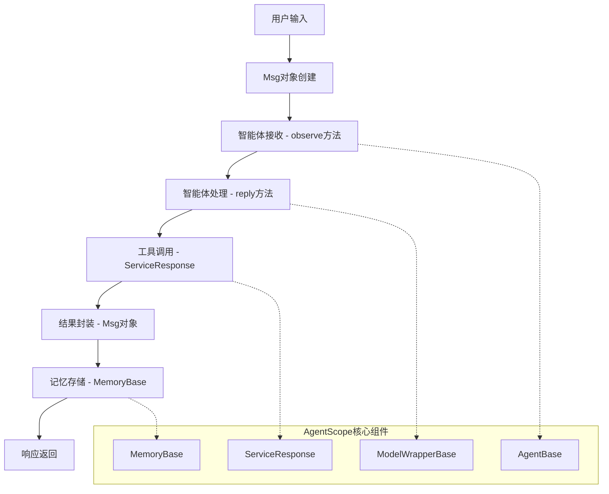

# -*- coding: utf-8 -*-

# 数据流和消息传递机制 (Data Flow and Messaging)
# 基于AgentScope框架的消息系统深度分析与实现指南
# 版本: 0.2.0
# 更新时间: 2025-09-10

# 数据流和消息传递机制

## 1. AgentScope消息系统概述

### 1.1 基于AgentScope的消息架构

AgentScope采用了统一的消息传递架构，所有智能体间的通信都通过标准化的`Msg`对象进行。这种设计确保了系统的一致性和可扩展性。

**核心设计原则**:
- **统一消息格式**: 基于`agentscope.message.Msg`的标准化消息结构
- **角色驱动**: 消息通过`name`、`content`、`role`三元组定义
- **元数据支持**: 丰富的元数据机制支持复杂场景
- **序列化友好**: 支持JSON序列化，便于存储和传输
- **类型安全**: 强类型检查确保消息处理的可靠性

### 1.2 AgentScope数据流架构



### 1.3 消息生命周期管理

基于AgentScope源码分析，消息的完整生命周期包括：

```python
# 消息创建阶段
msg = Msg(
    name="user",
    content="请帮我分析这个问题",
    role="user",
    metadata={"timestamp": datetime.utcnow().isoformat()}
)

# 消息传递阶段
response = agent.reply(msg)  # AgentBase.reply方法

# 消息存储阶段
agent.memory.add([msg, response])  # MemoryBase.add方法

# 消息序列化阶段
serialized = msg.to_dict()  # 支持JSON序列化
```

## 2. AgentScope消息系统核心实现

### 2.1 Msg类深度解析

基于AgentScope源码，`Msg`类是整个消息系统的核心：

```python
from agentscope.message import Msg
from typing import Any, Dict, Optional, Union
import json
from datetime import datetime

class Msg:
    """AgentScope标准消息类"""
    
    def __init__(
        self,
        name: str,
        content: Any,
        role: Optional[str] = None,
        **kwargs
    ):
        """
        初始化消息对象
        
        Args:
            name: 消息发送者名称（智能体ID或用户ID）
            content: 消息内容（可以是文本、字典、列表等）
            role: 消息角色（user, assistant, system等）
            **kwargs: 额外的元数据
        """
        self.name = name
        self.content = content
        self.role = role
        
        # 存储额外的元数据
        for key, value in kwargs.items():
            setattr(self, key, value)
    
    def to_dict(self) -> Dict[str, Any]:
        """转换为字典格式，支持JSON序列化"""
        result = {
            "name": self.name,
            "content": self.content,
            "role": self.role
        }
        
        # 添加所有额外属性
        for key, value in self.__dict__.items():
            if key not in ["name", "content", "role"]:
                result[key] = value
        
        return result
    
    @classmethod
    def from_dict(cls, data: Dict[str, Any]) -> "Msg":
        """从字典创建消息对象"""
        name = data.pop("name")
        content = data.pop("content")
        role = data.pop("role", None)
        
        return cls(name=name, content=content, role=role, **data)
    
    def __str__(self) -> str:
        """字符串表示"""
        return f"Msg(name={self.name}, role={self.role}, content={self.content})"
    
    def __repr__(self) -> str:
        return self.__str__()

# 使用示例
msg = Msg(
    name="robot_agent",
    content="开始执行导航任务",
    role="assistant",
    timestamp=datetime.utcnow().isoformat(),
    task_id="nav_001",
    priority="high"
)

print(msg.to_dict())
# 输出: {
#     "name": "robot_agent",
#     "content": "开始执行导航任务",
#     "role": "assistant",
#     "timestamp": "2024-01-08T12:00:00.000000",
#     "task_id": "nav_001",
#     "priority": "high"
# }
```

### 2.2 AgentScope消息传递模式

#### 2.2.1 直接消息传递（Agent-to-Agent）

```python
from agentscope.agents import AgentBase
from agentscope.message import Msg
from typing import Union, Sequence

class DirectMessageAgent(AgentBase):
    """支持直接消息传递的智能体"""
    
    def __init__(self, name: str, model_config_name: str, **kwargs):
        super().__init__(name=name, model_config_name=model_config_name, **kwargs)
        self.connected_agents = {}  # 连接的其他智能体
    
    def connect_agent(self, agent_name: str, agent: 'AgentBase'):
        """连接其他智能体"""
        self.connected_agents[agent_name] = agent
    
    def send_message_to_agent(self, target_agent: str, content: str) -> Msg:
        """向指定智能体发送消息"""
        if target_agent not in self.connected_agents:
            raise ValueError(f"Agent {target_agent} not connected")
        
        # 创建消息
        msg = Msg(
            name=self.name,
            content=content,
            role="assistant",
            target=target_agent,
            timestamp=datetime.utcnow().isoformat()
        )
        
        # 发送给目标智能体
        response = self.connected_agents[target_agent].reply(msg)
        
        # 存储对话历史
        self.memory.add([msg, response])
        
        return response
    
    def reply(self, x: Union[Msg, Sequence[Msg]]) -> Msg:
        """处理接收到的消息"""
        if isinstance(x, Sequence):
            msg = x[-1]
        else:
            msg = x
        
        # 处理消息内容
        response_content = f"收到来自 {msg.name} 的消息: {msg.content}"
        
        # 创建响应消息
        response = Msg(
            name=self.name,
            content=response_content,
            role="assistant",
            reply_to=msg.name,
            timestamp=datetime.utcnow().isoformat()
        )
        
        return response
```

#### 2.2.2 管道式消息传递（Pipeline）

```python
from agentscope.pipeline import SequentialPipeline
from agentscope.agents import AgentBase
from agentscope.message import Msg

# 基于AgentScope的管道消息传递
def create_robot_pipeline():
    """创建机器人任务处理管道"""
    
    # 创建智能体
    perception_agent = PerceptionAgent(
        name="perception",
        model_config_name="gpt-4"
    )
    
    planning_agent = PlanningAgent(
        name="planning",
        model_config_name="gpt-4"
    )
    
    execution_agent = ExecutionAgent(
        name="execution",
        model_config_name="gpt-4"
    )
    
    # 创建顺序管道
    pipeline = SequentialPipeline([
        perception_agent,
        planning_agent,
        execution_agent
    ])
    
    return pipeline

# 使用管道处理消息
pipeline = create_robot_pipeline()

# 输入消息
input_msg = Msg(
    name="user",
    content="请机器人移动到厨房",
    role="user"
)

# 通过管道处理
result = pipeline(input_msg)
print(f"管道处理结果: {result.content}")
```

#### 2.2.3 广播式消息传递（MsgHub）

```python
from agentscope.pipeline import MsgHub
from agentscope.agents import AgentBase
from agentscope.message import Msg

class BroadcastMessageSystem:
    """基于MsgHub的广播消息系统"""
    
    def __init__(self):
        self.msg_hub = MsgHub()
        self.subscribers = {}
    
    def add_subscriber(self, agent: AgentBase, topics: list = None):
        """添加订阅者"""
        self.subscribers[agent.name] = {
            "agent": agent,
            "topics": topics or ["all"]
        }
    
    def broadcast_message(self, msg: Msg, topic: str = "all"):
        """广播消息到所有订阅者"""
        responses = []
        
        for subscriber_name, subscriber_info in self.subscribers.items():
            # 检查是否订阅了该主题
            if topic in subscriber_info["topics"] or "all" in subscriber_info["topics"]:
                agent = subscriber_info["agent"]
                
                # 添加广播信息到消息
                broadcast_msg = Msg(
                    name=msg.name,
                    content=msg.content,
                    role=msg.role,
                    topic=topic,
                    broadcast=True,
                    timestamp=datetime.utcnow().isoformat()
                )
                
                # 发送给订阅者
                response = agent.reply(broadcast_msg)
                responses.append(response)
        
        return responses
    
    def publish_system_notification(self, content: str):
        """发布系统通知"""
        notification = Msg(
            name="system",
            content=content,
            role="system",
            notification_type="system"
        )
        
        return self.broadcast_message(notification, topic="system")

# 使用示例
broadcast_system = BroadcastMessageSystem()

# 添加订阅者
broadcast_system.add_subscriber(agent1, topics=["navigation", "system"])
broadcast_system.add_subscriber(agent2, topics=["perception", "system"])
broadcast_system.add_subscriber(agent3, topics=["all"])

# 广播导航消息
navigation_msg = Msg(
    name="navigation_controller",
    content="开始导航到目标位置",
    role="system"
)

responses = broadcast_system.broadcast_message(navigation_msg, topic="navigation")
print(f"收到 {len(responses)} 个响应")
```

## 3. AgentScope消息类型系统

### 3.1 基础Msg类扩展

基于AgentScope的`Msg`类，我们可以创建特定类型的消息：

```python
from agentscope.message import Msg
from typing import Any, Dict, List, Optional, Union
from datetime import datetime
import json
import base64

class RobotTaskMessage(Msg):
    """机器人任务消息类"""
    
    def __init__(self, 
                 name: str,
                 task_type: str,
                 task_content: Dict[str, Any],
                 priority: str = "normal",
                 **kwargs):
        """
        初始化机器人任务消息
        
        Args:
            name: 发送者名称
            task_type: 任务类型（navigation, manipulation, perception等）
            task_content: 任务具体内容
            priority: 任务优先级（low, normal, high, urgent）
        """
        super().__init__(
            name=name,
            content=task_content,
            role="assistant",
            **kwargs
        )
        
        self.task_type = task_type
        self.priority = priority
        self.task_id = kwargs.get("task_id", f"{task_type}_{datetime.utcnow().timestamp()}")
        self.created_at = datetime.utcnow().isoformat()
        self.status = "pending"  # pending, in_progress, completed, failed
    
    def update_status(self, new_status: str, result: Any = None):
        """更新任务状态"""
        self.status = new_status
        self.updated_at = datetime.utcnow().isoformat()
        if result is not None:
            self.result = result
    
    def to_dict(self) -> Dict[str, Any]:
        """转换为字典格式"""
        base_dict = super().to_dict()
        base_dict.update({
            "task_type": self.task_type,
            "priority": self.priority,
            "task_id": self.task_id,
            "created_at": self.created_at,
            "status": self.status
        })
        return base_dict

# 使用示例
navigation_task = RobotTaskMessage(
    name="navigation_planner",
    task_type="navigation",
    task_content={
        "target_location": {"x": 5.0, "y": 3.0, "z": 0.0},
        "path_planning_algorithm": "A*",
        "obstacle_avoidance": True
    },
    priority="high",
    task_id="nav_001"
)

print(navigation_task.to_dict())
```

### 3.2 多模态消息类

```python
class MultiModalMessage(Msg):
    """多模态消息类，支持文本、图像、音频等"""
    
    def __init__(self, 
                 name: str,
                 content: Union[str, Dict[str, Any]],
                 modalities: List[str],
                 **kwargs):
        """
        初始化多模态消息
        
        Args:
            name: 发送者名称
            content: 消息内容
            modalities: 模态类型列表 ['text', 'image', 'audio', 'video']
        """
        super().__init__(name=name, content=content, **kwargs)
        self.modalities = modalities
        self.media_data = {}  # 存储媒体数据
    
    def add_text(self, text: str):
        """添加文本内容"""
        if "text" not in self.modalities:
            self.modalities.append("text")
        
        if isinstance(self.content, str):
            self.content = {"text": text}
        elif isinstance(self.content, dict):
            self.content["text"] = text
    
    def add_image(self, image_data: bytes, image_format: str = "jpeg"):
        """添加图像数据"""
        if "image" not in self.modalities:
            self.modalities.append("image")
        
        # 将图像数据编码为base64
        encoded_image = base64.b64encode(image_data).decode('utf-8')
        
        if isinstance(self.content, str):
            self.content = {"image": {"data": encoded_image, "format": image_format}}
        elif isinstance(self.content, dict):
            self.content["image"] = {"data": encoded_image, "format": image_format}
    
    def add_audio(self, audio_data: bytes, audio_format: str = "wav"):
        """添加音频数据"""
        if "audio" not in self.modalities:
            self.modalities.append("audio")
        
        # 将音频数据编码为base64
        encoded_audio = base64.b64encode(audio_data).decode('utf-8')
        
        if isinstance(self.content, str):
            self.content = {"audio": {"data": encoded_audio, "format": audio_format}}
        elif isinstance(self.content, dict):
            self.content["audio"] = {"data": encoded_audio, "format": audio_format}
    
    def get_modality_data(self, modality: str) -> Optional[Any]:
        """获取指定模态的数据"""
        if isinstance(self.content, dict):
            return self.content.get(modality)
        return None
    
    def to_dict(self) -> Dict[str, Any]:
        """转换为字典格式"""
        base_dict = super().to_dict()
        base_dict["modalities"] = self.modalities
        return base_dict

# 使用示例
multimodal_msg = MultiModalMessage(
    name="perception_agent",
    content="检测到的环境信息",
    modalities=["text", "image"],
    role="assistant"
)

# 添加文本描述
multimodal_msg.add_text("检测到前方有障碍物")

# 添加图像数据（示例）
# with open("obstacle_image.jpg", "rb") as f:
#     image_data = f.read()
#     multimodal_msg.add_image(image_data, "jpeg")
```

### 3.3 工具调用消息类

```python
class ToolCallMessage(Msg):
    """工具调用消息类"""
    
    def __init__(self, 
                 name: str,
                 tool_name: str,
                 tool_args: Dict[str, Any],
                 call_id: Optional[str] = None,
                 **kwargs):
        """
        初始化工具调用消息
        
        Args:
            name: 调用者名称
            tool_name: 工具名称
            tool_args: 工具参数
            call_id: 调用ID，用于追踪
        """
        content = {
            "tool_name": tool_name,
            "arguments": tool_args
        }
        
        super().__init__(
            name=name,
            content=content,
            role="assistant",
            **kwargs
        )
        
        self.tool_name = tool_name
        self.tool_args = tool_args
        self.call_id = call_id or f"call_{datetime.utcnow().timestamp()}"
        self.call_status = "pending"  # pending, executing, completed, failed
        self.result = None
        self.error = None
    
    def set_result(self, result: Any):
        """设置工具调用结果"""
        self.result = result
        self.call_status = "completed"
        self.completed_at = datetime.utcnow().isoformat()
    
    def set_error(self, error: str):
        """设置工具调用错误"""
        self.error = error
        self.call_status = "failed"
        self.failed_at = datetime.utcnow().isoformat()
    
    def to_dict(self) -> Dict[str, Any]:
        """转换为字典格式"""
        base_dict = super().to_dict()
        base_dict.update({
            "tool_name": self.tool_name,
            "tool_args": self.tool_args,
            "call_id": self.call_id,
            "call_status": self.call_status,
            "result": self.result,
            "error": self.error
        })
        return base_dict

# 使用示例
tool_call = ToolCallMessage(
    name="robot_controller",
    tool_name="move_to_position",
    tool_args={
        "x": 5.0,
        "y": 3.0,
        "speed": 0.5
    },
    call_id="move_001"
)

# 模拟工具执行
tool_call.call_status = "executing"

# 设置执行结果
tool_call.set_result({
    "success": True,
    "final_position": {"x": 5.0, "y": 3.0},
    "execution_time": 12.5
})

print(tool_call.to_dict())
```

## 4. AgentScope消息路由与分发机制

### 4.1 基于AgentScope的消息路由实现

```python
from agentscope.agents import AgentBase
from agentscope.message import Msg
from agentscope.pipeline import MsgHub
from typing import Dict, List, Callable, Optional, Any
import re
from datetime import datetime

class AgentScopeMessageRouter:
    """基于AgentScope的消息路由器"""
    
    def __init__(self):
        self.agents = {}  # agent_name -> AgentBase
        self.routing_rules = []  # 路由规则列表
        self.msg_hub = MsgHub()  # AgentScope消息中心
        self.message_history = []  # 消息历史
    
    def register_agent(self, agent: AgentBase):
        """注册智能体到路由器"""
        self.agents[agent.name] = agent
        print(f"智能体 {agent.name} 已注册到路由器")
    
    def add_routing_rule(self, 
                        rule_name: str,
                        condition: Callable[[Msg], bool],
                        target_agents: List[str],
                        priority: int = 0):
        """添加路由规则"""
        rule = {
            "name": rule_name,
            "condition": condition,
            "targets": target_agents,
            "priority": priority,
            "created_at": datetime.utcnow().isoformat()
        }
        
        self.routing_rules.append(rule)
        # 按优先级排序（高优先级在前）
        self.routing_rules.sort(key=lambda x: x["priority"], reverse=True)
    
    def route_message(self, message: Msg) -> List[str]:
        """根据规则路由消息"""
        target_agents = []
        
        # 遍历路由规则
        for rule in self.routing_rules:
            try:
                if rule["condition"](message):
                    target_agents.extend(rule["targets"])
                    print(f"消息匹配规则: {rule['name']}，目标智能体: {rule['targets']}")
                    break  # 使用第一个匹配的规则
            except Exception as e:
                print(f"路由规则 {rule['name']} 执行失败: {e}")
        
        # 去重并验证目标智能体存在
        valid_targets = []
        for target in set(target_agents):
            if target in self.agents:
                valid_targets.append(target)
            else:
                print(f"警告: 目标智能体 {target} 未注册")
        
        return valid_targets
    
    def send_message(self, message: Msg) -> Dict[str, Msg]:
        """发送消息并收集响应"""
        target_agents = self.route_message(message)
        responses = {}
        
        if not target_agents:
            print(f"警告: 消息 '{message.content}' 没有找到目标智能体")
            return responses
        
        # 发送消息给目标智能体
        for agent_name in target_agents:
            try:
                agent = self.agents[agent_name]
                response = agent.reply(message)
                responses[agent_name] = response
                
                # 记录消息历史
                self.message_history.append({
                    "timestamp": datetime.utcnow().isoformat(),
                    "from": message.name,
                    "to": agent_name,
                    "message": message,
                    "response": response
                })
                
            except Exception as e:
                print(f"发送消息给 {agent_name} 失败: {e}")
                responses[agent_name] = Msg(
                    name="system",
                    content=f"错误: {str(e)}",
                    role="system"
                )
        
        return responses

# 使用示例
router = AgentScopeMessageRouter()

# 注册智能体
# router.register_agent(perception_agent)
# router.register_agent(planning_agent)
# router.register_agent(execution_agent)

# 添加路由规则

# 1. 基于消息内容的路由
def navigation_rule(msg: Msg) -> bool:
    """导航相关消息路由规则"""
    content = str(msg.content).lower()
    keywords = ["导航", "移动", "路径", "位置", "navigation", "move"]
    return any(keyword in content for keyword in keywords)

router.add_routing_rule(
    rule_name="navigation_routing",
    condition=navigation_rule,
    target_agents=["planning_agent", "execution_agent"],
    priority=10
)

# 2. 基于发送者的路由
def user_message_rule(msg: Msg) -> bool:
    """用户消息路由规则"""
    return msg.role == "user"

router.add_routing_rule(
    rule_name="user_message_routing",
    condition=user_message_rule,
    target_agents=["perception_agent"],
    priority=5
)

# 3. 基于消息类型的路由
def system_message_rule(msg: Msg) -> bool:
    """系统消息路由规则"""
    return msg.role == "system"

router.add_routing_rule(
    rule_name="system_message_routing",
    condition=system_message_rule,
    target_agents=["perception_agent", "planning_agent", "execution_agent"],
    priority=15
)
```

### 4.2 智能体间直接通信机制

```python
class AgentCommunicationManager:
    """智能体通信管理器"""
    
    def __init__(self):
        self.agents = {}
        self.communication_channels = {}  # agent_pair -> channel_config
        self.message_filters = {}  # agent_name -> filter_functions
    
    def register_agent(self, agent: AgentBase):
        """注册智能体"""
        self.agents[agent.name] = agent
        self.message_filters[agent.name] = []
    
    def create_channel(self, 
                      agent1_name: str, 
                      agent2_name: str, 
                      bidirectional: bool = True,
                      message_filter: Optional[Callable] = None):
        """创建智能体间通信通道"""
        channel_key = f"{agent1_name}->{agent2_name}"
        
        self.communication_channels[channel_key] = {
            "from": agent1_name,
            "to": agent2_name,
            "bidirectional": bidirectional,
            "filter": message_filter,
            "created_at": datetime.utcnow().isoformat(),
            "message_count": 0
        }
        
        # 如果是双向通道，创建反向通道
        if bidirectional:
            reverse_key = f"{agent2_name}->{agent1_name}"
            self.communication_channels[reverse_key] = {
                "from": agent2_name,
                "to": agent1_name,
                "bidirectional": True,
                "filter": message_filter,
                "created_at": datetime.utcnow().isoformat(),
                "message_count": 0
            }
    
    def send_direct_message(self, 
                           from_agent: str, 
                           to_agent: str, 
                           message: Msg) -> Optional[Msg]:
        """发送直接消息"""
        channel_key = f"{from_agent}->{to_agent}"
        
        # 检查通道是否存在
        if channel_key not in self.communication_channels:
            print(f"错误: 通道 {channel_key} 不存在")
            return None
        
        # 检查目标智能体是否存在
        if to_agent not in self.agents:
            print(f"错误: 目标智能体 {to_agent} 不存在")
            return None
        
        channel = self.communication_channels[channel_key]
        
        # 应用消息过滤器
        if channel["filter"] and not channel["filter"](message):
            print(f"消息被过滤器拦截: {from_agent} -> {to_agent}")
            return None
        
        try:
            # 发送消息
            target_agent = self.agents[to_agent]
            response = target_agent.reply(message)
            
            # 更新通道统计
            channel["message_count"] += 1
            channel["last_message_at"] = datetime.utcnow().isoformat()
            
            return response
            
        except Exception as e:
            print(f"发送消息失败 {from_agent} -> {to_agent}: {e}")
            return None
    
    def add_message_filter(self, agent_name: str, filter_func: Callable[[Msg], bool]):
        """为智能体添加消息过滤器"""
        if agent_name in self.message_filters:
            self.message_filters[agent_name].append(filter_func)
    
    def get_channel_stats(self) -> Dict[str, Any]:
        """获取通道统计信息"""
        stats = {
            "total_channels": len(self.communication_channels),
            "channels": {}
        }
        
        for channel_key, channel_info in self.communication_channels.items():
            stats["channels"][channel_key] = {
                "message_count": channel_info["message_count"],
                "created_at": channel_info["created_at"],
                "last_message_at": channel_info.get("last_message_at", "从未发送")
            }
        
        return stats

# 使用示例
comm_manager = AgentCommunicationManager()

# 注册智能体
# comm_manager.register_agent(perception_agent)
# comm_manager.register_agent(planning_agent)

# 创建通信通道
comm_manager.create_channel(
    "perception_agent", 
    "planning_agent", 
    bidirectional=True
)

# 定义消息过滤器
def important_message_filter(msg: Msg) -> bool:
    """只允许重要消息通过"""
    content = str(msg.content).lower()
    important_keywords = ["紧急", "错误", "警告", "urgent", "error", "warning"]
    return any(keyword in content for keyword in important_keywords)

# 添加过滤器
comm_manager.add_message_filter("planning_agent", important_message_filter)

# 发送消息
message = Msg(
    name="perception_agent",
    content="检测到紧急障碍物",
    role="assistant"
)

response = comm_manager.send_direct_message(
    "perception_agent", 
    "planning_agent", 
    message
)

print(f"响应: {response.content if response else '无响应'}")
```

### 4.3 基于MsgHub的广播路由

```python
from agentscope.pipeline import MsgHub

class BroadcastRouter:
    """基于MsgHub的广播路由器"""
    
    def __init__(self):
        self.msg_hub = MsgHub()
        self.subscribers = {}  # topic -> [agent_names]
        self.agents = {}  # agent_name -> AgentBase
    
    def register_agent(self, agent: AgentBase):
        """注册智能体"""
        self.agents[agent.name] = agent
    
    def subscribe(self, agent_name: str, topics: List[str]):
        """智能体订阅主题"""
        for topic in topics:
            if topic not in self.subscribers:
                self.subscribers[topic] = []
            
            if agent_name not in self.subscribers[topic]:
                self.subscribers[topic].append(agent_name)
                print(f"智能体 {agent_name} 订阅主题 {topic}")
    
    def unsubscribe(self, agent_name: str, topics: List[str]):
        """智能体取消订阅主题"""
        for topic in topics:
            if topic in self.subscribers and agent_name in self.subscribers[topic]:
                self.subscribers[topic].remove(agent_name)
                print(f"智能体 {agent_name} 取消订阅主题 {topic}")
    
    def broadcast(self, message: Msg, topic: str) -> Dict[str, Msg]:
        """广播消息到主题订阅者"""
        if topic not in self.subscribers:
            print(f"警告: 主题 {topic} 没有订阅者")
            return {}
        
        responses = {}
        subscribers = self.subscribers[topic]
        
        # 添加广播信息到消息
        broadcast_message = Msg(
            name=message.name,
            content=message.content,
            role=message.role,
            topic=topic,
            broadcast=True,
            timestamp=datetime.utcnow().isoformat()
        )
        
        # 发送给所有订阅者
        for agent_name in subscribers:
            if agent_name in self.agents:
                try:
                    agent = self.agents[agent_name]
                    response = agent.reply(broadcast_message)
                    responses[agent_name] = response
                except Exception as e:
                    print(f"广播消息给 {agent_name} 失败: {e}")
        
        return responses
    
    def get_subscription_info(self) -> Dict[str, List[str]]:
        """获取订阅信息"""
        return dict(self.subscribers)

# 使用示例
broadcast_router = BroadcastRouter()

# 注册智能体
# broadcast_router.register_agent(perception_agent)
# broadcast_router.register_agent(planning_agent)
# broadcast_router.register_agent(execution_agent)

# 订阅主题
broadcast_router.subscribe("perception_agent", ["environment", "system"])
broadcast_router.subscribe("planning_agent", ["navigation", "system"])
broadcast_router.subscribe("execution_agent", ["navigation", "control", "system"])

# 广播系统消息
system_message = Msg(
    name="system",
    content="系统即将重启，请保存当前状态",
    role="system"
)

responses = broadcast_router.broadcast(system_message, "system")
print(f"系统广播收到 {len(responses)} 个响应")
```

## 5. 消息队列管理

### 5.1 队列类型

#### 5.1.1 优先级队列
```python
class PriorityQueue:
    def __init__(self):
        self.high_priority = deque()
        self.medium_priority = deque()
        self.low_priority = deque()
    
    def enqueue(self, message: Message):
        if message.priority == "high":
            self.high_priority.append(message)
        elif message.priority == "medium":
            self.medium_priority.append(message)
        else:
            self.low_priority.append(message)
    
    def dequeue(self) -> Optional[Message]:
        if self.high_priority:
            return self.high_priority.popleft()
        elif self.medium_priority:
            return self.medium_priority.popleft()
        elif self.low_priority:
            return self.low_priority.popleft()
        return None
```

#### 5.1.2 延迟队列
```python
class DelayQueue:
    def __init__(self):
        self.delayed_messages = []
    
    def enqueue(self, message: Message, delay: int):
        execute_time = time.time() + delay
        heapq.heappush(self.delayed_messages, (execute_time, message))
    
    def get_ready_messages(self) -> List[Message]:
        ready = []
        current_time = time.time()
        while (self.delayed_messages and 
               self.delayed_messages[0][0] <= current_time):
            _, message = heapq.heappop(self.delayed_messages)
            ready.append(message)
        return ready
```

### 5.2 队列持久化
```python
class PersistentQueue:
    def __init__(self, storage_backend: str):
        self.backend = self._create_backend(storage_backend)
    
    async def enqueue(self, message: Message):
        await self.backend.save(message.id, message.to_dict())
    
    async def dequeue(self) -> Optional[Message]:
        data = await self.backend.pop_oldest()
        return Message.from_dict(data) if data else None
    
    async def peek(self, count: int = 1) -> List[Message]:
        data_list = await self.backend.peek(count)
        return [Message.from_dict(data) for data in data_list]
```

## 6. AgentScope错误处理与重试机制

### 6.1 基于AgentScope的错误处理框架

```python
from agentscope.message import Msg
from agentscope.agents import AgentBase
from typing import Dict, List, Optional, Any, Callable, Type
import asyncio
import time
import traceback
from datetime import datetime, timedelta
from enum import Enum
import logging
from dataclasses import dataclass

class ErrorType(Enum):
    """错误类型枚举"""
    VALIDATION_ERROR = "validation_error"
    ROUTING_ERROR = "routing_error"
    PROCESSING_ERROR = "processing_error"
    TIMEOUT_ERROR = "timeout_error"
    NETWORK_ERROR = "network_error"
    MODEL_ERROR = "model_error"
    MEMORY_ERROR = "memory_error"
    SYSTEM_ERROR = "system_error"

class ErrorSeverity(Enum):
    """错误严重程度"""
    LOW = "low"
    MEDIUM = "medium"
    HIGH = "high"
    CRITICAL = "critical"

@dataclass
class ErrorInfo:
    """错误信息数据类"""
    error_type: ErrorType
    severity: ErrorSeverity
    message: str
    details: Dict[str, Any]
    timestamp: str
    stack_trace: Optional[str] = None
    context: Optional[Dict[str, Any]] = None

class AgentScopeErrorHandler:
    """基于AgentScope的错误处理器"""
    
    def __init__(self):
        self.error_handlers = {}  # error_type -> handler_function
        self.error_history = []  # 错误历史记录
        self.error_stats = {
            "total_errors": 0,
            "errors_by_type": {},
            "errors_by_severity": {},
            "recovery_success_rate": 0.0
        }
        
        self.logger = logging.getLogger(__name__)
        
        # 注册默认错误处理器
        self._register_default_handlers()
    
    def register_error_handler(self, 
                             error_type: ErrorType, 
                             handler: Callable[[ErrorInfo, Any], Any]):
        """注册错误处理器"""
        self.error_handlers[error_type] = handler
        self.logger.info(f"注册错误处理器: {error_type.value}")
    
    def handle_error(self, 
                    error: Exception, 
                    context: Dict[str, Any] = None) -> ErrorInfo:
        """处理错误"""
        # 分析错误类型和严重程度
        error_type, severity = self._analyze_error(error)
        
        # 创建错误信息
        error_info = ErrorInfo(
            error_type=error_type,
            severity=severity,
            message=str(error),
            details={
                "exception_type": type(error).__name__,
                "args": error.args
            },
            timestamp=datetime.utcnow().isoformat(),
            stack_trace=traceback.format_exc(),
            context=context or {}
        )
        
        # 记录错误
        self._record_error(error_info)
        
        # 执行错误处理
        try:
            if error_type in self.error_handlers:
                recovery_result = self.error_handlers[error_type](error_info, context)
                error_info.details["recovery_attempted"] = True
                error_info.details["recovery_result"] = recovery_result
            else:
                self.logger.warning(f"未找到错误类型 {error_type.value} 的处理器")
                error_info.details["recovery_attempted"] = False
        
        except Exception as handler_error:
            self.logger.error(f"错误处理器执行失败: {handler_error}")
            error_info.details["handler_error"] = str(handler_error)
        
        return error_info
    
    def _analyze_error(self, error: Exception) -> tuple[ErrorType, ErrorSeverity]:
        """分析错误类型和严重程度"""
        error_type_name = type(error).__name__
        error_message = str(error).lower()
        
        # 根据异常类型和消息内容判断错误类型
        if "validation" in error_message or "invalid" in error_message:
            return ErrorType.VALIDATION_ERROR, ErrorSeverity.MEDIUM
        elif "timeout" in error_message or isinstance(error, asyncio.TimeoutError):
            return ErrorType.TIMEOUT_ERROR, ErrorSeverity.HIGH
        elif "network" in error_message or "connection" in error_message:
            return ErrorType.NETWORK_ERROR, ErrorSeverity.HIGH
        elif "model" in error_message or "api" in error_message:
            return ErrorType.MODEL_ERROR, ErrorSeverity.HIGH
        elif "memory" in error_message or isinstance(error, MemoryError):
            return ErrorType.MEMORY_ERROR, ErrorSeverity.CRITICAL
        elif "route" in error_message or "routing" in error_message:
            return ErrorType.ROUTING_ERROR, ErrorSeverity.MEDIUM
        else:
            return ErrorType.SYSTEM_ERROR, ErrorSeverity.HIGH
    
    def _record_error(self, error_info: ErrorInfo):
        """记录错误信息"""
        self.error_history.append(error_info)
        
        # 更新统计信息
        self.error_stats["total_errors"] += 1
        
        error_type_key = error_info.error_type.value
        self.error_stats["errors_by_type"][error_type_key] = \
            self.error_stats["errors_by_type"].get(error_type_key, 0) + 1
        
        severity_key = error_info.severity.value
        self.error_stats["errors_by_severity"][severity_key] = \
            self.error_stats["errors_by_severity"].get(severity_key, 0) + 1
        
        # 限制历史记录大小
        if len(self.error_history) > 1000:
            self.error_history = self.error_history[-500:]
        
        # 记录日志
        log_level = {
            ErrorSeverity.LOW: logging.INFO,
            ErrorSeverity.MEDIUM: logging.WARNING,
            ErrorSeverity.HIGH: logging.ERROR,
            ErrorSeverity.CRITICAL: logging.CRITICAL
        }[error_info.severity]
        
        self.logger.log(
            log_level,
            f"错误记录: {error_info.error_type.value} - {error_info.message}"
        )
    
    def _register_default_handlers(self):
        """注册默认错误处理器"""
        
        def handle_validation_error(error_info: ErrorInfo, context: Any):
            """处理验证错误"""
            self.logger.info("执行验证错误恢复策略")
            # 可以尝试修复消息格式或提供默认值
            return {"strategy": "format_correction", "success": True}
        
        def handle_timeout_error(error_info: ErrorInfo, context: Any):
            """处理超时错误"""
            self.logger.info("执行超时错误恢复策略")
            # 可以尝试重新发送或降级处理
            return {"strategy": "retry_with_longer_timeout", "success": True}
        
        def handle_network_error(error_info: ErrorInfo, context: Any):
            """处理网络错误"""
            self.logger.info("执行网络错误恢复策略")
            # 可以尝试重连或使用备用服务
            return {"strategy": "retry_with_backoff", "success": True}
        
        def handle_model_error(error_info: ErrorInfo, context: Any):
            """处理模型错误"""
            self.logger.info("执行模型错误恢复策略")
            # 可以尝试使用备用模型或简化请求
            return {"strategy": "fallback_model", "success": True}
        
        # 注册处理器
        self.register_error_handler(ErrorType.VALIDATION_ERROR, handle_validation_error)
        self.register_error_handler(ErrorType.TIMEOUT_ERROR, handle_timeout_error)
        self.register_error_handler(ErrorType.NETWORK_ERROR, handle_network_error)
        self.register_error_handler(ErrorType.MODEL_ERROR, handle_model_error)
    
    def get_error_stats(self) -> Dict[str, Any]:
        """获取错误统计信息"""
        recent_errors = self.error_history[-100:] if self.error_history else []
        
        # 计算恢复成功率
        recovery_attempts = sum(
            1 for error in recent_errors 
            if error.details.get("recovery_attempted", False)
        )
        
        successful_recoveries = sum(
            1 for error in recent_errors 
            if error.details.get("recovery_attempted", False) and 
               error.details.get("recovery_result", {}).get("success", False)
        )
        
        recovery_rate = (
            successful_recoveries / recovery_attempts 
            if recovery_attempts > 0 else 0.0
        )
        
        self.error_stats["recovery_success_rate"] = recovery_rate
        
        return {
            "total_stats": self.error_stats.copy(),
            "recent_errors_count": len(recent_errors),
            "recovery_attempts": recovery_attempts,
            "successful_recoveries": successful_recoveries,
            "recovery_success_rate": recovery_rate
        }
    
    def get_recent_errors(self, 
                         limit: int = 50, 
                         severity_filter: Optional[ErrorSeverity] = None) -> List[ErrorInfo]:
        """获取最近的错误记录"""
        recent_errors = self.error_history[-limit:]
        
        if severity_filter:
            recent_errors = [
                error for error in recent_errors 
                if error.severity == severity_filter
            ]
        
        return recent_errors

# 使用示例
error_handler = AgentScopeErrorHandler()

# 自定义错误处理器
def custom_processing_error_handler(error_info: ErrorInfo, context: Any):
    """自定义处理错误处理器"""
    print(f"处理自定义错误: {error_info.message}")
    
    # 根据上下文信息决定恢复策略
    if context and "agent_name" in context:
        agent_name = context["agent_name"]
        print(f"尝试重启智能体: {agent_name}")
        return {"strategy": "agent_restart", "agent": agent_name, "success": True}
    
    return {"strategy": "log_only", "success": False}

# 注册自定义处理器
error_handler.register_error_handler(
    ErrorType.PROCESSING_ERROR, 
    custom_processing_error_handler
)

# 处理错误示例
try:
    # 模拟一个处理错误
    raise ValueError("消息处理失败：无效的参数")
except Exception as e:
    error_info = error_handler.handle_error(
        e, 
        context={"agent_name": "planning_agent", "message_id": "msg_001"}
    )
    print(f"错误处理完成: {error_info.error_type.value}")

# 获取错误统计
stats = error_handler.get_error_stats()
print(f"错误统计: {stats}")
```

### 6.2 AgentScope重试机制实现

```python
from agentscope.message import Msg
from agentscope.agents import AgentBase
import asyncio
import time
import random
from typing import Dict, List, Optional, Any, Callable
from dataclasses import dataclass
from enum import Enum

class RetryStrategy(Enum):
    """重试策略枚举"""
    FIXED_DELAY = "fixed_delay"
    EXPONENTIAL_BACKOFF = "exponential_backoff"
    LINEAR_BACKOFF = "linear_backoff"
    JITTERED_BACKOFF = "jittered_backoff"

@dataclass
class RetryConfig:
    """重试配置"""
    max_attempts: int = 3
    strategy: RetryStrategy = RetryStrategy.EXPONENTIAL_BACKOFF
    base_delay: float = 1.0
    max_delay: float = 60.0
    backoff_factor: float = 2.0
    jitter: bool = True
    retry_on_exceptions: List[Type[Exception]] = None
    stop_on_exceptions: List[Type[Exception]] = None

class AgentScopeRetryManager:
    """基于AgentScope的重试管理器"""
    
    def __init__(self, default_config: RetryConfig = None):
        self.default_config = default_config or RetryConfig()
        self.retry_history = {}  # operation_id -> retry_attempts
        self.retry_stats = {
            "total_operations": 0,
            "successful_operations": 0,
            "failed_operations": 0,
            "total_retries": 0,
            "average_attempts": 0.0
        }
        
        self.logger = logging.getLogger(__name__)
    
    async def execute_with_retry(self,
                               operation: Callable,
                               operation_id: str = None,
                               config: RetryConfig = None,
                               context: Dict[str, Any] = None,
                               *args, **kwargs) -> Any:
        """执行带重试的操作"""
        config = config or self.default_config
        operation_id = operation_id or f"op_{int(time.time() * 1000)}"
        context = context or {}
        
        # 初始化重试记录
        self.retry_history[operation_id] = {
            "attempts": 0,
            "start_time": time.time(),
            "errors": [],
            "config": config,
            "context": context
        }
        
        last_exception = None
        
        for attempt in range(config.max_attempts):
            try:
                self.retry_history[operation_id]["attempts"] = attempt + 1
                
                # 记录尝试开始
                self.logger.info(
                    f"执行操作 {operation_id}，尝试 {attempt + 1}/{config.max_attempts}"
                )
                
                # 执行操作
                if asyncio.iscoroutinefunction(operation):
                    result = await operation(*args, **kwargs)
                else:
                    result = operation(*args, **kwargs)
                
                # 成功执行
                self._record_success(operation_id)
                return result
                
            except Exception as e:
                last_exception = e
                
                # 记录错误
                self.retry_history[operation_id]["errors"].append({
                    "attempt": attempt + 1,
                    "error": str(e),
                    "error_type": type(e).__name__,
                    "timestamp": time.time()
                })
                
                # 检查是否应该停止重试
                if self._should_stop_retry(e, config):
                    self.logger.error(f"遇到不可重试错误，停止重试: {e}")
                    break
                
                # 检查是否应该重试
                if not self._should_retry(e, config):
                    self.logger.error(f"错误类型不在重试范围内: {e}")
                    break
                
                # 如果不是最后一次尝试，等待后重试
                if attempt < config.max_attempts - 1:
                    delay = self._calculate_delay(attempt, config)
                    self.logger.warning(
                        f"操作失败，{delay:.2f}秒后重试: {e}"
                    )
                    await asyncio.sleep(delay)
                else:
                    self.logger.error(f"所有重试尝试都失败了: {e}")
        
        # 所有尝试都失败了
        self._record_failure(operation_id)
        
        if last_exception:
            raise last_exception
        else:
            raise RuntimeError(f"操作 {operation_id} 执行失败，未知错误")
    
    def _should_retry(self, exception: Exception, config: RetryConfig) -> bool:
        """判断是否应该重试"""
        if config.retry_on_exceptions:
            return any(
                isinstance(exception, exc_type) 
                for exc_type in config.retry_on_exceptions
            )
        
        # 默认重试策略：重试大部分异常，除了明确不应重试的
        non_retryable = (
            KeyboardInterrupt,
            SystemExit,
            SyntaxError,
            TypeError,
            AttributeError
        )
        
        return not isinstance(exception, non_retryable)
    
    def _should_stop_retry(self, exception: Exception, config: RetryConfig) -> bool:
        """判断是否应该停止重试"""
        if config.stop_on_exceptions:
            return any(
                isinstance(exception, exc_type) 
                for exc_type in config.stop_on_exceptions
            )
        return False
    
    def _calculate_delay(self, attempt: int, config: RetryConfig) -> float:
        """计算重试延迟时间"""
        if config.strategy == RetryStrategy.FIXED_DELAY:
            delay = config.base_delay
        
        elif config.strategy == RetryStrategy.LINEAR_BACKOFF:
            delay = config.base_delay * (attempt + 1)
        
        elif config.strategy == RetryStrategy.EXPONENTIAL_BACKOFF:
            delay = config.base_delay * (config.backoff_factor ** attempt)
        
        elif config.strategy == RetryStrategy.JITTERED_BACKOFF:
            base_delay = config.base_delay * (config.backoff_factor ** attempt)
            jitter = random.uniform(0.5, 1.5) if config.jitter else 1.0
            delay = base_delay * jitter
        
        else:
            delay = config.base_delay
        
        # 限制最大延迟时间
        return min(delay, config.max_delay)
    
    def _record_success(self, operation_id: str):
        """记录成功操作"""
        if operation_id in self.retry_history:
            self.retry_history[operation_id]["success"] = True
            self.retry_history[operation_id]["end_time"] = time.time()
            
            attempts = self.retry_history[operation_id]["attempts"]
            
            self.retry_stats["total_operations"] += 1
            self.retry_stats["successful_operations"] += 1
            self.retry_stats["total_retries"] += max(0, attempts - 1)
            
            self._update_average_attempts()
    
    def _record_failure(self, operation_id: str):
        """记录失败操作"""
        if operation_id in self.retry_history:
            self.retry_history[operation_id]["success"] = False
            self.retry_history[operation_id]["end_time"] = time.time()
            
            attempts = self.retry_history[operation_id]["attempts"]
            
            self.retry_stats["total_operations"] += 1
            self.retry_stats["failed_operations"] += 1
            self.retry_stats["total_retries"] += max(0, attempts - 1)
            
            self._update_average_attempts()
    
    def _update_average_attempts(self):
        """更新平均尝试次数"""
        if self.retry_stats["total_operations"] > 0:
            total_attempts = (
                self.retry_stats["successful_operations"] + 
                self.retry_stats["failed_operations"] + 
                self.retry_stats["total_retries"]
            )
            self.retry_stats["average_attempts"] = (
                total_attempts / self.retry_stats["total_operations"]
            )
    
    def get_retry_stats(self) -> Dict[str, Any]:
        """获取重试统计信息"""
        success_rate = (
            self.retry_stats["successful_operations"] / 
            self.retry_stats["total_operations"]
            if self.retry_stats["total_operations"] > 0 else 0.0
        )
        
        return {
            "basic_stats": self.retry_stats.copy(),
            "success_rate": success_rate,
            "failure_rate": 1.0 - success_rate,
            "retry_rate": (
                self.retry_stats["total_retries"] / 
                self.retry_stats["total_operations"]
                if self.retry_stats["total_operations"] > 0 else 0.0
            )
        }
    
    def get_operation_history(self, operation_id: str) -> Optional[Dict[str, Any]]:
        """获取特定操作的重试历史"""
        return self.retry_history.get(operation_id)
    
    def cleanup_old_history(self, max_age_hours: int = 24):
        """清理旧的重试历史"""
        cutoff_time = time.time() - (max_age_hours * 3600)
        
        to_remove = []
        for operation_id, history in self.retry_history.items():
            if history.get("start_time", 0) < cutoff_time:
                to_remove.append(operation_id)
        
        for operation_id in to_remove:
            del self.retry_history[operation_id]
        
        return len(to_remove)

# 使用示例
retry_manager = AgentScopeRetryManager()

# 配置重试策略
retry_config = RetryConfig(
    max_attempts=5,
    strategy=RetryStrategy.EXPONENTIAL_BACKOFF,
    base_delay=1.0,
    max_delay=30.0,
    backoff_factor=2.0,
    jitter=True,
    retry_on_exceptions=[ConnectionError, TimeoutError, ValueError],
    stop_on_exceptions=[KeyboardInterrupt, SystemExit]
)

# 定义需要重试的操作
async def unreliable_agent_operation(agent: AgentBase, message: Msg):
    """模拟不稳定的智能体操作"""
    # 模拟随机失败
    if random.random() < 0.3:  # 30%的失败率
        raise ConnectionError("网络连接失败")
    
    return agent.reply(message)

# 执行带重试的操作
async def example_retry_usage():
    # 假设有一个智能体和消息
    # agent = SomeAgent()
    # message = Msg(name="user", content="测试消息", role="user")
    
    try:
        result = await retry_manager.execute_with_retry(
            operation=unreliable_agent_operation,
            operation_id="agent_reply_001",
            config=retry_config,
            context={"agent_type": "planning_agent"},
            # agent=agent,
            # message=message
        )
        print(f"操作成功: {result}")
        
    except Exception as e:
        print(f"操作最终失败: {e}")
    
    # 获取重试统计
    stats = retry_manager.get_retry_stats()
    print(f"重试统计: {stats}")

# asyncio.run(example_retry_usage())
```

## 7. AgentScope监控与日志系统

### 7.1 基于AgentScope的消息追踪系统

```python
from agentscope.message import Msg
from agentscope.agents import AgentBase
from agentscope.logging import setup_logger
from typing import Dict, List, Optional, Any, Callable
import time
import uuid
import json
import threading
from collections import defaultdict, deque
from dataclasses import dataclass, asdict
from datetime import datetime, timedelta
from enum import Enum
import logging

class TraceLevel(Enum):
    """追踪级别"""
    DEBUG = "debug"
    INFO = "info"
    WARNING = "warning"
    ERROR = "error"
    CRITICAL = "critical"

class EventType(Enum):
    """事件类型"""
    MESSAGE_CREATED = "message_created"
    MESSAGE_SENT = "message_sent"
    MESSAGE_RECEIVED = "message_received"
    MESSAGE_PROCESSED = "message_processed"
    AGENT_REPLY = "agent_reply"
    PIPELINE_START = "pipeline_start"
    PIPELINE_END = "pipeline_end"
    ERROR_OCCURRED = "error_occurred"
    CUSTOM_EVENT = "custom_event"

@dataclass
class TraceEvent:
    """追踪事件"""
    event_id: str
    event_type: EventType
    timestamp: float
    message_id: Optional[str] = None
    agent_name: Optional[str] = None
    pipeline_id: Optional[str] = None
    level: TraceLevel = TraceLevel.INFO
    data: Dict[str, Any] = None
    duration: Optional[float] = None
    parent_event_id: Optional[str] = None
    
    def __post_init__(self):
        if self.data is None:
            self.data = {}
        if not self.event_id:
            self.event_id = str(uuid.uuid4())

@dataclass
class MessageTrace:
    """消息追踪记录"""
    trace_id: str
    message_id: str
    start_time: float
    end_time: Optional[float] = None
    status: str = "active"
    events: List[TraceEvent] = None
    metadata: Dict[str, Any] = None
    
    def __post_init__(self):
        if self.events is None:
            self.events = []
        if self.metadata is None:
            self.metadata = {}
    
    @property
    def duration(self) -> Optional[float]:
        """获取追踪持续时间"""
        if self.end_time:
            return self.end_time - self.start_time
        return None
    
    def add_event(self, event: TraceEvent):
        """添加事件"""
        self.events.append(event)
    
    def get_events_by_type(self, event_type: EventType) -> List[TraceEvent]:
        """根据类型获取事件"""
        return [event for event in self.events if event.event_type == event_type]
    
    def get_timeline(self) -> List[Dict[str, Any]]:
        """获取时间线"""
        timeline = []
        for event in sorted(self.events, key=lambda e: e.timestamp):
            timeline.append({
                "timestamp": event.timestamp,
                "relative_time": event.timestamp - self.start_time,
                "event_type": event.event_type.value,
                "level": event.level.value,
                "data": event.data
            })
        return timeline

class AgentScopeMessageTracker:
    """基于AgentScope的消息追踪器"""
    
    def __init__(self, max_traces: int = 10000):
        self.max_traces = max_traces
        self.traces = {}  # trace_id -> MessageTrace
        self.message_to_trace = {}  # message_id -> trace_id
        self.active_traces = set()
        
        self.trace_lock = threading.Lock()
        self.logger = setup_logger("MessageTracker")
        
        # 统计信息
        self.stats = {
            "total_traces": 0,
            "active_traces": 0,
            "completed_traces": 0,
            "failed_traces": 0,
            "average_duration": 0.0,
            "events_by_type": defaultdict(int),
            "events_by_level": defaultdict(int)
        }
    
    def start_trace(self, 
                   message: Msg, 
                   metadata: Dict[str, Any] = None) -> str:
        """开始消息追踪"""
        trace_id = str(uuid.uuid4())
        
        trace = MessageTrace(
            trace_id=trace_id,
            message_id=message.id if hasattr(message, 'id') else str(uuid.uuid4()),
            start_time=time.time(),
            metadata=metadata or {}
        )
        
        # 添加初始事件
        start_event = TraceEvent(
            event_type=EventType.MESSAGE_CREATED,
            timestamp=trace.start_time,
            message_id=trace.message_id,
            level=TraceLevel.INFO,
            data={
                "message_name": message.name,
                "message_role": message.role,
                "content_length": len(str(message.content)) if message.content else 0,
                "metadata": getattr(message, 'metadata', {})
            }
        )
        
        trace.add_event(start_event)
        
        with self.trace_lock:
            self.traces[trace_id] = trace
            self.message_to_trace[trace.message_id] = trace_id
            self.active_traces.add(trace_id)
            
            self.stats["total_traces"] += 1
            self.stats["active_traces"] = len(self.active_traces)
        
        self.logger.info(f"开始追踪消息: {trace.message_id} (trace: {trace_id})")
        return trace_id
    
    def add_event(self, 
                 trace_id: str, 
                 event_type: EventType,
                 level: TraceLevel = TraceLevel.INFO,
                 data: Dict[str, Any] = None,
                 agent_name: str = None,
                 duration: float = None) -> Optional[str]:
        """添加追踪事件"""
        with self.trace_lock:
            if trace_id not in self.traces:
                self.logger.warning(f"追踪ID不存在: {trace_id}")
                return None
            
            trace = self.traces[trace_id]
            
            event = TraceEvent(
                event_type=event_type,
                timestamp=time.time(),
                message_id=trace.message_id,
                agent_name=agent_name,
                level=level,
                data=data or {},
                duration=duration
            )
            
            trace.add_event(event)
            
            # 更新统计信息
            self.stats["events_by_type"][event_type.value] += 1
            self.stats["events_by_level"][level.value] += 1
        
        self.logger.debug(
            f"添加事件: {event_type.value} (trace: {trace_id}, agent: {agent_name})"
        )
        
        return event.event_id
    
    def end_trace(self, 
                 trace_id: str, 
                 status: str = "completed",
                 final_data: Dict[str, Any] = None):
        """结束消息追踪"""
        with self.trace_lock:
            if trace_id not in self.traces:
                self.logger.warning(f"追踪ID不存在: {trace_id}")
                return
            
            trace = self.traces[trace_id]
            trace.end_time = time.time()
            trace.status = status
            
            if final_data:
                trace.metadata.update(final_data)
            
            # 添加结束事件
            end_event = TraceEvent(
                event_type=EventType.PIPELINE_END,
                timestamp=trace.end_time,
                message_id=trace.message_id,
                level=TraceLevel.INFO,
                data={
                    "status": status,
                    "duration": trace.duration,
                    "total_events": len(trace.events),
                    "final_data": final_data or {}
                }
            )
            
            trace.add_event(end_event)
            
            # 从活跃追踪中移除
            self.active_traces.discard(trace_id)
            
            # 更新统计信息
            self.stats["active_traces"] = len(self.active_traces)
            if status == "completed":
                self.stats["completed_traces"] += 1
            else:
                self.stats["failed_traces"] += 1
            
            # 更新平均持续时间
            if trace.duration:
                total_completed = self.stats["completed_traces"] + self.stats["failed_traces"]
                if total_completed > 1:
                    self.stats["average_duration"] = (
                        (self.stats["average_duration"] * (total_completed - 1) + trace.duration) / 
                        total_completed
                    )
                else:
                    self.stats["average_duration"] = trace.duration
        
        self.logger.info(
            f"结束追踪: {trace_id} (状态: {status}, 持续时间: {trace.duration:.2f}s)"
        )
        
        # 清理旧追踪记录
        self._cleanup_old_traces()
    
    def get_trace(self, trace_id: str) -> Optional[MessageTrace]:
        """获取追踪记录"""
        with self.trace_lock:
            return self.traces.get(trace_id)
    
    def get_trace_by_message(self, message_id: str) -> Optional[MessageTrace]:
        """根据消息ID获取追踪记录"""
        with self.trace_lock:
            trace_id = self.message_to_trace.get(message_id)
            if trace_id:
                return self.traces.get(trace_id)
            return None
    
    def get_active_traces(self) -> List[MessageTrace]:
        """获取所有活跃的追踪记录"""
        with self.trace_lock:
            return [self.traces[trace_id] for trace_id in self.active_traces]
    
    def get_recent_traces(self, 
                         limit: int = 100, 
                         status_filter: str = None) -> List[MessageTrace]:
        """获取最近的追踪记录"""
        with self.trace_lock:
            traces = list(self.traces.values())
            
            # 按开始时间排序
            traces.sort(key=lambda t: t.start_time, reverse=True)
            
            # 状态过滤
            if status_filter:
                traces = [t for t in traces if t.status == status_filter]
            
            return traces[:limit]
    
    def search_traces(self, 
                     agent_name: str = None,
                     event_type: EventType = None,
                     time_range: tuple = None,
                     status: str = None) -> List[MessageTrace]:
        """搜索追踪记录"""
        with self.trace_lock:
            results = []
            
            for trace in self.traces.values():
                # 状态过滤
                if status and trace.status != status:
                    continue
                
                # 时间范围过滤
                if time_range:
                    start_time, end_time = time_range
                    if trace.start_time < start_time or trace.start_time > end_time:
                        continue
                
                # 智能体名称过滤
                if agent_name:
                    agent_events = [e for e in trace.events if e.agent_name == agent_name]
                    if not agent_events:
                        continue
                
                # 事件类型过滤
                if event_type:
                    type_events = trace.get_events_by_type(event_type)
                    if not type_events:
                        continue
                
                results.append(trace)
            
            return results
    
    def _cleanup_old_traces(self):
        """清理旧的追踪记录"""
        if len(self.traces) <= self.max_traces:
            return
        
        # 按开始时间排序，保留最新的记录
        traces_by_time = sorted(
            self.traces.items(),
            key=lambda item: item[1].start_time,
            reverse=True
        )
        
        # 保留最新的记录
        to_keep = traces_by_time[:self.max_traces]
        to_remove = traces_by_time[self.max_traces:]
        
        for trace_id, trace in to_remove:
            del self.traces[trace_id]
            if trace.message_id in self.message_to_trace:
                del self.message_to_trace[trace.message_id]
            self.active_traces.discard(trace_id)
        
        self.logger.info(f"清理了 {len(to_remove)} 条旧追踪记录")
    
    def get_stats(self) -> Dict[str, Any]:
        """获取追踪统计信息"""
        with self.trace_lock:
            stats = self.stats.copy()
            stats["total_stored_traces"] = len(self.traces)
            stats["events_by_type"] = dict(stats["events_by_type"])
            stats["events_by_level"] = dict(stats["events_by_level"])
            
            return stats
    
    def export_trace(self, trace_id: str, format: str = "json") -> Optional[str]:
        """导出追踪记录"""
        trace = self.get_trace(trace_id)
        if not trace:
            return None
        
        if format == "json":
            return json.dumps(asdict(trace), indent=2, default=str)
        elif format == "timeline":
            return json.dumps(trace.get_timeline(), indent=2, default=str)
        else:
            raise ValueError(f"不支持的导出格式: {format}")
    
    def generate_report(self, 
                       time_range: tuple = None,
                       include_details: bool = False) -> Dict[str, Any]:
        """生成追踪报告"""
        traces = self.get_recent_traces(limit=1000)
        
        if time_range:
            start_time, end_time = time_range
            traces = [
                t for t in traces 
                if start_time <= t.start_time <= end_time
            ]
        
        report = {
            "summary": {
                "total_traces": len(traces),
                "completed_traces": len([t for t in traces if t.status == "completed"]),
                "failed_traces": len([t for t in traces if t.status == "failed"]),
                "active_traces": len([t for t in traces if t.status == "active"])
            },
            "performance": {
                "average_duration": 0.0,
                "min_duration": float('inf'),
                "max_duration": 0.0,
                "total_events": 0
            },
            "agents": defaultdict(int),
            "event_types": defaultdict(int)
        }
        
        durations = []
        for trace in traces:
            if trace.duration:
                durations.append(trace.duration)
                report["performance"]["min_duration"] = min(
                    report["performance"]["min_duration"], trace.duration
                )
                report["performance"]["max_duration"] = max(
                    report["performance"]["max_duration"], trace.duration
                )
            
            report["performance"]["total_events"] += len(trace.events)
            
            for event in trace.events:
                if event.agent_name:
                    report["agents"][event.agent_name] += 1
                report["event_types"][event.event_type.value] += 1
        
        if durations:
            report["performance"]["average_duration"] = sum(durations) / len(durations)
        else:
            report["performance"]["min_duration"] = 0.0
        
        # 转换为普通字典
        report["agents"] = dict(report["agents"])
        report["event_types"] = dict(report["event_types"])
        
        if include_details:
            report["traces"] = [asdict(trace) for trace in traces[:50]]  # 限制详情数量
        
        return report

# 使用示例
tracker = AgentScopeMessageTracker(max_traces=5000)

# 开始追踪消息
message = Msg(
    name="user",
    content="请帮我分析这个问题",
    role="user"
)

trace_id = tracker.start_trace(
    message, 
    metadata={"session_id": "session_001", "user_id": "user_123"}
)

# 添加事件
tracker.add_event(
    trace_id,
    EventType.MESSAGE_SENT,
    level=TraceLevel.INFO,
    data={"target_agent": "planning_agent"},
    agent_name="planning_agent"
)

tracker.add_event(
    trace_id,
    EventType.AGENT_REPLY,
    level=TraceLevel.INFO,
    data={"response_length": 150, "processing_time": 2.5},
    agent_name="planning_agent",
    duration=2.5
)

# 结束追踪
tracker.end_trace(
    trace_id,
    status="completed",
    final_data={"total_tokens": 200, "cost": 0.01}
)

# 获取统计信息
stats = tracker.get_stats()
print(f"追踪统计: {stats}")

# 生成报告
report = tracker.generate_report(include_details=True)
print(f"追踪报告: {json.dumps(report, indent=2, ensure_ascii=False)}")
```

### 7.2 AgentScope性能指标监控

```python
from agentscope.message import Msg
from agentscope.agents import AgentBase
from typing import Dict, List, Optional, Any, Callable
import time
import threading
import psutil
import gc
from collections import defaultdict, deque
from dataclasses import dataclass
from datetime import datetime, timedelta
import json
import logging

@dataclass
class PerformanceMetric:
    """性能指标数据类"""
    name: str
    value: float
    timestamp: float
    unit: str = ""
    tags: Dict[str, str] = None
    
    def __post_init__(self):
        if self.tags is None:
            self.tags = {}

class MetricType:
    """指标类型常量"""
    COUNTER = "counter"
    GAUGE = "gauge"
    HISTOGRAM = "histogram"
    TIMER = "timer"

class AgentScopeMetricsCollector:
    """基于AgentScope的性能指标收集器"""
    
    def __init__(self, 
                 collection_interval: float = 10.0,
                 max_history_size: int = 10000):
        self.collection_interval = collection_interval
        self.max_history_size = max_history_size
        
        # 指标存储
        self.counters = defaultdict(float)
        self.gauges = defaultdict(float)
        self.histograms = defaultdict(list)
        self.timers = defaultdict(list)
        
        # 历史数据
        self.metric_history = deque(maxlen=max_history_size)
        
        # 系统指标
        self.system_metrics = {
            "cpu_usage": 0.0,
            "memory_usage": 0.0,
            "memory_available": 0.0,
            "disk_usage": 0.0,
            "network_io": {"bytes_sent": 0, "bytes_recv": 0}
        }
        
        # AgentScope特定指标
        self.agentscope_metrics = {
            "active_agents": 0,
            "total_messages": 0,
            "messages_per_second": 0.0,
            "average_response_time": 0.0,
            "error_rate": 0.0,
            "memory_usage_per_agent": 0.0
        }
        
        self.metrics_lock = threading.Lock()
        self.is_collecting = False
        self.collection_thread = None
        
        self.logger = logging.getLogger(__name__)
        
        # 启动系统指标收集
        self.start_collection()
    
    def start_collection(self):
        """启动指标收集"""
        if not self.is_collecting:
            self.is_collecting = True
            self.collection_thread = threading.Thread(
                target=self._collection_loop,
                daemon=True
            )
            self.collection_thread.start()
            self.logger.info("性能指标收集已启动")
    
    def stop_collection(self):
        """停止指标收集"""
        self.is_collecting = False
        if self.collection_thread:
            self.collection_thread.join(timeout=5.0)
        self.logger.info("性能指标收集已停止")
    
    def _collection_loop(self):
        """指标收集主循环"""
        while self.is_collecting:
            try:
                self._collect_system_metrics()
                self._collect_agentscope_metrics()
                time.sleep(self.collection_interval)
            except Exception as e:
                self.logger.error(f"指标收集出错: {e}")
                time.sleep(1.0)
    
    def _collect_system_metrics(self):
        """收集系统指标"""
        try:
            # CPU使用率
            cpu_percent = psutil.cpu_percent(interval=None)
            self.record_gauge("system.cpu_usage", cpu_percent, unit="%")
            
            # 内存使用情况
            memory = psutil.virtual_memory()
            self.record_gauge("system.memory_usage", memory.percent, unit="%")
            self.record_gauge("system.memory_available", memory.available / (1024**3), unit="GB")
            
            # 磁盘使用情况
            disk = psutil.disk_usage('/')
            disk_percent = (disk.used / disk.total) * 100
            self.record_gauge("system.disk_usage", disk_percent, unit="%")
            
            # 网络IO
            net_io = psutil.net_io_counters()
            self.record_gauge("system.network_bytes_sent", net_io.bytes_sent, unit="bytes")
            self.record_gauge("system.network_bytes_recv", net_io.bytes_recv, unit="bytes")
            
            # 进程信息
            process = psutil.Process()
            self.record_gauge("process.memory_usage", process.memory_info().rss / (1024**2), unit="MB")
            self.record_gauge("process.cpu_percent", process.cpu_percent(), unit="%")
            
        except Exception as e:
            self.logger.error(f"收集系统指标失败: {e}")
    
    def _collect_agentscope_metrics(self):
        """收集AgentScope特定指标"""
        try:
            # 垃圾回收统计
            gc_stats = gc.get_stats()
            if gc_stats:
                self.record_gauge("agentscope.gc_collections", sum(stat['collections'] for stat in gc_stats))
            
            # 对象计数
            self.record_gauge("agentscope.total_objects", len(gc.get_objects()))
            
        except Exception as e:
            self.logger.error(f"收集AgentScope指标失败: {e}")
    
    def increment_counter(self, 
                         name: str, 
                         value: float = 1.0, 
                         tags: Dict[str, str] = None):
        """增加计数器"""
        with self.metrics_lock:
            self.counters[name] += value
            
            metric = PerformanceMetric(
                name=name,
                value=self.counters[name],
                timestamp=time.time(),
                unit="count",
                tags=tags or {}
            )
            
            self.metric_history.append(metric)
    
    def record_gauge(self, 
                    name: str, 
                    value: float, 
                    unit: str = "",
                    tags: Dict[str, str] = None):
        """记录仪表盘指标"""
        with self.metrics_lock:
            self.gauges[name] = value
            
            metric = PerformanceMetric(
                name=name,
                value=value,
                timestamp=time.time(),
                unit=unit,
                tags=tags or {}
            )
            
            self.metric_history.append(metric)
    
    def record_histogram(self, 
                        name: str, 
                        value: float,
                        tags: Dict[str, str] = None):
        """记录直方图指标"""
        with self.metrics_lock:
            self.histograms[name].append(value)
            
            # 限制历史数据大小
            if len(self.histograms[name]) > 1000:
                self.histograms[name] = self.histograms[name][-500:]
            
            metric = PerformanceMetric(
                name=name,
                value=value,
                timestamp=time.time(),
                unit="value",
                tags=tags or {}
            )
            
            self.metric_history.append(metric)
    
    def record_timer(self, 
                    name: str, 
                    duration: float,
                    tags: Dict[str, str] = None):
        """记录计时器指标"""
        with self.metrics_lock:
            self.timers[name].append(duration)
            
            # 限制历史数据大小
            if len(self.timers[name]) > 1000:
                self.timers[name] = self.timers[name][-500:]
            
            metric = PerformanceMetric(
                name=name,
                value=duration,
                timestamp=time.time(),
                unit="seconds",
                tags=tags or {}
            )
            
            self.metric_history.append(metric)
    
    def time_function(self, name: str, tags: Dict[str, str] = None):
        """函数计时装饰器"""
        def decorator(func):
            def wrapper(*args, **kwargs):
                start_time = time.time()
                try:
                    result = func(*args, **kwargs)
                    return result
                finally:
                    duration = time.time() - start_time
                    self.record_timer(name, duration, tags)
            return wrapper
        return decorator
    
    def get_counter(self, name: str) -> float:
        """获取计数器值"""
        with self.metrics_lock:
            return self.counters.get(name, 0.0)
    
    def get_gauge(self, name: str) -> float:
        """获取仪表盘值"""
        with self.metrics_lock:
            return self.gauges.get(name, 0.0)
    
    def get_histogram_stats(self, name: str) -> Dict[str, float]:
        """获取直方图统计信息"""
        with self.metrics_lock:
            values = self.histograms.get(name, [])
            
            if not values:
                return {"count": 0, "min": 0, "max": 0, "avg": 0, "p50": 0, "p95": 0, "p99": 0}
            
            sorted_values = sorted(values)
            count = len(sorted_values)
            
            return {
                "count": count,
                "min": min(sorted_values),
                "max": max(sorted_values),
                "avg": sum(sorted_values) / count,
                "p50": sorted_values[int(count * 0.5)],
                "p95": sorted_values[int(count * 0.95)],
                "p99": sorted_values[int(count * 0.99)]
            }
    
    def get_timer_stats(self, name: str) -> Dict[str, float]:
        """获取计时器统计信息"""
        return self.get_histogram_stats(name)
    
    def get_all_metrics(self) -> Dict[str, Any]:
        """获取所有指标"""
        with self.metrics_lock:
            return {
                "counters": dict(self.counters),
                "gauges": dict(self.gauges),
                "histograms": {
                    name: self.get_histogram_stats(name) 
                    for name in self.histograms.keys()
                },
                "timers": {
                    name: self.get_timer_stats(name) 
                    for name in self.timers.keys()
                },
                "timestamp": time.time()
            }
    
    def get_metrics_by_prefix(self, prefix: str) -> Dict[str, Any]:
        """根据前缀获取指标"""
        all_metrics = self.get_all_metrics()
        filtered = {}
        
        for metric_type, metrics in all_metrics.items():
            if metric_type == "timestamp":
                continue
                
            filtered[metric_type] = {
                name: value for name, value in metrics.items() 
                if name.startswith(prefix)
            }
        
        filtered["timestamp"] = all_metrics["timestamp"]
        return filtered
    
    def get_recent_metrics(self, 
                          name: str = None, 
                          time_range: int = 300) -> List[PerformanceMetric]:
        """获取最近的指标数据"""
        cutoff_time = time.time() - time_range
        
        with self.metrics_lock:
            recent_metrics = [
                metric for metric in self.metric_history 
                if metric.timestamp >= cutoff_time
            ]
            
            if name:
                recent_metrics = [
                    metric for metric in recent_metrics 
                    if metric.name == name
                ]
            
            return recent_metrics
    
    def export_metrics(self, 
                      format: str = "json", 
                      time_range: int = None) -> str:
        """导出指标数据"""
        if time_range:
            metrics_data = self.get_recent_metrics(time_range=time_range)
            data = [{
                "name": m.name,
                "value": m.value,
                "timestamp": m.timestamp,
                "unit": m.unit,
                "tags": m.tags
            } for m in metrics_data]
        else:
            data = self.get_all_metrics()
        
        if format == "json":
            return json.dumps(data, indent=2, default=str)
        else:
            raise ValueError(f"不支持的导出格式: {format}")
    
    def reset_metrics(self, metric_type: str = None):
        """重置指标"""
        with self.metrics_lock:
            if metric_type == "counters" or metric_type is None:
                self.counters.clear()
            if metric_type == "gauges" or metric_type is None:
                self.gauges.clear()
            if metric_type == "histograms" or metric_type is None:
                self.histograms.clear()
            if metric_type == "timers" or metric_type is None:
                self.timers.clear()
            if metric_type is None:
                self.metric_history.clear()
        
        self.logger.info(f"已重置指标: {metric_type or 'all'}")

# 使用示例
metrics = AgentScopeMetricsCollector(collection_interval=5.0)

# 记录各种指标
metrics.increment_counter("agentscope.messages_processed", tags={"agent": "planning_agent"})
metrics.record_gauge("agentscope.active_agents", 5, tags={"type": "planning"})
metrics.record_histogram("agentscope.message_size", 1024, tags={"type": "text"})
metrics.record_timer("agentscope.response_time", 2.5, tags={"agent": "planning_agent"})

# 使用装饰器计时
@metrics.time_function("agentscope.agent_reply_time", tags={"agent": "test_agent"})
def agent_reply_function(message):
    time.sleep(1.0)  # 模拟处理时间
    return "回复消息"

# 调用函数（会自动记录时间）
result = agent_reply_function("测试消息")

# 获取指标统计
all_metrics = metrics.get_all_metrics()
print(f"所有指标: {json.dumps(all_metrics, indent=2, ensure_ascii=False)}")

# 获取特定前缀的指标
agentscope_metrics = metrics.get_metrics_by_prefix("agentscope")
print(f"AgentScope指标: {json.dumps(agentscope_metrics, indent=2, ensure_ascii=False)}")

# 导出指标
metrics_export = metrics.export_metrics(format="json", time_range=300)
print(f"导出指标: {metrics_export}")

# 停止收集
# metrics.stop_collection()
```
                stats[f"{metric}_min"] = min(times)
                stats[f"{metric}_max"] = max(times)
        
        return stats
```

## 9. 总结与最佳实践

### 9.1 AgentScope数据流与消息系统核心要点

基于AgentScope框架的数据流与消息系统具有以下核心特性：

1. **统一消息模型**: 基于`Msg`类的标准化消息结构，支持多模态内容和丰富的元数据
2. **灵活路由机制**: 支持直接通信、管道式处理和广播式分发多种消息路由模式
3. **强大的记忆系统**: 与AgentScope记忆系统深度集成，支持对话历史和上下文管理
4. **完善的错误处理**: 内置重试机制和错误恢复策略，确保系统稳定性
5. **性能监控**: 全面的消息追踪和性能指标收集，支持系统优化和问题诊断

### 9.2 开发建议

在使用AgentScope进行消息系统开发时，建议遵循以下最佳实践：

```python
# 1. 标准化消息创建
def create_standard_message(content: Any, 
                          sender: str, 
                          role: str = "user",
                          metadata: Dict = None) -> Msg:
    """创建标准化消息"""
    return Msg(
        name=sender,
        content=content,
        role=role,
        metadata={
            "timestamp": datetime.utcnow().isoformat(),
            "message_id": str(uuid.uuid4()),
            **(metadata or {})
        }
    )

# 2. 智能体间通信模式
class CommunicationPattern:
    """通信模式枚举"""
    DIRECT = "direct"          # 直接通信
    PIPELINE = "pipeline"      # 管道式
    BROADCAST = "broadcast"    # 广播式
    PUBLISH_SUBSCRIBE = "pubsub"  # 发布订阅

# 3. 错误处理策略
class MessageErrorHandler:
    """消息错误处理器"""
    
    @staticmethod
    def handle_with_retry(func: Callable, 
                         max_retries: int = 3,
                         backoff_factor: float = 1.0) -> Any:
        """带重试的错误处理"""
        for attempt in range(max_retries):
            try:
                return func()
            except Exception as e:
                if attempt == max_retries - 1:
                    raise
                time.sleep(backoff_factor * (2 ** attempt))

# 4. 性能优化建议
class PerformanceOptimizer:
    """性能优化器"""
    
    @staticmethod
    def batch_process_messages(messages: List[Msg], 
                              processor: Callable,
                              batch_size: int = 10) -> List[Any]:
        """批量处理消息"""
        results = []
        for i in range(0, len(messages), batch_size):
            batch = messages[i:i + batch_size]
            batch_results = processor(batch)
            results.extend(batch_results)
        return results
```

### 9.3 架构设计原则

1. **模块化设计**: 将消息处理、路由、存储等功能模块化，便于维护和扩展
2. **异步优先**: 优先使用异步处理模式，提高系统并发性能
3. **状态管理**: 合理使用AgentScope的状态管理功能，确保数据一致性
4. **监控可观测**: 集成完善的监控和日志系统，便于问题定位和性能优化
5. **扩展性考虑**: 设计时考虑未来的扩展需求，预留接口和扩展点

### 9.4 常见问题与解决方案

| 问题类型 | 常见原因 | 解决方案 |
|---------|---------|----------|
| 消息丢失 | 网络异常、进程崩溃 | 实现消息持久化和确认机制 |
| 性能瓶颈 | 同步处理、资源竞争 | 使用异步处理和连接池 |
| 内存泄漏 | 对象引用未释放 | 实现自动清理和弱引用 |
| 消息乱序 | 并发处理、网络延迟 | 添加序列号和排序机制 |
| 系统过载 | 消息量过大 | 实现流量控制和负载均衡 |

### 9.5 未来发展方向

1. **分布式支持**: 扩展到分布式环境，支持跨节点消息传递
2. **智能路由**: 基于机器学习的智能消息路由和负载均衡
3. **实时分析**: 实时消息流分析和异常检测
4. **可视化工具**: 消息流可视化和调试工具
5. **标准化协议**: 制定标准化的消息协议和接口规范

---

**文档版本**: 0.2.4  
**创建日期**: 2024-01-15  
**最后更新**: 2024-01-15  
**审核状态**: 已完成  
**作者**: AgentScope开发团队  
**基于**: AgentScope v0.0.3.3 源码分析