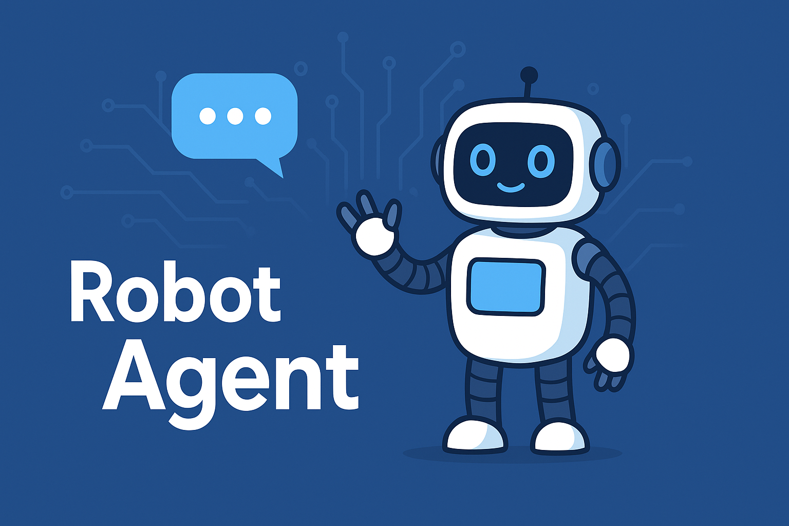
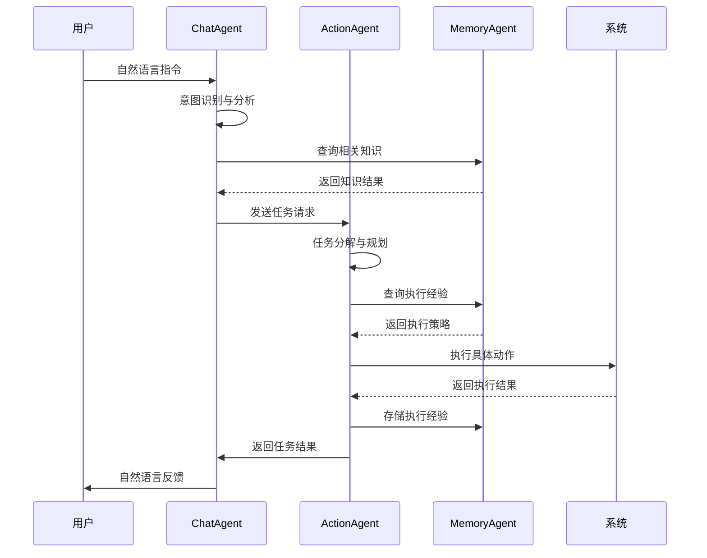

# RobotAgent - 智能机器人代理系统 (MVP开发阶段)

## ⚠️ 项目状态

**当前阶段**: MVP (最小可行产品) 开发阶段

本项目目前处于早期开发阶段，正在进行基础架构设计和核心组件的原型开发。大部分功能仍在设计和开发中。

## 项目愿景

RobotAgent是一个基于**大脑-小脑架构**和**多智能体协作**理念的机器人智能体系统，旨在解决当前机器人领域的核心挑战。本项目融合了VLM+Action工程化路径、AI-coding中间层和精确小脑控制，为机器人提供类人的智能决策和精确执行能力，具备**分层的、解耦的、可观测的**三大核心特点。

### 核心设计理念

**RobotAgent采用三层架构设计，解决了传统VLA（Vision-Language-Action）模型的工程化难题：**

- 🧠 **上层多-Agent loop**: 基于CAMEL框架的智能体协作系统，负责高层决策和任务规划
- 💻 **中间层AI-coding**: 将自然语言指令转换为可执行代码，实现灵活的动作生成
- 🎯 **下层小脑**: 精确的底层控制系统，确保动作执行的准确性和安全性

### 技术突破

**技术优势对比：**

#### 对比传统VLA（Vision-Language-Action）黑盒方案

| 对比维度 | 传统VLA黑盒 | RobotAgent |
|---------|------------|------------|
| **可观测性** | 黑盒决策，难以理解 | 分层架构，决策过程透明可观测 |
| **可校准性** | 端到端训练，难以调优 | 模块化设计，各层独立校准优化 |
| **鲁棒性** | 单点故障，容错性差 | 多智能体协作，故障隔离和恢复 |
| **调试能力** | 难以定位问题根源 | 清晰的数据流和状态追踪 |

#### 对比VLM+A（Vision-Language Model + Action）方案

| 对比维度 | VLM+A方案 | RobotAgent |
|---------|-----------|------------|
| **架构耦合** | 紧耦合，模块间依赖强 | 解耦设计，模块独立可替换 |
| **结构化程度** | 相对松散的组合 | 严格的分层结构和协议规范 |
| **通用性** | 特定场景优化 | 通用框架，跨场景适用 |
| **经验复用** | 难以跨机型和任务复用 | 标准化接口，经验知识可迁移 |
| **扩展性** | 功能扩展需要重新设计 | 插件化架构，动态功能扩展 |

## 系统架构

### 🏗️ 整体架构设计

```
┌─────────────────────────────────────────────────────────────┐
│                    RobotAgent 系统架构                        │
├─────────────────────────────────────────────────────────────┤
│  上层: 多智能体协作层 (Multi-Agent Collaboration Layer)        │
│  ┌─────────────┐  ┌─────────────┐  ┌─────────────┐          │
│  │ ChatAgent   │  │ActionAgent  │  │MemoryAgent │          │
│  │ 对话协调     │  │ 任务执行     │  │ 记忆管理    │          │
│  └─────────────┘  └─────────────┘  └─────────────┘          │
│           │              │              │                   │
│           └──────────────┼──────────────┘                   │
│                          │                                  │
├─────────────────────────────────────────────────────────────┤
│  中层: AI编程层 (AI-Coding Layer)                            │
│  ┌─────────────────────────────────────────────────────────┐ │
│  │  自然语言 → 代码生成 → 动作序列 → 执行计划              │ │
│  │  NL Instructions → Code Gen → Action Seq → Exec Plan    │ │
│  └─────────────────────────────────────────────────────────┘ │
├─────────────────────────────────────────────────────────────┤
│  下层: 小脑控制层 (Cerebellum Control Layer)                 │
│  ┌─────────────────────────────────────────────────────────┐ │
│  │  精确控制 │ 安全监控 │ 硬件接口 │ 传感器融合            │ │
│  │  Precise   │ Safety   │ Hardware │ Sensor               │ │
│  │  Control   │ Monitor  │ Interface│ Fusion               │ │
│  └─────────────────────────────────────────────────────────┘ │
└─────────────────────────────────────────────────────────────┘
```

### 🧠 三智能体协作架构

#### ChatAgent - 对话协调智能体
- **核心职责**: 自然语言理解、意图识别、对话管理
- **技术实现**: 基于CAMEL框架的多轮对话系统
- **关键功能**:
  - 多轮对话上下文管理
  - 意图识别和情感分析
  - 任务分解和智能体协调
  - 用户交互界面管理

#### ActionAgent - 任务执行智能体
- **核心职责**: 任务规划、动作生成、执行监控
- **技术实现**: 基于AI-coding的动作序列生成
- **关键功能**:
  - 复杂任务分解和建模
  - 动作序列规划和优化
  - 工具调用和集成管理
  - 执行状态监控和异常处理

#### MemoryAgent - 记忆管理智能体
- **核心职责**: 知识存储、经验积累、学习优化
- **技术实现**: 多层记忆系统和知识图谱
- **关键功能**:
  - 多层记忆存储（工作/短期/长期）
  - 向量化知识检索
  - 经验模式识别
  - 持续学习和知识更新

### 🔄 数据流设计

```
用户输入 → ChatAgent → 意图分析 → 任务分解
    ↓
MemoryAgent ← 知识检索 ← ActionAgent ← 任务规划
    ↓              ↓           ↓
经验存储 → 学习优化 → 动作执行 → 结果反馈
    ↓              ↓           ↓
知识更新 ← 性能评估 ← 状态监控 ← 用户反馈
```

### 🛠️ 核心组件详解

#### BaseRobotAgent - 智能体基类
- **文件位置**: `RobotAgent_MVP/src/agents/base_agent.py`
- **设计模式**: 抽象基类 + 模板方法模式
- **核心功能**:
  - 状态管理系统（AgentState枚举）
  - 消息处理机制（MessageType路由）
  - 工具集成框架（ToolDefinition）
  - 协作通信协议（CollaborationMode）
  - 任务执行引擎（TaskDefinition）
  - 记忆管理接口（MemoryItem）

#### 消息通信系统
- **协议定义**: `src/communication/protocols.py`
- **消息总线**: `src/communication/message_bus.py`
- **消息类型**: 支持20+种消息类型（TEXT, TASK, COLLABORATION等）
- **通信模式**: 异步消息传递 + 事件驱动架构

#### 配置管理系统
- **配置加载**: `src/utils/config_loader.py`
- **消息类型**: `config/message_types.py`
- **动态配置**: 支持运行时配置更新和热重载
- **环境适配**: 多环境配置管理（开发/测试/生产）

## 📁 项目结构

```
RobotAgent/
├── docs/                           # 项目文档
│   └── PROJECT_SUMMARY.md          # 项目总览
├── RobotAgent_MVP/                 # MVP实现
│   ├── src/
│   │   ├── agents/                 # 智能体实现
│   │   │   ├── base_agent.py       # 智能体基类
│   │   │   ├── chat_agent.py       # 对话智能体
│   │   │   ├── action_agent.py     # 任务执行智能体
│   │   │   └── memory_agent.py     # 记忆管理智能体
│   │   ├── communication/          # 通信系统
│   │   │   ├── protocols.py        # 通信协议
│   │   │   └── message_bus.py      # 消息总线
│   │   ├── memory/                 # 记忆系统
│   │   │   ├── graph_storage.py    # 图存储
│   │   │   └── knowledge_retriever.py # 知识检索
│   │   └── utils/                  # 工具模块
│   │       └── config_loader.py    # 配置加载
│   ├── config/                     # 配置文件
│   │   └── message_types.py        # 消息类型定义
│   ├── tests/                      # 测试文件
│   └── requirements.txt            # 依赖管理
└── README.md                       # 项目说明
```

## 🔄 工作流程图

### 标准协作流程



### 消息传递协议

```
┌─────────────────────────────────────────────────────────────┐
│                    消息传递协议架构                           │
├─────────────────────────────────────────────────────────────┤
│  消息类型 (MessageType)                                      │
│  ┌─────────────┬─────────────┬─────────────┬─────────────┐  │
│  │    TEXT     │    TASK     │ COLLABORATION│   STATUS    │  │
│  │   文本消息   │   任务消息   │   协作消息    │  状态消息   │  │
│  └─────────────┴─────────────┴─────────────┴─────────────┘  │
│                                                             │
│  消息优先级 (MessagePriority)                               │
│  ┌─────────────┬─────────────┬─────────────┬─────────────┐  │
│  │    LOW      │   NORMAL    │    HIGH     │  CRITICAL   │  │
│  │    低优先级  │   普通优先级 │   高优先级   │  紧急优先级  │  │
│  └─────────────┴─────────────┴─────────────┴─────────────┘  │
│                                                             │
│  协作模式 (CollaborationMode)                               │
│  ┌─────────────┬─────────────┬─────────────┬─────────────┐  │
│  │ SEQUENTIAL  │  PARALLEL   │ CONDITIONAL │  ADAPTIVE   │  │
│  │   顺序执行   │   并行执行   │   条件执行   │  自适应执行  │  │
│  └─────────────┴─────────────┴─────────────┴─────────────┘  │
└─────────────────────────────────────────────────────────────┘
```

## 🛠️ 技术实现详解

### 核心类设计

#### 1. BaseRobotAgent 抽象基类
```python
class BaseRobotAgent(ABC):
    """智能体基类，定义了所有智能体的通用接口和行为"""
    
    # 核心属性
    agent_id: str                    # 智能体唯一标识
    agent_type: str                  # 智能体类型
    state: AgentState               # 当前状态
    capabilities: List[AgentCapability]  # 智能体能力
    tools: Dict[str, ToolDefinition]     # 工具集合
    
    # 抽象方法（子类必须实现）
    @abstractmethod
    async def execute_task(self, task: TaskDefinition) -> Any
    
    @abstractmethod
    async def process_message(self, message: AgentMessage) -> AgentMessage
```

#### 2. ChatAgent 对话智能体
```python
class RobotChatAgent(BaseRobotAgent):
    """基于CAMEL框架的对话智能体"""
    
    # 专业化属性
    conversation_state: ConversationState  # 对话状态
    emotion_analyzer: EmotionAnalyzer      # 情感分析器
    intent_recognizer: IntentRecognizer    # 意图识别器
    camel_agent: ChatAgent                 # CAMEL智能体实例
```

#### 3. ActionAgent 任务执行智能体
```python
class ActionAgent(BaseRobotAgent):
    """任务执行和动作规划智能体"""
    
    # 专业化属性
    active_tasks: Dict[str, TaskTree]      # 活跃任务
    execution_engine: ExecutionEngine     # 执行引擎
    performance_monitor: PerformanceMonitor # 性能监控
    tool_mapper: ToolMapper               # 工具映射器
```

#### 4. MemoryAgent 记忆管理智能体
```python
class MemoryAgent(BaseRobotAgent):
    """多层记忆管理和知识存储智能体"""
    
    # 记忆系统
    working_memory: Dict[str, Any]         # 工作记忆
    short_term_memory: List[MemoryItem]    # 短期记忆
    long_term_memory: GraphStorage         # 长期记忆
    knowledge_retriever: KnowledgeRetriever # 知识检索器
```

### 关键协议实现

#### AgentMessage 消息协议
```python
@dataclass
class AgentMessage:
    """智能体间通信的标准消息格式"""
    
    message_id: str                    # 消息唯一标识
    sender_id: str                     # 发送者ID
    receiver_id: str                   # 接收者ID
    message_type: MessageType          # 消息类型
    content: Dict[str, Any]            # 消息内容
    priority: MessagePriority          # 消息优先级
    timestamp: datetime                # 时间戳
    correlation_id: Optional[str]      # 关联消息ID
```

#### TaskDefinition 任务定义
```python
@dataclass
class TaskDefinition:
    """任务定义和执行状态管理"""
    
    task_id: str                       # 任务唯一标识
    task_type: str                     # 任务类型
    description: str                   # 任务描述
    parameters: Dict[str, Any]         # 任务参数
    status: TaskStatus                 # 执行状态
    priority: int                      # 任务优先级
    dependencies: List[str]            # 依赖任务
    estimated_duration: float          # 预估执行时间
```

## 🚀 快速开始

### 环境要求
- **Python**: 3.8+ (推荐3.10)
- **操作系统**: Linux/macOS/Windows
- **内存**: 最低8GB，推荐16GB+
- **GPU**: NVIDIA GPU (可选，用于加速推理)

### 安装步骤

#### 1. 克隆项目
```bash
git clone https://github.com/your-org/RobotAgent.git
cd RobotAgent
```

#### 2. 创建虚拟环境
```bash
python -m venv robotagent_env
source robotagent_env/bin/activate  # Linux/macOS
# 或
robotragent_env\Scripts\activate     # Windows
```

#### 3. 安装依赖
```bash
# 安装基础依赖
pip install -r RobotAgent_MVP/requirements.txt

# 安装CAMEL框架（可选）
pip install camel-ai

# 安装开发依赖（开发者）
pip install -r RobotAgent_MVP/requirements-dev.txt
```

#### 4. 配置环境
```bash
# 复制配置模板
cp RobotAgent_MVP/config/config.example.yaml RobotAgent_MVP/config/config.yaml

# 设置环境变量
export OPENAI_API_KEY="your-openai-api-key"
export ROBOTAGENT_CONFIG_PATH="./RobotAgent_MVP/config/config.yaml"
```

#### 5. 启动MVP系统
```bash
cd RobotAgent_MVP
python -m src.main
```

### 基本使用示例

```python
import asyncio
from src.agents.chat_agent import RobotChatAgent
from src.agents.action_agent import ActionAgent
from src.agents.memory_agent import MemoryAgent

async def main():
    # 创建三智能体系统
    chat_agent = RobotChatAgent("chat_001")
    action_agent = ActionAgent("action_001")
    memory_agent = MemoryAgent("memory_001")
    
    # 启动智能体
    await chat_agent.start()
    await action_agent.start()
    await memory_agent.start()
    
    # 处理用户输入
    user_input = "请帮我分析一下今天的任务安排"
    response = await chat_agent.process_user_input(user_input)
    
    print(f"智能体回复: {response}")
    
    # 关闭智能体
    await chat_agent.stop()
    await action_agent.stop()
    await memory_agent.stop()

if __name__ == "__main__":
    asyncio.run(main())
```

## 📖 开发指南

### 核心设计原则

基于 `ppt.md` 文档定义的核心理念：

1. **可进化性 (Evolvability)**: 系统能够自我学习和改进
2. **可扩展性 (Scalability)**: 支持新智能体和功能的动态添加
3. **状态性 (Statefulness)**: 维护完整的状态信息和上下文
4. **工具集成 (Tool Integration)**: 丰富的工具生态系统

### 开发环境设置

```bash
# 安装开发工具
pip install black flake8 pytest pytest-asyncio mypy

# 安装pre-commit钩子
pre-commit install

# 运行代码检查
black src/ --check
flake8 src/
mypy src/

# 运行测试套件
pytest tests/ -v --cov=src
```

### 添加新智能体

遵循 `BaseRobotAgent` 设计模式：

```python
from src.agents.base_agent import BaseRobotAgent, AgentState, TaskDefinition

class CustomAgent(BaseRobotAgent):
    """自定义智能体实现示例"""
    
    def __init__(self, agent_id: str, config: Dict[str, Any] = None):
        super().__init__(agent_id, "custom", config)
        self._init_custom_components()
    
    async def execute_task(self, task: TaskDefinition) -> Any:
        """实现任务执行逻辑"""
        await self._set_state(AgentState.EXECUTING)
        try:
            # 自定义任务执行逻辑
            result = await self._process_custom_task(task)
            return result
        finally:
            await self._set_state(AgentState.IDLE)
    
    async def process_message(self, message: AgentMessage) -> AgentMessage:
        """实现消息处理逻辑"""
        # 自定义消息处理逻辑
        return await self._create_response(message)
```

### 消息协议扩展

```python
# 在 config/message_types.py 中添加新消息类型
class CustomMessageType(Enum):
    CUSTOM_REQUEST = "custom_request"
    CUSTOM_RESPONSE = "custom_response"

# 在 src/communication/protocols.py 中定义消息格式
@dataclass
class CustomMessage(BaseMessage):
    custom_field: str
    custom_data: Dict[str, Any]
```

## 🧪 测试指南

### 测试结构

```
tests/
├── unit/                    # 单元测试
│   ├── test_base_agent.py   # 基类测试
│   ├── test_chat_agent.py   # 对话智能体测试
│   └── test_memory_agent.py # 记忆智能体测试
├── integration/             # 集成测试
│   └── test_agent_collaboration.py
└── fixtures/                # 测试数据
    └── sample_messages.json
```

### 运行测试

```bash
# 运行所有测试
pytest tests/

# 运行特定测试文件
pytest tests/unit/test_chat_agent.py -v

# 运行带覆盖率的测试
pytest tests/ --cov=src --cov-report=html

# 运行性能测试
pytest tests/performance/ --benchmark-only
```

## 🤝 贡献指南

### 贡献流程

1. **Fork项目** 到你的GitHub账户
2. **创建功能分支**
   ```bash
   git checkout -b feature/amazing-feature
   ```
3. **遵循代码规范** 进行开发
4. **编写测试** 确保功能正确
5. **提交更改**
   ```bash
   git commit -m "feat: add amazing feature"
   ```
6. **推送分支**
   ```bash
   git push origin feature/amazing-feature
   ```
7. **创建Pull Request**

### 代码规范

- **代码风格**: 遵循PEP 8和项目特定规范
- **类型注解**: 所有公共接口必须有类型注解
- **文档字符串**: 使用Google风格的docstring
- **测试覆盖率**: 新代码测试覆盖率不低于80%
- **提交信息**: 遵循Conventional Commits规范

### 代码审查清单

- [ ] 代码遵循项目规范
- [ ] 添加了适当的测试
- [ ] 更新了相关文档
- [ ] 通过了所有CI检查
- [ ] 没有引入破坏性变更

## 📄 许可证

本项目采用 **MIT许可证** - 查看 [LICENSE](LICENSE) 文件了解详情

## 📞 联系我们

- **项目主页**: [GitHub Repository](https://github.com/your-org/RobotAgent)
- **问题反馈**: [GitHub Issues](https://github.com/your-org/RobotAgent/issues)
- **功能请求**: [GitHub Discussions](https://github.com/your-org/RobotAgent/discussions)
- **技术交流**: [Discord社区](https://discord.gg/robotagent)

## 🙏 致谢

感谢以下开源项目和社区的支持：

- **[CAMEL-AI](https://github.com/camel-ai/camel)** - 多智能体协作框架的核心基础
- **[Eigent](https://github.com/eigent-ai/eigent)** - 智能体协作模式的重要参考
- **[LangChain](https://github.com/hwchase17/langchain)** - LLM应用开发的强大工具
- **[ROS2](https://ros.org/)** - 机器人系统的标准平台

## 🔮 未来规划

### 短期目标 (3个月)
- [ ] 完善MVP三智能体协作系统
- [ ] 集成ROS2硬件控制层
- [ ] 开发Web管理界面
- [ ] 建立CI/CD流水线

### 中期目标 (6个月)
- [ ] 支持多机器人协作
- [ ] 实现视觉感知模块
- [ ] 开发移动端应用
- [ ] 建立插件生态系统

### 长期愿景 (1年+)
- [ ] 构建完整的机器人操作系统
- [ ] 支持工业级应用场景
- [ ] 建立开发者社区
- [ ] 实现商业化部署

---

**RobotAgent** - 让机器人更智能，让智能更实用 🤖✨

*基于CAMEL框架的下一代智能机器人系统*

## 当前已完成的功能

### ✅ 三智能体协作架构
- **BaseRobotAgent抽象基类**: 完整的智能体基础框架
- **ChatAgent对话智能体**: 自然语言处理
- **ActionAgent任务执行智能体**: 任务分解和执行管理
- **MemoryAgent记忆管理智能体**: 多层次记忆系统
- **消息总线系统**: 智能体间标准化通信协议

### ✅ 智能消息分析系统
- **基于提示词模板的消息分析**: 智能意图识别和情感分析
- **规则基础回退机制**: 确保系统稳定性
- **多维度分析能力**: 意图、情感、实体、主题、置信度分析
- **可配置分析模板**: 支持自定义分析提示词

### ✅ 基础配置系统
- 项目目录结构搭建
- 基础配置文件管理
- API密钥安全管理（配置文件化）
- 智能体配置和提示词模板管理

### ✅ 火山方舟Chat API集成
- 火山方舟Chat API测试工具
- 配置文件化的API密钥管理
- 多轮对话支持
- 智能助手prompt模板加载

### ✅ 开发工具和测试框架
- 配置加载器工具类
- API配置模板系统
- 安全的.gitignore配置
- 智能体测试工具和验证脚本

## 正在开发中的功能

### 🚧 CAMEL智能体系统 (设计阶段)
- Dialog Agent (对话智能体)
- Planning Agent (规划智能体) 
- Decision Agent (决策智能体)
- Perception Agent (感知智能体)
- Learning Agent (学习智能体)
- ROS2 Agent (机器人控制智能体)

### 🚧 多模态记忆系统 (设计阶段)
- 向量数据库集成 (Milvus)
- 知识图谱系统 (Neo4j)
- GraphRAG检索增强生成
- 记忆分层存储策略

### 🚧 ROS2集成 (设计阶段)
- ROS2接口模块
- 机器人控制接口
- 安全监控系统

## 当前可用的工具

### 火山方舟Chat API测试工具

位置: `RobotAgent_MVP/tests/volcengine_chat_test.py`

这是一个完整的火山方舟Chat API测试工具，支持：
- 配置文件管理API密钥
- 多轮对话
- 智能助手prompt模板
- 命令行交互界面

使用方法请参考: [火山方舟Chat API测试工具说明](RobotAgent_MVP/tests/README_volcengine_chat.md)

## 📚 文档导航

### 当前可用文档
- **[项目目录结构](PROJECT_STRUCTURE.md)** - 完整的项目文件组织说明
- **[火山方舟Chat API测试工具说明](RobotAgent_MVP/tests/README_volcengine_chat.md)** - 当前可用工具的使用指南
- **[API配置迁移总结](RobotAgent_MVP/docs/API_CONFIG_MIGRATION.md)** - API密钥配置文件化改造说明

## 当前项目结构

```
RobotAgent/
├── README.md                           # 项目说明文档 ✅
├── PROJECT_STRUCTURE.md               # 项目结构说明
├── QUICK_START.md                      # 快速开始指南 (需要更新)
├── DOCUMENTATION_INDEX.md             # 文档索引
├── .gitignore                          # Git忽略文件配置 ✅
├── docs/                               # 设计文档目录
│   ├── Image_1.png                     # 项目头图 ✅
│   ├── camel_ros2_architecture.md      # CAMEL-ROS2架构设计 (设计阶段)
│   ├── multimodal_memory_system.md     # 多模态记忆系统设计 (设计阶段)
│   ├── camel_agent_implementation.md   # CAMEL智能体设计 (设计阶段)
│   ├── system_configuration_deployment.md # 系统配置设计 (设计阶段)
│   ├── api_development_guide.md        # API接口设计 (设计阶段)
│   └── code_architecture.md            # 代码架构设计 (设计阶段)
└── RobotAgent_MVP/                     # MVP开发目录 ✅
    ├── README.md                       # MVP说明文档 ✅
    ├── requirements.txt                # Python依赖 ✅
    ├── test_prompt_based_tools.py      # 提示词工具测试脚本 ✅
    ├── config/                         # 配置文件目录 ✅
    │   ├── __init__.py
    │   ├── config_manager.py           # 配置管理器 ✅
    │   ├── message_types.py            # 消息类型定义 ✅
    │   ├── agents_config.yaml          # 智能体配置 ✅
    │   ├── system_config.yaml          # 系统配置 ✅
    │   └── prompts/                    # 提示词模板目录 ✅
    │       └── message_analysis_tool_template.json # 消息分析工具模板 ✅
    ├── src/                            # 源代码目录 ✅
    │   ├── __init__.py
    │   ├── main.py                     # 主程序入口 ✅
    │   ├── agents/                     # 智能体模块 ✅
    │   │   ├── __init__.py
    │   │   ├── base_agent.py           # 智能体基类 ✅
    │   │   ├── chat_agent.py           # 对话智能体 ✅
    │   │   ├── action_agent.py         # 任务执行智能体 ✅
    │   │   └── memory_agent.py         # 记忆管理智能体 ✅
    │   ├── communication/              # 通信模块 ✅
    │   │   ├── __init__.py
    │   │   └── message_bus.py          # 消息总线 ✅
    │   ├── memory/                     # 记忆系统 ✅
    │   │   ├── __init__.py
    │   │   └── conversation_history.py # 对话历史管理 ✅
    │   ├── output/                     # 输出模块 ✅
    │   │   ├── __init__.py
    │   │   └── response_formatter.py   # 响应格式化 ✅
    │   └── utils/                      # 工具模块 ✅
    │       ├── __init__.py
    │       └── config_loader.py        # 配置加载器 ✅
    ├── tests/                          # 测试代码目录 ✅
    │   ├── __init__.py
    │   └── volcengine_chat_test.py     # 火山方舟Chat API测试工具 ✅
    └── docs/                           # MVP文档目录 ✅
        └── API_CONFIG_MIGRATION.md     # API配置迁移说明 ✅
```

### 图例说明
- ✅ **已完成**: 功能完整，可正常使用
- **(基础)**: 基础文件结构已创建，功能待开发
- **(设计阶段)**: 设计文档，对应功能尚未实现

## 开发进度

### ✅ 已完成的组件

#### 1. 三智能体协作架构
- **BaseRobotAgent基类**: 完整的智能体抽象基类，支持状态管理、消息传递、工具集成
- **ChatAgent对话智能体**: 基于CAMEL框架的自然语言处理和对话协调
- **ActionAgent任务执行智能体**: 任务分解、规划和执行管理
- **MemoryAgent记忆管理智能体**: 多层次记忆系统和知识管理
- **MessageBus消息总线**: 智能体间标准化通信协议和消息路由

#### 2. 智能消息分析系统
- **基于提示词的分析**: 使用LLM进行智能意图识别、情感分析、实体提取
- **规则基础回退**: 确保系统稳定性的规则基础分析方法
- **多维度分析**: 意图、情感、实体、主题、置信度的综合分析
- **可配置模板**: 支持自定义分析提示词模板

#### 3. 配置管理系统
- **配置加载器**: 安全的API密钥和系统配置管理
- **配置模板系统**: 便于团队协作的配置模板
- **环境隔离**: 开发/生产环境配置分离
- **智能体配置**: 智能体行为和能力的配置化管理

#### 4. 火山方舟Chat API集成
- **API客户端**: 基于OpenAI SDK的火山方舟API调用
- **多轮对话**: 支持上下文记忆的对话系统
- **Prompt模板**: 智能助手行为配置和模板加载
- **交互界面**: 命令行对话测试工具

### 🚧 规划中的组件 (设计阶段)

#### 1. CAMEL智能体系统
- **对话智能体 (Dialog Agent)**: 自然语言理解和对话管理
- **规划智能体 (Planning Agent)**: 任务规划和路径规划
- **决策智能体 (Decision Agent)**: 智能决策和动作选择
- **感知智能体 (Perception Agent)**: 多模态感知和环境理解
- **学习智能体 (Learning Agent)**: 经验学习和知识更新
- **ROS2智能体 (ROS2 Agent)**: 机器人控制和状态管理

#### 2. 多模态记忆系统
- **LangGraph工作流引擎**: 智能记忆处理和分析工作流
- **记忆分类系统**: 智能体记忆、任务经验、领域知识三大类别
- **向量数据库 (Milvus)**: 多模态嵌入存储和语义检索
- **知识图谱 (Neo4j)**: 结构化知识表示和关系推理
- **GraphRAG**: 图增强检索生成系统
- **分层存储**: 热/温/冷/归档四层存储策略

#### 3. ROS2接口模块
- **话题通信**: 标准ROS2话题发布和订阅
- **服务调用**: ROS2服务的同步通信
- **动作执行**: 长时间任务的异步执行
- **安全监控**: 实时安全状态监控

#### 4. 通信架构
- **消息总线**: 基于Redis的智能体间通信
- **REST API**: 标准化的外部接口
- **WebSocket**: 实时数据推送
- **安全机制**: 认证、授权、监控

## 快速体验

### 智能体系统测试

1. **安装依赖**:
   ```bash
   cd RobotAgent_MVP
   pip install -r requirements.txt
   ```

2. **配置API密钥**:
   ```bash
   # 编辑 config/system_config.yaml，填入您的API密钥
   ```

3. **运行火山方舟Chat API测试工具**:
   ```bash
   python tests/volcengine_chat_test.py
   ```

### 测试功能
- **智能消息分析**: 测试基于提示词的意图识别、情感分析、实体提取
- **三智能体协作**: 验证ChatAgent、ActionAgent、MemoryAgent的协作能力
- **消息总线通信**: 测试智能体间的消息传递和路由
- **配置管理**: 验证配置加载和管理功能

## 开发计划

### 近期目标 (MVP阶段)
- [ ] 完善基础智能体框架
- [ ] 实现简单的多智能体通信
- [ ] 集成基础的记忆系统
- [ ] 添加更多API服务支持

### 中期目标
- [ ] 实现完整的CAMEL智能体系统
- [ ] 集成ROS2接口
- [ ] 开发多模态记忆系统
- [ ] 构建Web管理界面

### 长期目标
- [ ] 完整的机器人控制系统
- [ ] 分布式部署支持
- [ ] 生产环境优化
- [ ] 社区生态建设

## 贡献指南

项目目前处于早期开发阶段，欢迎各种形式的贡献：

- 🐛 **Bug报告**: 发现问题请提交Issue
- 💡 **功能建议**: 欢迎提出新的功能想法
- 📝 **文档改进**: 帮助完善项目文档
- 🔧 **代码贡献**: 提交Pull Request改进代码
- 🧪 **测试用例**: 添加测试用例提高代码质量

### 开发环境设置
```bash
# 克隆项目
git clone <repository-url>
cd RobotAgent

# 进入MVP开发目录
cd RobotAgent_MVP

# 安装依赖
pip install -r requirements.txt

# 配置开发环境
cp config/api_config.yaml.template config/api_config.yaml
```
---

> ⚠️ **重要提醒**: 本项目目前处于MVP开发阶段，大部分功能仍在开发中。
