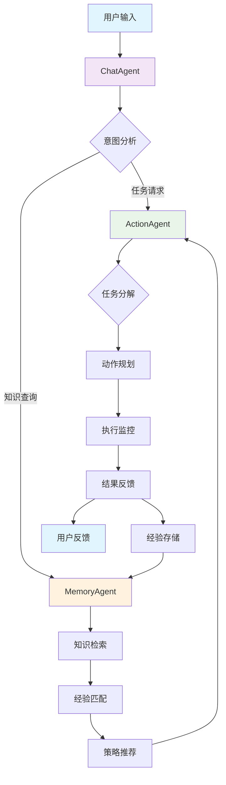
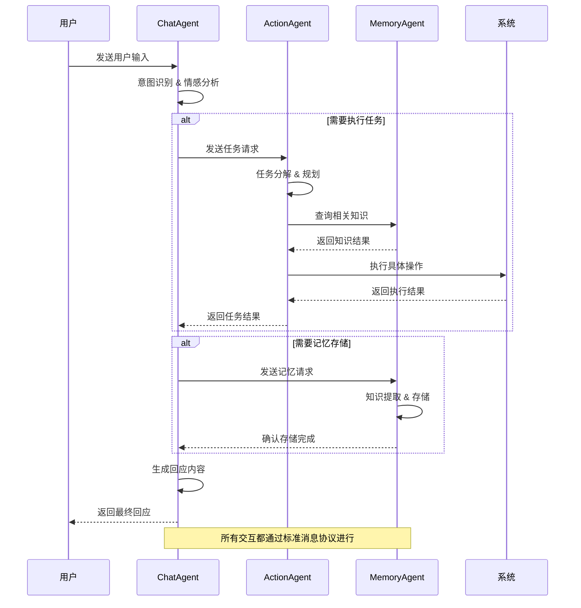
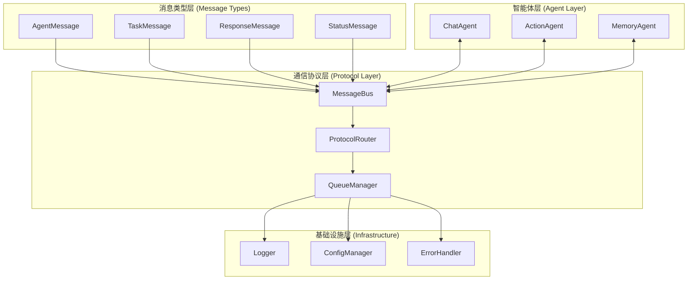

# RobotAgent MVP

**下一代智能机器人代理系统 - 最小可行产品(MVP)**

> *融合CAMEL、Eigent、OWL三大项目优势，实现真正的智能体协作机器人系统*

## 🎯 项目概述

RobotAgent MVP是基于**大脑-小脑架构**设计理念的智能机器人系统，采用**三智能体协作模式**，实现了从自然语言理解到精确动作执行的完整智能链路。

本项目采用**三智能体协作架构**，融合了CAMEL、Eigent和OWL项目的优势，构建了一个可扩展、状态化、可进化的智能体系统。系统由ChatAgent（对话协调）、ActionAgent（任务执行）、MemoryAgent（记忆管理）三个专业化智能体组成，通过标准化的消息传递机制实现高效协作。

### 🧠 核心设计理念

四大核心原则：

| 原则 | 英文 | 描述 | 实现方式 |
|------|------|------|----------|
| **可进化性** | Evolvability | 系统能够从经验中学习并自我改进 | 多层记忆系统 + 持续学习算法 |
| **可扩展性** | Scalability | 支持新智能体和功能的动态添加 | 模块化架构 + 插件机制 |
| **状态性** | Statefulness | 维护完整的状态信息和上下文 | 状态管理器 + 上下文追踪 |
| **工具集成** | Tool Integration | 丰富的工具生态系统 | 统一工具接口 + 动态加载 |

#### 🧬 可进化性 (Evolvability)
- 智能体通过与环境交互持续学习和改进
- 支持强化学习和监督学习驱动的自我优化
- 多层次记忆系统支持经验积累和知识迁移

#### 📈 可扩展性 (Scalability) 
- 异步消息传递机制支持大规模智能体协作
- 模块化设计便于功能扩展和性能优化
- 支持分布式部署和负载均衡

#### 💾 状态性 (Statefulness)
- 完整的状态管理系统跟踪智能体生命周期
- 多层次记忆架构维护上下文连续性
- 支持复杂多步骤任务的执行和恢复

#### 🔧 工具集成 (Tool Integration)
- 动态工具注册和权限管理
- 支持MCP协议和自定义工具扩展
- 工具调用链追踪和错误处理

## 系统架构

### 🏗️ 三智能体协作架构

```
┌─────────────────────────────────────────────────────────────┐
│                 RobotAgent MVP 三智能体架构                   │
├─────────────────────────────────────────────────────────────┤
│  🗣️ ChatAgent (对话协调智能体)                               │
│  ┌─────────────────────────────────────────────────────────┐ │
│  │ 🎯 核心职责: 自然语言理解 | 意图识别 | 对话管理           │ │
│  │ 🔧 技术实现: ChatAgent + 多轮对话系统              │ │
│  │ 📊 数据流向: 用户输入 → 意图分析 → 任务分解 → 智能体协调   │ │
│  └─────────────────────────────────────────────────────────┘ │
│                              ↓                               │
│  🤖 ActionAgent (任务执行智能体)                              │
│  ┌─────────────────────────────────────────────────────────┐ │
│  │ 🎯 核心职责: 任务规划 | 动作生成 | 执行监控               │ │
│  │ 🔧 技术实现: AI-Coding + 动作序列生成                    │ │
│  │ 📊 数据流向: 任务请求 → 规划分解 → 动作执行 → 状态反馈     │ │
│  └─────────────────────────────────────────────────────────┘ │
│                              ↓                               │
│  🧠 MemoryAgent (记忆管理智能体)                              │
│  ┌─────────────────────────────────────────────────────────┐ │
│  │ 🎯 核心职责: 知识存储 | 经验积累 | 学习优化               │ │
│  │ 🔧 技术实现: 多层记忆系统 + 知识图谱 + 向量检索           │ │
│  │ 📊 数据流向: 经验存储 → 知识检索 → 模式识别 → 策略优化     │ │
│  └─────────────────────────────────────────────────────────┘ │
├─────────────────────────────────────────────────────────────┤
│  🔄 消息总线 (Message Bus) - 异步通信 + 事件驱动             │
│  📡 协作协议 (Collaboration Protocol) - 标准化消息格式        │
│  ⚡ 状态同步 (State Synchronization) - 实时状态管理          │
└─────────────────────────────────────────────────────────────┘
```

### 🔄 数据流设计



## 🛠️ 核心组件详解

### BaseRobotAgent - 智能体基类

**文件位置**: `src/agents/base_agent.py`

**设计模式**: 抽象基类 + 模板方法模式 + 状态机模式

#### 核心功能架构

```python
class BaseRobotAgent(ABC):
    """智能体基类 - 定义所有智能体的通用接口和行为"""
    
    # 🏷️ 核心属性
    agent_id: str                    # 智能体唯一标识
    agent_type: str                  # 智能体类型 (chat/action/memory)
    state: AgentState               # 当前状态 (IDLE/EXECUTING/ERROR等)
    capabilities: List[AgentCapability]  # 智能体能力列表
    tools: Dict[str, ToolDefinition]     # 工具集合
    memory_items: List[MemoryItem]       # 记忆项目
    
    # 🔄 状态管理系统
    async def _set_state(self, new_state: AgentState)
    async def get_state(self) -> AgentState
    
    # 📨 消息处理机制
    async def send_message(self, message: AgentMessage)
    async def receive_message(self, message: AgentMessage)
    
    # 🛠️ 工具集成框架
    def register_tool(self, tool: ToolDefinition)
    async def execute_tool(self, tool_name: str, **kwargs)
    
    # 🤝 协作通信协议
    async def collaborate_with(self, agent_id: str, mode: CollaborationMode)
    
    # 📝 抽象方法（子类必须实现）
    @abstractmethod
    async def execute_task(self, task: TaskDefinition) -> Any
    
    @abstractmethod
    async def process_message(self, message: AgentMessage) -> AgentMessage
```

#### 状态管理系统

```python
class AgentState(Enum):
    """智能体状态枚举"""
    INITIALIZING = "initializing"    # 初始化中
    IDLE = "idle"                   # 空闲状态
    EXECUTING = "executing"         # 执行任务中
    COLLABORATING = "collaborating" # 协作中
    LEARNING = "learning"           # 学习中
    ERROR = "error"                 # 错误状态
    SHUTDOWN = "shutdown"           # 关闭状态
```

#### 工具定义系统

```python
@dataclass
class ToolDefinition:
    """工具定义数据结构"""
    name: str                       # 工具名称
    description: str                # 工具描述
    parameters: Dict[str, Any]      # 参数定义
    return_type: Type               # 返回类型
    category: str                   # 工具分类
    version: str                    # 版本信息
    dependencies: List[str]         # 依赖项
```

### ChatAgent - 对话协调智能体

**文件位置**: `src/agents/chat_agent.py`

**继承关系**: `RobotChatAgent(BaseRobotAgent)`

#### 核心架构设计

```python
class RobotChatAgent(BaseRobotAgent):
    """基于CAMEL框架的对话智能体"""
    
    # 🧠 专业化组件
    conversation_state: ConversationState  # 对话状态管理
    emotion_analyzer: EmotionAnalyzer      # 情感分析器
    intent_recognizer: IntentRecognizer    # 意图识别器
    camel_agent: ChatAgent                 # CAMEL智能体实例
    
    # 📊 对话上下文
    conversation_history: List[ConversationTurn]  # 对话历史
    current_context: ConversationContext          # 当前上下文
    user_profile: UserProfile                     # 用户画像
```

#### 对话状态管理

```python
class ConversationState(Enum):
    """对话状态枚举"""
    GREETING = "greeting"           # 问候阶段
    LISTENING = "listening"         # 倾听阶段
    UNDERSTANDING = "understanding" # 理解阶段
    RESPONDING = "responding"       # 回应阶段
    COORDINATING = "coordinating"   # 协调阶段
    CLOSING = "closing"             # 结束阶段

class EmotionType(Enum):
    """情感类型枚举"""
    NEUTRAL = "neutral"             # 中性
    POSITIVE = "positive"           # 积极
    NEGATIVE = "negative"           # 消极
    CONFUSED = "confused"           # 困惑
    EXCITED = "excited"             # 兴奋
    FRUSTRATED = "frustrated"       # 沮丧
```

#### 核心处理流程

```python
async def process_user_input(self, user_input: str) -> str:
    """处理用户输入的完整流程"""
    
    # 1. 预处理和清理
    cleaned_input = await self._preprocess_input(user_input)
    
    # 2. 意图识别
    intent = await self._recognize_intent(cleaned_input)
    
    # 3. 情感分析
    emotion = await self._analyze_emotion(cleaned_input)
    
    # 4. 上下文更新
    await self._update_context(cleaned_input, intent, emotion)
    
    # 5. 智能体协调
    if intent.requires_action:
        await self._coordinate_with_action_agent(intent)
    
    if intent.requires_memory:
        await self._coordinate_with_memory_agent(intent)
    
    # 6. 生成回应
    response = await self._generate_response(intent, emotion)
    
    # 7. 后处理
    return await self._postprocess_response(response)
```

### ActionAgent - 任务执行智能体

**文件位置**: `src/agents/action_agent.py`

**继承关系**: `ActionAgent(BaseRobotAgent)`

#### 核心架构设计

```python
class ActionAgent(BaseRobotAgent):
    """任务执行和动作规划智能体"""
    
    # 🎯 任务管理系统
    active_tasks: Dict[str, TaskTree]      # 活跃任务树
    task_history: List[TaskExecution]      # 任务执行历史
    execution_state: ExecutionState        # 执行状态
    
    # ⚡ 执行引擎
    execution_engine: ExecutionEngine     # 任务执行引擎
    performance_monitor: PerformanceMonitor # 性能监控器
    tool_mapper: ToolMapper               # 工具映射器
    
    # 📈 性能统计
    execution_stats: ExecutionStatistics  # 执行统计信息
```

#### 任务类型系统

```python
class TaskType(Enum):
    """任务类型枚举"""
    SIMPLE = "simple"               # 简单任务
    COMPLEX = "complex"             # 复杂任务
    SEQUENTIAL = "sequential"       # 顺序任务
    PARALLEL = "parallel"           # 并行任务
    CONDITIONAL = "conditional"     # 条件任务
    LOOP = "loop"                   # 循环任务

class ExecutionStatus(Enum):
    """执行状态枚举"""
    PENDING = "pending"             # 待执行
    RUNNING = "running"             # 执行中
    PAUSED = "paused"               # 暂停
    COMPLETED = "completed"         # 已完成
    FAILED = "failed"               # 执行失败
    CANCELLED = "cancelled"         # 已取消
```

#### 任务分解与执行

```python
@dataclass
class TaskTree:
    """任务树数据结构"""
    root_task: TaskDefinition       # 根任务
    sub_tasks: List['TaskTree']     # 子任务列表
    dependencies: List[str]         # 依赖关系
    execution_plan: ExecutionPlan   # 执行计划
    
@dataclass
class ExecutionPlan:
    """执行计划数据结构"""
    steps: List[ExecutionStep]      # 执行步骤
    estimated_duration: float       # 预估执行时间
    resource_requirements: Dict[str, Any]  # 资源需求
    risk_assessment: RiskLevel      # 风险评估
```

### MemoryAgent - 记忆管理智能体

**文件位置**: `src/agents/memory_agent.py`

**继承关系**: `MemoryAgent(BaseRobotAgent)`

#### 多层记忆架构

```python
class MemoryAgent(BaseRobotAgent):
    """多层记忆管理和知识存储智能体"""
    
    # 🧠 多层记忆系统
    working_memory: Dict[str, Any]         # 工作记忆 (临时存储)
    short_term_memory: List[MemoryItem]    # 短期记忆 (会话级)
    long_term_memory: GraphStorage         # 长期记忆 (持久化)
    
    # 🔍 检索系统
    memory_index: MemoryIndex              # 记忆索引
    knowledge_graph: KnowledgeGraph        # 知识图谱
    vector_store: VectorStore              # 向量存储
    knowledge_retriever: KnowledgeRetriever # 知识检索器
    
    # 📊 统计信息
    conversation_stats: ConversationStats  # 对话统计
    learning_progress: LearningProgress    # 学习进度
```

#### 记忆类型系统

```python
class MemoryType(Enum):
    """记忆类型枚举"""
    EPISODIC = "episodic"           # 情节记忆
    SEMANTIC = "semantic"           # 语义记忆
    PROCEDURAL = "procedural"       # 程序记忆
    WORKING = "working"             # 工作记忆
    EMOTIONAL = "emotional"         # 情感记忆

class MemoryPriority(Enum):
    """记忆优先级枚举"""
    LOW = "low"                     # 低优先级
    NORMAL = "normal"               # 普通优先级
    HIGH = "high"                   # 高优先级
    CRITICAL = "critical"           # 关键优先级
```

#### 知识图谱结构

```python
@dataclass
class KnowledgeNode:
    """知识节点数据结构"""
    node_id: str                    # 节点ID
    node_type: str                  # 节点类型
    content: Dict[str, Any]         # 节点内容
    metadata: Dict[str, Any]        # 元数据
    created_at: datetime            # 创建时间
    updated_at: datetime            # 更新时间
    
@dataclass
class KnowledgeEdge:
    """知识边数据结构"""
    edge_id: str                    # 边ID
    source_node: str                # 源节点
    target_node: str                # 目标节点
    relationship: str               # 关系类型
    weight: float                   # 权重
    confidence: float               # 置信度
```

## 📁 项目结构

```
RobotAgent_MVP/
├── 📁 src/                          # 源代码目录
│   ├── 📁 agents/                    # 智能体模块
│   │   ├── 📄 __init__.py           # 模块初始化
│   │   ├── 📄 base_agent.py         # 智能体基类 ⭐
│   │   ├── 📄 chat_agent.py         # 对话智能体 🗣️
│   │   ├── 📄 action_agent.py       # 任务执行智能体 ⚡
│   │   └── 📄 memory_agent.py       # 记忆管理智能体 🧠
│   ├── 📁 communication/             # 通信协议模块
│   │   ├── 📄 __init__.py           # 模块初始化
│   │   ├── 📄 protocols.py          # 通信协议定义 📡
│   │   └── 📄 message_bus.py        # 消息总线实现
│   ├── 📁 memory/                   # 记忆系统模块
│   │   ├── 📄 __init__.py           # 模块初始化
│   │   ├── 📄 graph_storage.py      # 图存储实现 🕸️
│   │   └── 📄 knowledge_retriever.py # 知识检索器 🔍
│   └── 📁 utils/                    # 工具模块
│       ├── 📄 __init__.py           # 模块初始化
│       ├── 📄 logger.py             # 日志工具 📝
│       └── 📄 config_loader.py      # 配置加载器 ⚙️
├── 📁 config/                       # 配置文件目录
│   ├── 📄 __init__.py              # 模块初始化
│   ├── 📄 message_types.py         # 消息类型定义 📋
│   ├── 📄 agent_config.py          # 智能体配置 🎛️
│   └── 📄 system_config.py         # 系统配置 🔧
├── 📁 tests/                       # 测试目录
│   ├── 📄 test_base_agent.py       # 基类测试
│   ├── 📄 test_chat_agent.py       # 对话智能体测试
│   ├── 📄 test_action_agent.py     # 任务智能体测试
│   └── 📄 test_memory_agent.py     # 记忆智能体测试
├── 📁 examples/                    # 示例代码
│   ├── 📄 basic_usage.py           # 基础使用示例
│   └── 📄 advanced_collaboration.py # 高级协作示例
├── 📄 requirements.txt             # 依赖包列表
├── 📄 setup.py                     # 安装脚本
└── 📄 README.md                    # 项目说明文档
```

## 🔄 工作流程图

### 标准协作流程



### 消息传递协议架构



## 📡 消息通信协议

### 核心消息类型

**文件位置**: `config/message_types.py` & `src/communication/protocols.py`

#### 基础消息结构

```python
@dataclass
class BaseMessage:
    """基础消息类 - 所有消息的父类"""
    message_id: str                 # 消息唯一标识
    timestamp: datetime             # 时间戳
    sender_id: str                  # 发送者ID
    receiver_id: str                # 接收者ID
    message_type: MessageType       # 消息类型
    priority: MessagePriority       # 消息优先级
    status: MessageStatus           # 消息状态
    content: Dict[str, Any]         # 消息内容
    metadata: Dict[str, Any]        # 元数据
```

#### 智能体间通信消息

```python
@dataclass
class AgentMessage(BaseMessage):
    """智能体间通信消息"""
    intent_type: IntentType         # 意图类型
    context: Dict[str, Any]         # 上下文信息
    requires_response: bool         # 是否需要回应
    correlation_id: Optional[str]   # 关联消息ID
    
@dataclass
class TaskMessage(BaseMessage):
    """任务相关消息"""
    task_id: str                    # 任务ID
    task_type: str                  # 任务类型
    task_status: TaskStatus         # 任务状态
    task_data: Dict[str, Any]       # 任务数据
    execution_context: Dict[str, Any] # 执行上下文
```

#### 协作模式定义

```python
class CollaborationMode(Enum):
    """协作模式枚举"""
    SEQUENTIAL = "sequential"       # 顺序协作
    PARALLEL = "parallel"           # 并行协作
    PIPELINE = "pipeline"           # 流水线协作
    BROADCAST = "broadcast"         # 广播协作
    PEER_TO_PEER = "peer_to_peer"   # 点对点协作
    
class AgentRole(Enum):
    """智能体角色枚举"""
    COORDINATOR = "coordinator"     # 协调者
    EXECUTOR = "executor"           # 执行者
    ADVISOR = "advisor"             # 顾问
    OBSERVER = "observer"           # 观察者
```

### 协作请求协议

```python
@dataclass
class CollaborationRequest:
    """协作请求数据结构"""
    request_id: str                 # 请求ID
    requester_id: str               # 请求者ID
    target_agent_id: str            # 目标智能体ID
    collaboration_mode: CollaborationMode # 协作模式
    task_description: str           # 任务描述
    expected_outcome: str           # 期望结果
    deadline: Optional[datetime]    # 截止时间
    priority: MessagePriority       # 优先级
    context: Dict[str, Any]         # 上下文信息
```

### 传统架构图

```
┌─────────────────────────────────────────────────────────────┐
│                 RobotAgent MVP 三智能体系统                  │
├─────────────────────────────────────────────────────────────┤
│  用户交互层 (User Interface Layer)                          │
│  ┌─────────────┐  ┌─────────────┐  ┌─────────────┐        │
│  │ 语音输入     │  │ 文本输入     │  │ 多模态输入   │        │
│  └─────────────┘  └─────────────┘  └─────────────┘        │
├─────────────────────────────────────────────────────────────┤
│  智能体协作层 (Agent Collaboration Layer)                   │
│  ┌─────────────────────────────────────────────────────────┐│
│  │                BaseRobotAgent (抽象基类)                ││
│  │                                                         ││
│  │  ┌─────────────┐    ┌─────────────┐    ┌─────────────┐ ││
│  │  │ ChatAgent   │◄──►│ ActionAgent │◄──►│ MemoryAgent │ ││
│  │  │ 对话协调     │    │ 任务执行     │    │ 记忆管理     │ ││
│  │  │ • 意图识别   │    │ • 任务分解   │    │ • 知识存储   │ ││
│  │  │ • 上下文管理 │    │ • 动作规划   │    │ • 向量检索   │ ││
│  │  │ • 智能体调度 │    │ • 工具调用   │    │ • 知识图谱   │ ││
│  │  └─────────────┘    └─────────────┘    └─────────────┘ ││
│  │           │               │                    │       ││
│  │           └───────────────┼────────────────────┘       ││
│  │                          │                            ││
│  │                   协作消息传递                         ││
│  └─────────────────────────────────────────────────────────┘│
├─────────────────────────────────────────────────────────────┤
│  数据流处理层 (Data Flow Layer)                             │
│  ┌─────────────┐  ┌─────────────┐  ┌─────────────┐        │
│  │ 消息路由     │  │ 状态同步     │  │ 结果整合     │        │
│  └─────────────┘  └─────────────┘  └─────────────┘        │
├─────────────────────────────────────────────────────────────┤
│  工具执行层 (Tool Execution Layer)                         │
│  ┌─────────────┐  ┌─────────────┐  ┌─────────────┐        │
│  │ CAMEL工具   │  │ 外部API     │  │ 硬件接口     │        │
│  └─────────────┘  └─────────────┘  └─────────────┘        │
├─────────────────────────────────────────────────────────────┤
│  输出响应层 (Output Response Layer)                        │
│  ┌─────────────┐  ┌─────────────┐  ┌─────────────┐        │
│  │ 自然语言响应 │  │ 动作指令     │  │ 状态反馈     │        │
│  └─────────────┘  └─────────────┘  └─────────────┘        │
└─────────────────────────────────────────────────────────────┘
```

### 核心组件详解

#### 1. BaseRobotAgent (智能体基类)

**设计模式**: 抽象工厂模式 + 观察者模式 + 状态机模式

**核心功能**:
- **状态管理**: 8种智能体状态的完整生命周期管理
- **消息系统**: 10种消息类型的标准化通信协议
- **工具集成**: 动态工具注册、权限控制、调用链追踪
- **协作机制**: 4种协作模式支持多智能体协调
- **记忆系统**: 短期、长期、情节、语义四层记忆架构
- **学习能力**: 交互式学习和经验积累机制

**技术实现**:
```python
# 状态枚举
class AgentState(Enum):
    INITIALIZING = "initializing"  # 初始化中
    IDLE = "idle"                  # 空闲状态
    PROCESSING = "processing"      # 处理消息中
    EXECUTING = "executing"        # 执行任务中
    COLLABORATING = "collaborating" # 协作中
    LEARNING = "learning"          # 学习中
    ERROR = "error"                # 错误状态
    SHUTDOWN = "shutdown"          # 关闭状态

# 消息类型
class MessageType(Enum):
    TEXT = "text"                  # 文本消息
    TASK = "task"                  # 任务分配
    INSTRUCTION = "instruction"    # 指令消息
    RESPONSE = "response"          # 响应消息
    TOOL_CALL = "tool_call"        # 工具调用
    TOOL_RESULT = "tool_result"    # 工具结果
    STATUS = "status"              # 状态更新
    ERROR = "error"                # 错误报告
    HEARTBEAT = "heartbeat"        # 心跳检测
    COLLABORATION = "collaboration" # 协作请求
```

#### 2. 三智能体协作系统

**数据流设计**:

```
用户输入 → ChatAgent → ActionAgent → MemoryAgent
    ↑                ↓         ↓         ↓
    └─── 响应整合 ←── 协作消息传递 ←── 知识检索
```

### 智能体协作工作流

#### 基于消息总线的协作架构

系统采用MessageBus作为核心通信组件，实现智能体间的解耦通信：

```
┌─────────────┐    ┌─────────────────┐    ┌─────────────┐
│ ChatAgent   │◄──►│   MessageBus    │◄──►│ ActionAgent │
└─────────────┘    │                 │    └─────────────┘
                   │ • 消息路由       │           ▲
┌─────────────┐    │ • 队列管理       │           │
│ MemoryAgent │◄──►│ • 状态监控       │           │
└─────────────┘    │ • 持久化重试     │           │
                   └─────────────────┘           │
                            │                    │
                   ┌─────────────────┐           │
                   │ AgentCoordinator│───────────┘
                   │ • 协调模式管理   │
                   │ • 任务分发       │
                   │ • 结果整合       │
                   └─────────────────┘
```

#### 标准协作流程

**1. 用户输入处理流程**：
```
用户输入 → ChatAgent.process_message()
    ↓
消息分析 → 意图识别 → 情感分析 → 实体提取
    ↓
协作决策 → MessageBus.send_message()
    ↓
目标智能体接收 → 处理 → 响应
    ↓
ChatAgent接收响应 → 整合 → 生成最终回复
```

**2. 任务执行协作流程**：
```
ChatAgent → MessageBus → ActionAgent
    ↓
ActionAgent.execute_task() → 任务分解
    ↓
ActionAgent → MessageBus → MemoryAgent (查询经验)
    ↓
MemoryAgent.retrieve_memories() → 返回相关经验
    ↓
ActionAgent执行 → 结果存储 → MessageBus → MemoryAgent
    ↓
MemoryAgent.store_memory() → 更新知识库
    ↓
ActionAgent → MessageBus → ChatAgent (返回结果)
```

**3. 知识检索协作流程**：
```
ChatAgent → MessageBus → MemoryAgent
    ↓
MemoryAgent.retrieve_memories()
    ↓
向量检索 + 知识图谱查询 + 关系推理
    ↓
结果排序 → MessageBus → ChatAgent
    ↓
ChatAgent整合知识 → 生成回复
```

#### 消息传递协议

**AgentMessage数据结构**（基于config/message_types.py）：
```python
class AgentMessage:
    message_id: str = field(default_factory=lambda: str(uuid.uuid4()))
    sender_id: str
    receiver_id: str
    message_type: MessageType
    content: str
    metadata: Dict[str, Any] = field(default_factory=dict)
    timestamp: datetime = field(default_factory=datetime.now)
    priority: int = 1
    requires_response: bool = False
    correlation_id: Optional[str] = None
```

**MessageType枚举**：
```python
class MessageType(Enum):
    TEXT = "text"                  # 文本消息
    TASK = "task"                  # 任务分配
    INSTRUCTION = "instruction"    # 指令消息
    RESPONSE = "response"          # 响应消息
    TOOL_CALL = "tool_call"        # 工具调用
    TOOL_RESULT = "tool_result"    # 工具结果
    STATUS = "status"              # 状态更新
    ERROR = "error"                # 错误报告
    HEARTBEAT = "heartbeat"        # 心跳检测
    COLLABORATION = "collaboration" # 协作请求
```

**协作模式**（AgentCoordinator支持）：
```python
class CoordinationMode(Enum):
    SEQUENTIAL = "sequential"      # 顺序协作
    PARALLEL = "parallel"          # 并行协作
    PIPELINE = "pipeline"          # 流水线协作
    ADAPTIVE = "adaptive"          # 自适应协作
```

**ChatAgent (对话协调智能体)**:

**核心职责**：作为系统的对话入口和协调中心，基于CAMEL框架实现自然语言处理

**技术架构**：
- **基础框架**：继承自BaseRobotAgent，集成CAMEL ChatAgent
- **记忆集成**：集成ConversationHistory进行对话历史管理
- **消息处理**：异步消息处理循环，支持多种消息类型

**主要功能**：
- **意图识别与分析**：使用IntentType枚举(QUESTION, TASK, CHAT, CLARIFICATION, GREETING, GOODBYE)识别用户意图
- **情感分析**：EmotionType枚举(NEUTRAL, HAPPY, SAD, ANGRY, EXCITED, CONFUSED)分析用户情感
- **实体提取**：从用户输入中提取关键实体和概念
- **对话上下文管理**：ConversationContext数据结构维护多轮对话状态
- **智能体协作**：通过消息总线与ActionAgent和MemoryAgent协作
- **响应生成**：支持CAMEL响应、知识检索响应、回退响应和澄清响应

**数据流转流程**：
```
用户输入 → 消息分析 → 意图识别 → 情感分析 → 实体提取
    ↓
上下文更新 → 协作决策 → 响应生成 → 对话历史存储
    ↓
最终响应输出
```

**核心数据结构**：
```python
class ConversationState(Enum):
    GREETING = "greeting"      # 问候阶段
    ACTIVE = "active"          # 活跃对话
    WAITING = "waiting"        # 等待响应
    CLARIFYING = "clarifying"  # 澄清阶段
    ENDING = "ending"          # 结束阶段

class MessageAnalysis:
    intent: IntentType
    emotion: EmotionType
    entities: List[str]
    confidence: float
    keywords: List[str]
```
```

**ActionAgent (任务执行智能体)**:

**核心职责**：负责复杂任务的分解、规划和执行，专注于动作规划和任务分解

**技术架构**：
- **基础框架**：继承自BaseRobotAgent，集成消息总线通信
- **任务管理**：TaskTree数据结构支持层次化任务分解
- **执行引擎**：异步任务执行和状态监控

**主要功能**：
- **任务分解与建模**：TaskType枚举(SIMPLE, COMPLEX, PARALLEL, SEQUENTIAL)支持不同类型任务
- **执行状态管理**：ExecutionStatus枚举(PENDING, IN_PROGRESS, COMPLETED, FAILED, PAUSED, CANCELLED)
- **动作序列规划**：ExecutionPlan数据结构制定执行策略
- **工具调用与集成**：动态工具注册和调用管理
- **并发执行控制**：支持并行和顺序任务执行
- **异常处理与恢复**：完整的错误处理和任务恢复机制

**数据流转流程**：
```
任务接收 → 任务分析 → 任务分解 → 执行计划生成
    ↓
子任务创建 → 依赖关系分析 → 执行顺序确定
    ↓
任务执行 → 状态监控 → 结果收集 → 执行报告
```

**核心数据结构**：
```python
class SubTask:
    task_id: str
    parent_id: Optional[str]
    task_type: TaskType
    description: str
    parameters: Dict[str, Any]
    dependencies: List[str]
    status: ExecutionStatus
    priority: int
    estimated_duration: float
    actual_duration: Optional[float]
    tools_required: List[str]
    result: Optional[Any]
    error_info: Optional[str]

class TaskTree:
    root_task: SubTask
    subtasks: Dict[str, SubTask]
    execution_order: List[str]
    parallel_groups: List[List[str]]
```
```

**MemoryAgent (记忆管理智能体)**:

**核心职责**：管理系统的多层记忆和知识图谱，专注于知识存储和检索

**技术架构**：
- **基础框架**：继承自BaseRobotAgent，集成GraphStorage和KnowledgeRetriever
- **存储引擎**：GraphStorage管理知识图谱和向量存储
- **检索引擎**：KnowledgeRetriever提供多模式知识检索
- **嵌入模型**：EmbeddingModel提供向量化服务

**主要功能**：
- **多层记忆管理**：MemoryType枚举(WORKING, SHORT_TERM, LONG_TERM, EPISODIC, SEMANTIC, PROCEDURAL)
- **记忆优先级**：MemoryPriority枚举(LOW, MEDIUM, HIGH, CRITICAL)控制存储策略
- **向量化知识检索**：基于embedding模型的语义相似度检索
- **知识图谱构建**：NetworkX图结构存储实体关系网络
- **智能知识提取**：自动从文本中提取实体、关系和概念
- **记忆整合与衰减**：后台任务进行记忆优化和清理
- **多模式检索**：支持快速、联想、关系和综合检索模式

**数据流转流程**：
```
记忆存储请求 → 内容分析 → 向量嵌入生成 → 记忆层分配
    ↓
知识图谱更新 → 实体关系提取 → 索引构建
    ↓
记忆检索请求 → 查询向量生成 → 相似度计算 → 结果排序
    ↓
知识图谱查询 → 关系推理 → 结果整合 → 返回记忆
```

**记忆层次结构**：
- **工作记忆**：当前会话临时信息（容量：工作记忆容量配置）
- **短期记忆**：近期交互历史（保留：短期记忆保留时间配置）
- **长期记忆**：重要经验和知识（永久存储，定期整合）
- **情节记忆**：特定事件和经历的完整记录
- **语义记忆**：抽象概念和知识的结构化存储
- **程序记忆**：技能和操作程序的存储

**核心数据结构**：
```python
class MemoryItem:
    memory_id: str
    content: str
    memory_type: MemoryType
    priority: MemoryPriority
    timestamp: datetime
    embedding: Optional[np.ndarray]
    metadata: Dict[str, Any]
    access_count: int
    last_accessed: datetime
    related_entities: List[str]
    tags: List[str]

class RetrievalMode(Enum):
    QUICK = "quick"              # 快速检索
    ASSOCIATIVE = "associative"  # 联想检索
    RELATIONAL = "relational"    # 关系检索
    COMPREHENSIVE = "comprehensive"  # 综合检索
```
```

## 项目结构

```
RobotAgent_MVP/
├── src/
│   ├── agents/                    # 智能体模块
│   │   ├── __init__.py
│   │   ├── base_agent.py          # 智能体基类 (已完成)
│   │   ├── chat_agent.py          # 对话智能体 (已完成)
│   │   ├── action_agent.py        # 动作智能体 (已完成)
│   │   ├── memory_agent.py        # 记忆智能体 (已完成)
│   │   └── agent_coordinator.py   # 智能体协调器 (已完成)
│   ├── communication/             # 通信模块
│   │   ├── __init__.py
│   │   ├── protocols.py           # 通信协议 (已完成)
│   │   └── message_bus.py         # 消息总线 (已完成)
│   ├── memory/                    # 记忆模块
│   │   ├── __init__.py
│   │   ├── simple_memory.py       # 简单记忆系统 (已完成)
│   │   ├── conversation_history.py # 对话历史 (已完成)
│   │   ├── graph_storage.py       # 知识图谱存储 (已完成)
│   │   └── embedding_model.py     # 向量嵌入模型 (已完成)
│   ├── output/                    # 输出模块
│   │   ├── __init__.py
│   │   ├── tts_handler.py         # 语音合成处理 (已完成)
│   │   └── action_file_generator.py # 动作文件生成 (已完成)
│   ├── utils/                     # 工具模块
│   │   ├── __init__.py
│   │   ├── config_loader.py       # 配置加载 (已完成)
│   │   ├── logger.py              # 日志系统 (已完成)
│   │   ├── config.py              # 配置管理 (已完成)
│   │   └── message_types.py       # 消息类型定义 (已完成)
│   └── main.py                    # 主程序入口 (基础框架)
├── config/                        # 配置文件
│   ├── agents_config.yaml         # 智能体配置
│   ├── system_config.yaml         # 系统配置
│   ├── chat_agent_prompt_template.json # 对话模板
│   └── api_config.yaml.template   # API配置模板
├── tests/                         # 测试代码
│   ├── __init__.py
│   ├── test_agents.py             # 智能体测试
│   ├── test_communication.py      # 通信测试
│   └── volcengine_chat_test.py    # 火山引擎测试
├── requirements.txt               # 依赖包
├── demo.py                        # 演示程序
└── README.md                      # 说明文档
```

## 技术实现细节

### 1. 异步消息处理机制

```python
# 消息处理流程
async def _message_processing_loop(self):
    """异步消息处理循环"""
    while self._running:
        try:
            if self._message_queue:
                message = self._message_queue.popleft()
                await self._process_message(message)
            else:
                await asyncio.sleep(0.01)  # 避免CPU占用过高
        except Exception as e:
            self.logger.error(f"消息处理错误: {e}")
            await self._set_state(AgentState.ERROR)
```

### 2. 工具集成架构

```python
# 工具定义数据结构
@dataclass
class ToolDefinition:
    name: str                          # 工具名称
    description: str                   # 工具描述
    function: Callable                 # 工具函数
    parameters_schema: Dict[str, Any]  # 参数模式
    return_schema: Dict[str, Any]      # 返回模式
    enabled: bool = True               # 是否启用
    permissions: List[str] = field(default_factory=list)  # 权限列表
    category: str = "general"          # 工具分类
```

### 3. 多层记忆系统

```python
# 记忆系统架构
class MemorySystem:
    def __init__(self):
        self._short_term_memory = deque(maxlen=100)    # 短期记忆
        self._long_term_memory = {}                    # 长期记忆
        self._episodic_memory = []                     # 情节记忆
        self._semantic_memory = {}                     # 语义记忆
        self._conversation_memory = {}                 # 对话记忆
```

### 4. 知识存储与检索系统

```python
# 知识图谱存储架构
class GraphStorage:
    def __init__(self, storage_path: str):
        self.entities = {}              # 实体存储
        self.relationships = {}         # 关系存储
        self.vector_stores = {}         # 向量存储
        self.embedding_model = embedding_model  # 嵌入模型
    
    def add_entity(self, entity_data: Dict) -> str:
        """添加实体并生成向量嵌入"""
        entity_vector = self.embedding_model.encode(entity_data['text'])
        entity_id = self._generate_entity_id(entity_data)
        self.entities[entity_id] = {
            'data': entity_data,
            'vector': entity_vector,
            'timestamp': datetime.now()
        }
        return entity_id
    
    def search_similar_entities(self, query: str, top_k: int = 5) -> List[Tuple[str, float]]:
        """基于语义相似度搜索实体"""
        query_vector = self.embedding_model.encode(query)
        similarities = []
        
        for entity_id, entity_info in self.entities.items():
            similarity = self._cosine_similarity(query_vector, entity_info['vector'])
            similarities.append((entity_id, similarity))
        
        return sorted(similarities, key=lambda x: x[1], reverse=True)[:top_k]

# 向量存储实现
class VectorStore:
    def __init__(self):
        self.vectors = {}               # 向量数据
        self.metadata = {}              # 元数据
    
    def add_vector(self, doc_id: str, vector: np.ndarray, metadata: Dict):
        """添加向量和元数据"""
        self.vectors[doc_id] = vector
        self.metadata[doc_id] = metadata
    
    def similarity_search(self, query_vector: np.ndarray, top_k: int = 5) -> List[Tuple[str, float]]:
        """执行相似性搜索"""
        similarities = []
        for doc_id, vector in self.vectors.items():
            similarity = np.dot(query_vector, vector) / (np.linalg.norm(query_vector) * np.linalg.norm(vector))
            similarities.append((doc_id, float(similarity)))
        
        return sorted(similarities, key=lambda x: x[1], reverse=True)[:top_k]
```

### 5. 智能知识提取

```python
# 知识提取实现
class KnowledgeExtractor:
    def _extract_entities_advanced(self, text: str) -> List[Dict]:
        """高级实体提取"""
        entities = []
        
        # 使用正则表达式提取专有名词
        proper_nouns = re.findall(r'[A-Z][a-z]+(?:\s+[A-Z][a-z]+)*', text)
        for noun in proper_nouns:
            entities.append({
                'text': noun,
                'type': 'PROPER_NOUN',
                'confidence': 0.8
            })
        
        # 提取技术术语
        tech_terms = re.findall(r'[a-zA-Z]+(?:学习|智能|系统|算法|模型|网络)', text)
        for term in tech_terms:
            entities.append({
                'text': term,
                'type': 'TECHNICAL_TERM',
                'confidence': 0.9
            })
        
        return entities
    
    def _extract_relationships_advanced(self, entities: List[Dict], text: str) -> List[Dict]:
        """高级关系提取"""
        relationships = []
        
        # 基于模式的关系提取
        for i, entity1 in enumerate(entities):
            for j, entity2 in enumerate(entities[i+1:], i+1):
                # 检查实体间的关系模式
                pattern = f"{entity1['text']}.*?{entity2['text']}"
                if re.search(pattern, text, re.IGNORECASE):
                    relationships.append({
                        'source': entity1['text'],
                        'target': entity2['text'],
                        'relation': 'RELATED_TO',
                        'confidence': 0.7
                    })
        
        return relationships
```

### 6. 协作模式实现

```python
# 协作模式枚举
class CollaborationMode(Enum):
    ROLE_PLAYING = "role_playing"      # 角色扮演模式
    PEER_TO_PEER = "peer_to_peer"      # 对等协作模式
    HIERARCHICAL = "hierarchical"      # 层次化协作模式
    SOCIETY = "society"                # 智能体社会模式
```

## 实现计划与开发步骤

### Phase 1: 三智能体核心架构实现

**Week 1-2: ActionAgent实现** ✅ 已完成
- [x] 创建ActionAgent类，继承BaseRobotAgent
- [x] 实现任务分解算法和任务树数据结构
- [x] 开发动作序列规划引擎
- [x] 集成CAMEL工具调用接口
- [x] 实现执行状态监控和异常处理

**Week 3-4: MemoryAgent实现** ✅ 已完成
- [x] 创建MemoryAgent类，继承BaseRobotAgent
- [x] 实现多层记忆存储系统（工作/短期/长期记忆）
- [x] 开发向量化知识检索引擎
- [x] 构建知识图谱存储和查询机制
- [x] 实现记忆优化和清理算法

**Week 5-6: ChatAgent协调功能增强** ✅ 已完成
- [x] 扩展ChatAgent的智能体调度功能
- [x] 实现意图识别和任务路由逻辑
- [x] 开发响应整合和生成机制
- [x] 完善情感分析和上下文管理

### Phase 2: 智能体协作系统

**Week 7-8: 消息传递协议** ✅ 已完成
- [x] 实现标准化消息格式和传递机制
- [x] 开发智能体间的异步通信系统
- [x] 构建消息路由和状态同步机制
- [x] 实现协作模式（直接/链式/并行/反馈）

**Week 9-10: 协作工作流** ✅ 已完成
- [x] 实现ChatAgent → ActionAgent任务执行流程
- [x] 开发ChatAgent → MemoryAgent知识查询流程
- [x] 构建ActionAgent ↔ MemoryAgent协作机制
- [x] 完善错误处理和恢复策略

### Phase 3: 高级功能与优化

**Week 11-12: 知识系统优化** ✅ 已完成
- [x] 修复embedding模型集成问题
- [x] 增强知识提取功能，使用专业NLP技术
- [x] 集成ChatAgent知识检索功能
- [x] 完善向量存储和相似性搜索
- [x] 创建完整的知识系统测试验证

**Week 13-14: 学习与适应**
- [ ] 实现经验学习和模式识别
- [ ] 开发个性化适应机制
- [ ] 构建知识图谱自动更新

**Week 15: 性能优化**
- [ ] 优化消息传递性能
- [ ] 改进记忆检索效率
- [ ] 调优任务执行速度

### Phase 4: 测试与部署 

**Week 16-17: 系统测试**
- [ ] 单元测试（各智能体功能）
- [ ] 集成测试（智能体协作）
- [ ] 性能测试（并发和负载）
- [ ] 用户验收测试

**Week 18: 部署准备**
- [ ] 文档完善和API文档
- [ ] 配置管理和环境部署
- [ ] 监控和日志系统
- [ ] 用户界面优化

### 关键里程碑

- **里程碑1** (Week 6): 三智能体基础功能完成 ✅
- **里程碑2** (Week 10): 智能体协作系统可用 ✅
- **里程碑2.5** (Week 12): 知识存储与检索系统完成 ✅
- **里程碑3** (Week 15): 高级功能集成完成 🚧
- **里程碑4** (Week 18): 系统部署就绪 📋

## 核心特性

### ✨ 已实现功能
- **完整的智能体基类**: 包含状态管理、消息处理、工具集成等核心功能
- **专业化智能体**: ChatAgent、ActionAgent、MemoryAgent完整实现
- **智能体协调器**: AgentCoordinator智能体协调机制
- **异步消息系统**: 支持10种消息类型的标准化通信
- **通信路由系统**: 智能体间消息路由和协调
- **动态工具注册**: 支持运行时工具添加和权限管理
- **多层记忆架构**: 短期、长期、情节、语义四层记忆系统
- **知识存储与检索系统**: 
  - 基于embedding的向量化知识存储
  - 知识图谱构建和实体关系管理
  - 智能知识提取和NLP处理
  - 语义相似度搜索和知识检索
- **对话知识集成**: ChatAgent集成知识检索功能，支持上下文增强的智能回复
- **协作机制**: 支持4种协作模式的多智能体协调
- **学习能力**: 交互式学习和经验积累机制
- **输出处理模块**: TTS语音合成、动作文件生成器
- **配置管理系统**: 动态配置加载和热更新
- **监控和日志**: 完整的系统监控和日志记录
- **测试验证系统**: 完整的知识系统集成测试，验证存储、检索和协作功能

### 🚧 开发中功能
- **主程序入口**: 系统集成和启动流程
- **演示程序**: 完整的功能演示脚本

### 🎯 规划中功能
- **多模态处理**: 语音、图像、传感器数据集成
- **知识图谱**: 结构化知识存储和推理
- **分布式部署**: 云原生架构和容器化部署
- **可视化界面**: Web界面和实时监控面板
- **插件系统**: 第三方插件和扩展支持

## 快速开始

### 环境要求

- **Python**: 3.8+
- **操作系统**: Windows 10+, macOS 10.15+, Ubuntu 18.04+
- **内存**: 最低 4GB，推荐 8GB+
- **存储**: 至少 2GB 可用空间

### 安装步骤

1. **克隆项目**
   ```bash
   git clone https://github.com/your-org/RobotAgent.git
   cd RobotAgent/RobotAgent_MVP
   ```

2. **创建虚拟环境**
   ```bash
   python -m venv venv
   
   # Windows
   venv\Scripts\activate
   
   # macOS/Linux
   source venv/bin/activate
   ```

3. **安装依赖**
   ```bash
   pip install -r requirements.txt
   ```

4. **配置API密钥**
   ```bash
   # 复制配置模板
   cp config/api_config.yaml.template config/api_config.yaml
   
   # 编辑配置文件，添加你的API密钥
   # 支持：OpenAI、火山引擎、百度文心等
   ```

5. **运行演示程序**
   ```bash
   python demo.py
   ```

### 基本使用示例

```python
import asyncio
from src.agents.chat_agent import ChatAgent
from src.agents.action_agent import ActionAgent
from src.agents.memory_agent import MemoryAgent
from src.agents.agent_coordinator import AgentCoordinator

async def main():
    # 创建智能体实例
    chat_agent = ChatAgent("chat_001")
    action_agent = ActionAgent("action_001")
    memory_agent = MemoryAgent("memory_001")
    
    # 创建协调器
    coordinator = AgentCoordinator()
    coordinator.register_agent(chat_agent)
    coordinator.register_agent(action_agent)
    coordinator.register_agent(memory_agent)
    
    # 启动系统
    await coordinator.start_all_agents()
    
    # 处理用户输入
    user_input = "帮我分析一下人工智能的发展趋势"
    response = await chat_agent.process_user_input(user_input)
    
    print(f"智能体回复: {response}")
    
    # 关闭系统
    await coordinator.stop_all_agents()

if __name__ == "__main__":
    asyncio.run(main())
```

## 开发指南

### 核心设计原则

1. **基于已有架构扩展**: 所有新功能必须基于现有的 `BaseRobotAgent` 架构
2. **CAMEL框架集成**: 融合CAMEL的四大核心原则（可进化性、可扩展性、状态性、代码即提示）
3. **异步优先**: 所有I/O操作和智能体通信使用异步模式
4. **消息驱动**: 智能体间通过标准化消息协议进行通信
5. **模块化设计**: 每个组件都应该是独立、可测试、可替换的

### 开发环境设置

1. **IDE配置**
   - 推荐使用 PyCharm 或 VS Code
   - 安装 Python 类型检查插件
   - 配置代码格式化工具（black, isort）

2. **代码规范**
   ```bash
   # 安装开发工具
   pip install black isort flake8 mypy pytest
   
   # 代码格式化
   black src/ tests/
   isort src/ tests/
   
   # 代码检查
   flake8 src/ tests/
   mypy src/
   ```

3. **Git工作流**
   ```bash
   # 创建功能分支
   git checkout -b feature/new-agent
   
   # 提交代码
   git add .
   git commit -m "feat: 添加新智能体功能"
   
   # 推送并创建PR
   git push origin feature/new-agent
   ```

### 添加新智能体

1. **创建智能体类**
   ```python
   # src/agents/custom_agent.py
   from .base_agent import BaseRobotAgent, AgentState, TaskDefinition
   
   class CustomAgent(BaseRobotAgent):
       """自定义智能体实现"""
       
       def __init__(self, agent_id: str, config: Dict[str, Any] = None):
           super().__init__(agent_id, "custom", config)
           self._init_custom_components()
       
       async def execute_task(self, task: TaskDefinition) -> Any:
           """实现任务执行逻辑"""
           # 你的实现代码
           pass
       
       async def _process_message(self, message: AgentMessage) -> Optional[AgentMessage]:
           """实现消息处理逻辑"""
           # 你的实现代码
           pass
   ```

2. **注册智能体**
   ```python
   # src/agents/__init__.py
   from .custom_agent import CustomAgent
   
   __all__ = [
       "BaseRobotAgent",
       "ChatAgent", 
       "ActionAgent",
       "MemoryAgent",
       "CustomAgent",  # 添加新智能体
       "AgentCoordinator"
   ]
   ```

3. **添加配置**
   ```yaml
   # config/agents_config.yaml
   custom_agent:
     model_name: "gpt-3.5-turbo"
     temperature: 0.7
     max_tokens: 1000
     custom_parameter: "value"
   ```

### 消息协议扩展

1. **添加新消息类型**
   ```python
   # config/message_types.py
   class MessageType(Enum):
       # 现有类型...
       CUSTOM_REQUEST = "custom_request"    # 新增自定义请求
       CUSTOM_RESPONSE = "custom_response"  # 新增自定义响应
   ```

2. **实现消息处理**
   ```python
   async def _handle_custom_message(self, message: AgentMessage) -> Optional[AgentMessage]:
       """处理自定义消息类型"""
       if message.message_type == MessageType.CUSTOM_REQUEST:
           # 处理自定义请求
           result = await self._process_custom_request(message.content)
           
           # 返回响应消息
           return AgentMessage(
               message_id=self._generate_message_id(),
               sender_id=self.agent_id,
               receiver_id=message.sender_id,
               message_type=MessageType.CUSTOM_RESPONSE,
               content=result,
               timestamp=datetime.now()
           )
       
       return None
   ```

## 测试指南

### 测试结构

```
tests/
├── __init__.py
├── test_agents.py              # 智能体单元测试
├── test_communication.py       # 通信系统测试
├── test_memory.py              # 记忆系统测试
├── test_integration.py         # 集成测试
└── volcengine_chat_test.py     # 第三方API测试
```

### 运行测试

```bash
# 运行所有测试
pytest tests/

# 运行特定测试文件
pytest tests/test_agents.py

# 运行特定测试方法
pytest tests/test_agents.py::TestChatAgent::test_message_processing

# 生成覆盖率报告
pytest --cov=src tests/

# 详细输出
pytest -v tests/
```

### 测试示例

```python
import pytest
import asyncio
from src.agents.chat_agent import ChatAgent
from src.communication.protocols import AgentMessage, MessageType

class TestChatAgent:
    @pytest.fixture
    async def chat_agent(self):
        """创建测试用的ChatAgent实例"""
        agent = ChatAgent("test_chat_agent")
        await agent.start()
        yield agent
        await agent.stop()
    
    @pytest.mark.asyncio
    async def test_user_input_processing(self, chat_agent):
        """测试用户输入处理"""
        user_input = "你好，请介绍一下自己"
        response = await chat_agent.process_user_input(user_input)
        
        assert response is not None
        assert isinstance(response, str)
        assert len(response) > 0
    
    @pytest.mark.asyncio
    async def test_message_handling(self, chat_agent):
        """测试消息处理"""
        test_message = AgentMessage(
            message_id="test_001",
            sender_id="test_sender",
            receiver_id=chat_agent.agent_id,
            message_type=MessageType.TASK_REQUEST,
            content={"task": "test_task"},
            timestamp=datetime.now()
        )
        
        response = await chat_agent._process_message(test_message)
        assert response is not None
        assert response.message_type == MessageType.TASK_RESPONSE
```

## 贡献指南

### 贡献流程

1. **Fork 项目**
   - 在 GitHub 上 fork 本项目
   - 克隆你的 fork 到本地

2. **创建分支**
   ```bash
   git checkout -b feature/your-feature-name
   ```

3. **开发和测试**
   - 遵循代码规范
   - 添加必要的测试
   - 确保所有测试通过

4. **提交代码**
   ```bash
   git add .
   git commit -m "feat: 添加新功能描述"
   ```

5. **创建 Pull Request**
   - 推送到你的 fork
   - 在 GitHub 上创建 PR
   - 详细描述你的更改

### 代码规范

- **命名规范**: 使用有意义的变量和函数名
- **注释规范**: 重要逻辑必须添加注释
- **类型提示**: 所有函数参数和返回值都要有类型提示
- **文档字符串**: 所有公共方法都要有详细的文档字符串

### 提交信息规范

```
feat: 添加新功能
fix: 修复bug
docs: 更新文档
style: 代码格式调整
refactor: 代码重构
test: 添加测试
chore: 构建过程或辅助工具的变动
```

## 更新日志

### v0.0.1 (2025-08-25)
- ✅ 完成三智能体核心架构（ChatAgent、ActionAgent、MemoryAgent）
- ✅ 实现智能体协调器和消息传递系统
- ✅ 集成知识存储与检索系统
- ✅ 添加多层记忆架构和向量化知识存储
- ✅ 完成基础测试框架和演示程序

### 未来规划

**短期目标 (1-3个月)**:
- 完善主程序入口和系统集成
- 优化性能和内存使用
- 添加更多工具集成
- 完善文档和教程

**中期目标 (3-6个月)**:
- 实现多模态处理能力
- 添加分布式部署支持
- 开发Web界面和监控面板
- 构建插件生态系统

**长期目标 (6-12个月)**:
- 实现自主学习和进化能力
- 支持大规模智能体集群
- 集成更多AI模型和服务
- 建立开发者社区和生态
