# -*- coding: utf-8 -*-

# MVP 0.2.1 系统架构设计 (MVP 0.2.1 System Architecture Design)
# 基于AgentScope框架的RobotAgent系统详细架构设计文档
# 版本: 0.2.1
# 更新时间: 2025-01-08

# RobotAgent MVP 0.2.1 系统架构设计

## 📋 架构概述

### 设计原则

1. **模块化设计**: 每个组件都具有明确的职责边界和标准接口
2. **可扩展性**: 支持插件化扩展和动态功能加载
3. **高可用性**: 具备故障恢复和状态同步能力
4. **安全性**: 多层安全防护和权限控制机制
5. **性能优化**: 异步处理和资源池化管理

### 技术栈

- **核心框架**: AgentScope 0.0.3+
- **编程语言**: Python 3.8+
- **消息系统**: AgentScope.Msg + 自定义路由
- **状态管理**: AgentScope.SessionManager + Redis
- **工具系统**: AgentScope.ToolBase + 安全沙箱
- **插件系统**: 动态加载 + 依赖注入
- **配置管理**: YAML + 环境变量
- **日志系统**: 结构化日志 + 分级输出

## 🏗️ 分层架构设计

### 架构分层图

```mermaid
graph TB
    subgraph "用户接口层 (Interface Layer)"
        CLI["命令行接口"]
        API["REST API"]
        WEB["Web界面"]
        WS["WebSocket"]
    end
    
    subgraph "业务逻辑层 (Business Logic Layer)"
        COORD["智能体协调器"]
        TASK["任务管理器"]
        WORKFLOW["工作流引擎"]
        SECURITY["安全管理器"]
    end
    
    subgraph "智能体层 (Agent Layer)"
        CHAT["ChatAgent"]
        ACTION["ActionAgent"]
        MEMORY["MemoryAgent"]
        CUSTOM["自定义智能体"]
    end
    
    subgraph "服务层 (Service Layer)"
        MSG_BUS["消息总线"]
        TOOL_MGR["工具管理器"]
        PLUGIN_MGR["插件管理器"]
        STATE_MGR["状态管理器"]
    end
    
    subgraph "AgentScope框架层 (AgentScope Framework Layer)"
        AS_AGENT["AgentBase"]
        AS_MSG["Msg System"]
        AS_TOOL["ToolBase"]
        AS_SESSION["SessionManager"]
        AS_MEMORY["Memory System"]
    end
    
    subgraph "基础设施层 (Infrastructure Layer)"
        CONFIG["配置管理"]
        LOG["日志系统"]
        MONITOR["监控系统"]
        STORAGE["存储系统"]
    end
    
    %% 连接关系
    CLI --> COORD
    API --> COORD
    WEB --> COORD
    WS --> COORD
    
    COORD --> CHAT
    COORD --> ACTION
    COORD --> MEMORY
    COORD --> CUSTOM
    
    TASK --> MSG_BUS
    WORKFLOW --> TOOL_MGR
    SECURITY --> PLUGIN_MGR
    
    CHAT --> AS_AGENT
    ACTION --> AS_TOOL
    MEMORY --> AS_MEMORY
    
    MSG_BUS --> AS_MSG
    STATE_MGR --> AS_SESSION
    
    AS_AGENT --> CONFIG
    AS_MSG --> LOG
    AS_TOOL --> MONITOR
    AS_SESSION --> STORAGE
```

## 🤖 智能体架构设计

### 智能体类层次结构

### 智能体状态机

```mermaid
stateDiagram-v2
    [*] --> Initializing
    Initializing --> Idle: 初始化完成
    Initializing --> Error: 初始化失败
    
    Idle --> Processing: 收到消息
    Processing --> Executing: 需要执行动作
    Processing --> Collaborating: 需要协作
    Processing --> Learning: 需要学习
    Processing --> Idle: 处理完成
    
    Executing --> Idle: 执行完成
    Executing --> Error: 执行失败
    
    Collaborating --> Idle: 协作完成
    Collaborating --> Error: 协作失败
    
    Learning --> Idle: 学习完成
    Learning --> Error: 学习失败
    
    Error --> Idle: 错误恢复
    Error --> Shutdown: 无法恢复
    
    Idle --> Shutdown: 收到关闭信号
    Processing --> Shutdown: 收到关闭信号
    Executing --> Shutdown: 收到关闭信号
    Collaborating --> Shutdown: 收到关闭信号
    Learning --> Shutdown: 收到关闭信号
    
    Shutdown --> [*]
```

## 💬 消息系统架构

### 消息流架构

```mermaid
sequenceDiagram
    participant User
    participant Interface
    participant Coordinator
    participant MessageBus
    participant ChatAgent
    participant ActionAgent
    participant MemoryAgent
    participant ToolSystem
    
    User->>Interface: 发送请求
    Interface->>Coordinator: 创建任务
    Coordinator->>MessageBus: 发布任务消息
    
    Note over MessageBus: 消息路由和分发
    
    MessageBus->>ChatAgent: 路由到对话智能体
    ChatAgent->>ChatAgent: 理解用户意图
    ChatAgent->>MessageBus: 发送意图分析结果
    
    MessageBus->>ActionAgent: 路由到动作智能体
    ActionAgent->>ToolSystem: 请求工具执行
    ToolSystem->>ActionAgent: 返回执行结果
    ActionAgent->>MessageBus: 发送执行状态
    
    MessageBus->>MemoryAgent: 路由到记忆智能体
    MemoryAgent->>MemoryAgent: 存储交互记录
    MemoryAgent->>MessageBus: 确认存储完成
    
    MessageBus->>Coordinator: 汇总处理结果
    Coordinator->>Interface: 返回最终响应
    Interface->>User: 显示结果
```

### 消息类型定义

## 🛠️ 工具系统架构

### 工具管理架构

```mermaid
graph TB
    subgraph "工具接口层 (Tool Interface Layer)"
        TOOL_API["工具API"]
        TOOL_CLI["工具CLI"]
        TOOL_SDK["工具SDK"]
    end
    
    subgraph "工具管理层 (Tool Management Layer)"
        TOOL_MGR["工具管理器"]
        TOOL_REG["工具注册表"]
        TOOL_DISC["工具发现"]
        TOOL_VER["版本管理"]
    end
    
    subgraph "工具执行层 (Tool Execution Layer)"
        EXEC_ENGINE["执行引擎"]
        SANDBOX["安全沙箱"]
        RESULT_PROC["结果处理器"]
        ERROR_HANDLER["错误处理器"]
    end
    
    subgraph "工具实现层 (Tool Implementation Layer)"
        FILE_TOOLS["文件工具"]
        NET_TOOLS["网络工具"]
        SYS_TOOLS["系统工具"]
        DATA_TOOLS["数据工具"]
        CUSTOM_TOOLS["自定义工具"]
    end
    
    subgraph "AgentScope工具层 (AgentScope Tool Layer)"
        AS_TOOLBASE["ToolBase"]
        AS_TOOLKIT["BaseToolkit"]
        AS_FUNC_TOOL["FunctionTool"]
    end
    
    %% 连接关系
    TOOL_API --> TOOL_MGR
    TOOL_CLI --> TOOL_MGR
    TOOL_SDK --> TOOL_MGR
    
    TOOL_MGR --> EXEC_ENGINE
    TOOL_REG --> TOOL_DISC
    TOOL_VER --> TOOL_REG
    
    EXEC_ENGINE --> SANDBOX
    SANDBOX --> RESULT_PROC
    RESULT_PROC --> ERROR_HANDLER
    
    SANDBOX --> FILE_TOOLS
    SANDBOX --> NET_TOOLS
    SANDBOX --> SYS_TOOLS
    SANDBOX --> DATA_TOOLS
    SANDBOX --> CUSTOM_TOOLS
    
    FILE_TOOLS --> AS_TOOLBASE
    NET_TOOLS --> AS_TOOLBASE
    SYS_TOOLS --> AS_TOOLKIT
    DATA_TOOLS --> AS_FUNC_TOOL
    CUSTOM_TOOLS --> AS_TOOLBASE
```

### 工具执行流程

```mermaid
flowchart TD
    START(["工具执行请求"]) --> VALIDATE["参数验证"]
    VALIDATE --> SECURITY_CHECK["安全检查"]
    SECURITY_CHECK --> PERMISSION["权限验证"]
    PERMISSION --> SANDBOX_INIT["初始化沙箱"]
    SANDBOX_INIT --> TOOL_LOAD["加载工具"]
    TOOL_LOAD --> EXECUTE["执行工具"]
    EXECUTE --> MONITOR["监控执行"]
    MONITOR --> RESULT_CHECK["结果验证"]
    RESULT_CHECK --> CLEANUP["清理资源"]
    CLEANUP --> RETURN_RESULT["返回结果"]
    
    VALIDATE -->|验证失败| ERROR_HANDLE["错误处理"]
    SECURITY_CHECK -->|安全检查失败| ERROR_HANDLE
    PERMISSION -->|权限不足| ERROR_HANDLE
    SANDBOX_INIT -->|初始化失败| ERROR_HANDLE
    TOOL_LOAD -->|加载失败| ERROR_HANDLE
    EXECUTE -->|执行异常| ERROR_HANDLE
    MONITOR -->|超时或异常| ERROR_HANDLE
    RESULT_CHECK -->|结果无效| ERROR_HANDLE
    
    ERROR_HANDLE --> LOG_ERROR["记录错误"]
    LOG_ERROR --> CLEANUP
    
    RETURN_RESULT --> END(["执行完成"])
```

## 🔌 插件系统架构

### 插件生命周期管理

```mermaid
stateDiagram-v2
    [*] --> Discovered
    Discovered --> Loading: 开始加载
    Loading --> Loaded: 加载成功
    Loading --> Failed: 加载失败
    
    Loaded --> Initializing: 开始初始化
    Initializing --> Active: 初始化成功
    Initializing --> Failed: 初始化失败
    
    Active --> Paused: 暂停插件
    Paused --> Active: 恢复插件
    
    Active --> Updating: 开始更新
    Updating --> Active: 更新成功
    Updating --> Failed: 更新失败
    
    Active --> Unloading: 开始卸载
    Paused --> Unloading: 开始卸载
    Unloading --> Unloaded: 卸载成功
    Unloading --> Failed: 卸载失败
    
    Failed --> Unloading: 强制卸载
    Unloaded --> [*]
```

### 插件依赖管理

```mermaid
graph TD
    subgraph "插件A (Plugin A)"
        PA_CORE["核心功能"]
        PA_API["API接口"]
        PA_CONFIG["配置"]
    end
    
    subgraph "插件B (Plugin B)"
        PB_CORE["核心功能"]
        PB_API["API接口"]
        PB_CONFIG["配置"]
    end
    
    subgraph "插件C (Plugin C)"
        PC_CORE["核心功能"]
        PC_API["API接口"]
        PC_CONFIG["配置"]
    end
    
    subgraph "依赖管理器 (Dependency Manager)"
        DEP_RESOLVER["依赖解析器"]
        DEP_GRAPH["依赖图"]
        DEP_CHECKER["循环依赖检查"]
        LOAD_ORDER["加载顺序计算"]
    end
    
    PA_API --> PB_CORE
    PB_API --> PC_CORE
    PC_API --> PA_CORE
    
    DEP_RESOLVER --> DEP_GRAPH
    DEP_GRAPH --> DEP_CHECKER
    DEP_CHECKER --> LOAD_ORDER
    
    PA_CONFIG --> DEP_RESOLVER
    PB_CONFIG --> DEP_RESOLVER
    PC_CONFIG --> DEP_RESOLVER
```

## 🔄 状态管理架构

### 分布式状态同步

### 状态存储架构

```mermaid
graph TB
    subgraph "状态访问层 (State Access Layer)"
        STATE_API["状态API"]
        STATE_CACHE["状态缓存"]
        STATE_SYNC["状态同步"]
    end
    
    subgraph "状态管理层 (State Management Layer)"
        STATE_MGR["状态管理器"]
        SESSION_MGR["会话管理器"]
        CONFLICT_RESOLVER["冲突解决器"]
        VERSION_CTRL["版本控制"]
    end
    
    subgraph "状态存储层 (State Storage Layer)"
        MEMORY_STORE["内存存储"]
        REDIS_STORE["Redis存储"]
        FILE_STORE["文件存储"]
        DB_STORE["数据库存储"]
    end
    
    subgraph "状态类型 (State Types)"
        AGENT_STATE["智能体状态"]
        SESSION_STATE["会话状态"]
        GLOBAL_STATE["全局状态"]
        TEMP_STATE["临时状态"]
    end
    
    %% 连接关系
    STATE_API --> STATE_MGR
    STATE_CACHE --> SESSION_MGR
    STATE_SYNC --> CONFLICT_RESOLVER
    
    STATE_MGR --> MEMORY_STORE
    SESSION_MGR --> REDIS_STORE
    CONFLICT_RESOLVER --> FILE_STORE
    VERSION_CTRL --> DB_STORE
    
    AGENT_STATE --> STATE_MGR
    SESSION_STATE --> SESSION_MGR
    GLOBAL_STATE --> CONFLICT_RESOLVER
    TEMP_STATE --> VERSION_CTRL
```

## 🔐 安全架构设计

### 多层安全防护

```mermaid
graph TB
    subgraph "接入安全层 (Access Security Layer)"
        AUTH["身份认证"]
        AUTHZ["权限授权"]
        RATE_LIMIT["速率限制"]
        INPUT_VALID["输入验证"]
    end
    
    subgraph "执行安全层 (Execution Security Layer)"
        SANDBOX["执行沙箱"]
        RESOURCE_LIMIT["资源限制"]
        CODE_SCAN["代码扫描"]
        BEHAVIOR_MONITOR["行为监控"]
    end
    
    subgraph "数据安全层 (Data Security Layer)"
        ENCRYPT["数据加密"]
        ACCESS_CTRL["访问控制"]
        AUDIT_LOG["审计日志"]
        BACKUP["数据备份"]
    end
    
    subgraph "网络安全层 (Network Security Layer)"
        FIREWALL["防火墙"]
        TLS["TLS加密"]
        INTRUSION_DETECT["入侵检测"]
        TRAFFIC_MONITOR["流量监控"]
    end
    
    %% 安全层级关系
    AUTH --> SANDBOX
    AUTHZ --> RESOURCE_LIMIT
    RATE_LIMIT --> CODE_SCAN
    INPUT_VALID --> BEHAVIOR_MONITOR
    
    SANDBOX --> ENCRYPT
    RESOURCE_LIMIT --> ACCESS_CTRL
    CODE_SCAN --> AUDIT_LOG
    BEHAVIOR_MONITOR --> BACKUP
    
    ENCRYPT --> FIREWALL
    ACCESS_CTRL --> TLS
    AUDIT_LOG --> INTRUSION_DETECT
    BACKUP --> TRAFFIC_MONITOR
```

### 权限控制模型

## 📊 监控和日志架构

### 监控系统架构

```mermaid
graph TB
    subgraph "数据收集层 (Data Collection Layer)"
        METRICS["指标收集器"]
        LOGS["日志收集器"]
        TRACES["链路追踪"]
        EVENTS["事件收集器"]
    end
    
    subgraph "数据处理层 (Data Processing Layer)"
        AGGREGATOR["数据聚合器"]
        FILTER["数据过滤器"]
        ENRICHER["数据增强器"]
        CORRELATOR["关联分析器"]
    end
    
    subgraph "存储层 (Storage Layer)"
        TIME_SERIES["时序数据库"]
        LOG_STORE["日志存储"]
        TRACE_STORE["链路存储"]
        EVENT_STORE["事件存储"]
    end
    
    subgraph "分析层 (Analysis Layer)"
        DASHBOARD["监控面板"]
        ALERTING["告警系统"]
        ANALYTICS["数据分析"]
        REPORTING["报表生成"]
    end
    
    %% 数据流向
    METRICS --> AGGREGATOR
    LOGS --> FILTER
    TRACES --> ENRICHER
    EVENTS --> CORRELATOR
    
    AGGREGATOR --> TIME_SERIES
    FILTER --> LOG_STORE
    ENRICHER --> TRACE_STORE
    CORRELATOR --> EVENT_STORE
    
    TIME_SERIES --> DASHBOARD
    LOG_STORE --> ALERTING
    TRACE_STORE --> ANALYTICS
    EVENT_STORE --> REPORTING
```

### 日志分级架构

```mermaid
flowchart TD
    subgraph "日志级别 (Log Levels)"
        DEBUG["DEBUG - 调试信息"]
        INFO["INFO - 一般信息"]
        WARN["WARN - 警告信息"]
        ERROR["ERROR - 错误信息"]
        FATAL["FATAL - 致命错误"]
    end
    
    subgraph "日志处理器 (Log Handlers)"
        CONSOLE["控制台输出"]
        FILE["文件输出"]
        REMOTE["远程日志"]
        ALERT["告警通知"]
    end
    
    subgraph "日志格式化 (Log Formatters)"
        JSON_FMT["JSON格式"]
        TEXT_FMT["文本格式"]
        STRUCT_FMT["结构化格式"]
    end
    
    DEBUG --> CONSOLE
    INFO --> FILE
    WARN --> REMOTE
    ERROR --> ALERT
    FATAL --> ALERT
    
    CONSOLE --> TEXT_FMT
    FILE --> JSON_FMT
    REMOTE --> STRUCT_FMT
    ALERT --> JSON_FMT
```

## 🚀 部署架构设计

### 容器化部署架构

```mermaid
graph TB
    subgraph "负载均衡层 (Load Balancer Layer)"
        LB["负载均衡器"]
        GATEWAY["API网关"]
    end
    
    subgraph "应用层 (Application Layer)"
        APP1["RobotAgent实例1"]
        APP2["RobotAgent实例2"]
        APP3["RobotAgent实例3"]
    end
    
    subgraph "服务层 (Service Layer)"
        REDIS["Redis集群"]
        POSTGRES["PostgreSQL"]
        ELASTICSEARCH["Elasticsearch"]
    end
    
    subgraph "监控层 (Monitoring Layer)"
        PROMETHEUS["Prometheus"]
        GRAFANA["Grafana"]
        JAEGER["Jaeger"]
    end
    
    subgraph "基础设施层 (Infrastructure Layer)"
        K8S["Kubernetes"]
        DOCKER["Docker"]
        STORAGE["持久化存储"]
    end
    
    %% 连接关系
    LB --> APP1
    LB --> APP2
    LB --> APP3
    GATEWAY --> LB
    
    APP1 --> REDIS
    APP2 --> POSTGRES
    APP3 --> ELASTICSEARCH
    
    PROMETHEUS --> APP1
    PROMETHEUS --> APP2
    PROMETHEUS --> APP3
    
    GRAFANA --> PROMETHEUS
    JAEGER --> APP1
    
    K8S --> APP1
    K8S --> APP2
    K8S --> APP3
    DOCKER --> K8S
    STORAGE --> K8S
```

### 微服务架构

```mermaid
graph TB
    subgraph "前端服务 (Frontend Services)"
        WEB_UI["Web界面服务"]
        MOBILE_API["移动端API"]
        CLI_SERVICE["CLI服务"]
    end
    
    subgraph "网关层 (Gateway Layer)"
        API_GATEWAY["API网关"]
        AUTH_SERVICE["认证服务"]
        RATE_LIMITER["限流服务"]
    end
    
    subgraph "核心服务 (Core Services)"
        AGENT_SERVICE["智能体服务"]
        TASK_SERVICE["任务服务"]
        MESSAGE_SERVICE["消息服务"]
        TOOL_SERVICE["工具服务"]
    end
    
    subgraph "支撑服务 (Supporting Services)"
        CONFIG_SERVICE["配置服务"]
        LOG_SERVICE["日志服务"]
        MONITOR_SERVICE["监控服务"]
        STORAGE_SERVICE["存储服务"]
    end
    
    subgraph "数据层 (Data Layer)"
        CACHE["缓存层"]
        DATABASE["数据库"]
        MESSAGE_QUEUE["消息队列"]
        FILE_STORAGE["文件存储"]
    end
    
    %% 服务间调用关系
    WEB_UI --> API_GATEWAY
    MOBILE_API --> API_GATEWAY
    CLI_SERVICE --> API_GATEWAY
    
    API_GATEWAY --> AUTH_SERVICE
    API_GATEWAY --> RATE_LIMITER
    API_GATEWAY --> AGENT_SERVICE
    
    AGENT_SERVICE --> TASK_SERVICE
    TASK_SERVICE --> MESSAGE_SERVICE
    MESSAGE_SERVICE --> TOOL_SERVICE
    
    AGENT_SERVICE --> CONFIG_SERVICE
    TASK_SERVICE --> LOG_SERVICE
    MESSAGE_SERVICE --> MONITOR_SERVICE
    TOOL_SERVICE --> STORAGE_SERVICE
    
    CONFIG_SERVICE --> CACHE
    LOG_SERVICE --> DATABASE
    MONITOR_SERVICE --> MESSAGE_QUEUE
    STORAGE_SERVICE --> FILE_STORAGE
```

## 📈 性能优化架构

### 缓存架构设计

```mermaid
graph TB
    subgraph "缓存层级 (Cache Hierarchy)"
        L1["L1缓存 - 进程内存"]
        L2["L2缓存 - Redis"]
        L3["L3缓存 - 分布式缓存"]
    end
    
    subgraph "缓存策略 (Cache Strategies)"
        LRU["LRU淘汰"]
        TTL["TTL过期"]
        WRITE_THROUGH["写穿透"]
        WRITE_BACK["写回"]
    end
    
    subgraph "缓存类型 (Cache Types)"
        AGENT_CACHE["智能体状态缓存"]
        SESSION_CACHE["会话缓存"]
        TOOL_CACHE["工具结果缓存"]
        CONFIG_CACHE["配置缓存"]
    end
    
    L1 --> LRU
    L2 --> TTL
    L3 --> WRITE_THROUGH
    
    AGENT_CACHE --> L1
    SESSION_CACHE --> L2
    TOOL_CACHE --> L2
    CONFIG_CACHE --> L3
```

### 异步处理架构

```mermaid
sequenceDiagram
    participant Client
    participant AsyncHandler
    participant TaskQueue
    participant Worker1
    participant Worker2
    participant ResultStore
    
    Client->>AsyncHandler: 提交异步任务
    AsyncHandler->>TaskQueue: 任务入队
    AsyncHandler->>Client: 返回任务ID
    
    TaskQueue->>Worker1: 分发任务1
    TaskQueue->>Worker2: 分发任务2
    
    Worker1->>Worker1: 处理任务1
    Worker2->>Worker2: 处理任务2
    
    Worker1->>ResultStore: 存储结果1
    Worker2->>ResultStore: 存储结果2
    
    Client->>AsyncHandler: 查询任务状态
    AsyncHandler->>ResultStore: 获取结果
    ResultStore->>AsyncHandler: 返回结果
    AsyncHandler->>Client: 返回最终结果
```

## 🔧 配置管理架构

### 配置层次结构

```mermaid
graph TB
    subgraph "配置层次 (Configuration Hierarchy)"
        DEFAULT["默认配置"]
        SYSTEM["系统配置"]
        ENV["环境配置"]
        USER["用户配置"]
        RUNTIME["运行时配置"]
    end
    
    subgraph "配置来源 (Configuration Sources)"
        FILE["配置文件"]
        ENV_VAR["环境变量"]
        CMD_LINE["命令行参数"]
        REMOTE["远程配置中心"]
        DATABASE["数据库配置"]
    end
    
    subgraph "配置管理 (Configuration Management)"
        LOADER["配置加载器"]
        VALIDATOR["配置验证器"]
        MERGER["配置合并器"]
        WATCHER["配置监听器"]
    end
    
    %% 配置优先级（从低到高）
    DEFAULT --> SYSTEM
    SYSTEM --> ENV
    ENV --> USER
    USER --> RUNTIME
    
    %% 配置来源映射
    FILE --> DEFAULT
    ENV_VAR --> ENV
    CMD_LINE --> USER
    REMOTE --> SYSTEM
    DATABASE --> RUNTIME
    
    %% 配置处理流程
    LOADER --> VALIDATOR
    VALIDATOR --> MERGER
    MERGER --> WATCHER
```

---

## 📝 总结

本架构设计文档详细描述了RobotAgent MVP 0.2.1基于AgentScope框架的系统架构。主要特点包括：

1. **模块化设计**: 清晰的分层架构和组件边界
2. **可扩展性**: 插件化和微服务架构支持
3. **高可用性**: 分布式部署和故障恢复机制
4. **安全性**: 多层安全防护和权限控制
5. **可观测性**: 完整的监控、日志和链路追踪
6. **性能优化**: 缓存、异步处理和资源池化

该架构为RobotAgent系统提供了坚实的技术基础，支持未来的功能扩展和性能优化需求。