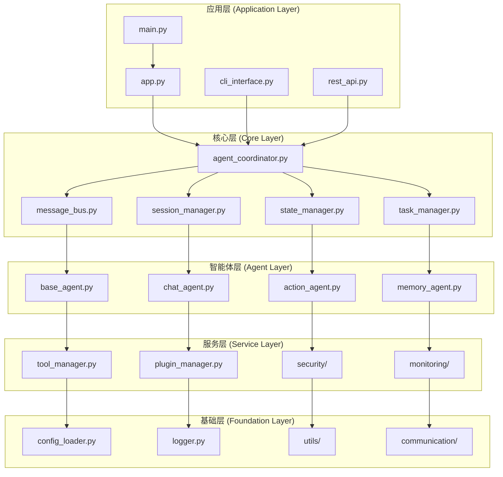
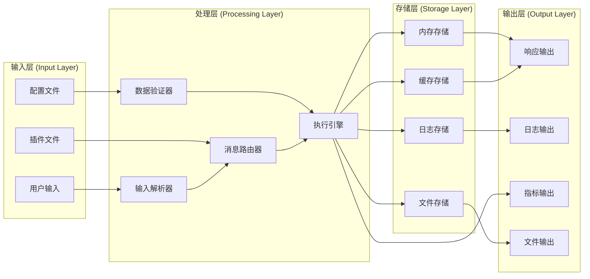

# -*- coding: utf-8 -*-

# 项目结构指南 (Project Structure Guide)
# RobotAgent MVP 0.2.1项目结构详细说明和组件关系文档
# 版本: 0.2.1
# 更新时间: 2025-01-08

# RobotAgent MVP 0.2.1 项目结构指南

## 📋 概述

本文档详细说明RobotAgent MVP 0.2.1项目的目录结构、文件组织和组件关系，帮助开发者快速理解项目架构和定位相关代码。

## 📁 根目录结构

```
RobotAgent_MVP_0.2.1/
├── README.md                    # 项目主要说明文档
├── README_MVP_0.2.1.md         # MVP 0.2.1版本特性说明
├── requirements.txt             # Python依赖包列表
├── setup.py                     # 项目安装和打包配置
├── pyproject.toml              # 现代Python项目配置
├── .env.example                 # 环境变量配置示例
├── .gitignore                   # Git版本控制忽略文件
├── .dockerignore               # Docker构建忽略文件
├── Dockerfile                   # Docker容器构建文件
├── docker-compose.yml          # Docker Compose服务编排
├── Makefile                     # 项目构建和管理脚本
└── LICENSE                      # 项目许可证文件
```

### 根目录文件说明

#### 📄 README.md
- **作用**: 项目主要说明文档，包含快速开始指南
- **内容**: 项目介绍、安装步骤、基本使用方法
- **维护**: 随项目功能更新而更新

#### 📄 requirements.txt
```txt
# AgentScope框架核心依赖
agentscope>=0.0.3

# 异步处理和并发
aiohttp>=3.8.0
aiofiles>=23.0.0
asyncio-mqtt>=0.11.0

# 数据处理和序列化
pydantic>=2.0.0
pyyaml>=6.0
jsonschema>=4.0.0

# 网络和API
requests>=2.28.0
fastapi>=0.100.0
uvicorn>=0.20.0

# 数据库和缓存
redis>=4.5.0
sqlalchemy>=2.0.0
alembic>=1.10.0

# 日志和监控
loguru>=0.7.0
prometheus-client>=0.16.0
opentelemetry-api>=1.15.0

# 安全和加密
cryptography>=40.0.0
jwt>=1.3.1
bcrypt>=4.0.0

# 开发和测试工具
pytest>=7.0.0
pytest-asyncio>=0.21.0
black>=23.0.0
flake8>=6.0.0
mypy>=1.0.0
```

#### 📄 setup.py
```python
from setuptools import setup, find_packages

setup(
    name="robotagent-mvp",
    version="0.2.1",
    description="基于AgentScope的智能机器人代理系统",
    long_description=open("README.md").read(),
    long_description_content_type="text/markdown",
    author="RobotAgent开发团队",
    author_email="dev@robotagent.com",
    url="https://github.com/your-org/RobotAgent",
    packages=find_packages(),
    python_requires=">=3.8",
    install_requires=[
        "agentscope>=0.0.3",
        "aiohttp>=3.8.0",
        "pydantic>=2.0.0",
        # ... 其他依赖
    ],
    extras_require={
        "dev": [
            "pytest>=7.0.0",
            "black>=23.0.0",
            "flake8>=6.0.0",
        ],
        "monitoring": [
            "prometheus-client>=0.16.0",
            "opentelemetry-api>=1.15.0",
        ],
    },
    classifiers=[
        "Development Status :: 4 - Beta",
        "Intended Audience :: Developers",
        "License :: OSI Approved :: MIT License",
        "Programming Language :: Python :: 3.8",
        "Programming Language :: Python :: 3.9",
        "Programming Language :: Python :: 3.10",
        "Programming Language :: Python :: 3.11",
    ],
)
```

## 📂 配置目录 (config/)

```
config/
├── __init__.py                  # 配置模块初始化
├── system_config.yaml           # 系统核心配置
├── agents_config.yaml           # 智能体配置
├── tools_config.yaml            # 工具系统配置
├── plugins_config.yaml          # 插件系统配置
├── deployment_config.yaml       # 部署环境配置
├── security_config.yaml         # 安全策略配置
├── monitoring_config.yaml       # 监控配置
└── templates/                   # 配置模板目录
    ├── development.yaml         # 开发环境模板
    ├── production.yaml          # 生产环境模板
    └── testing.yaml             # 测试环境模板
```

### 配置文件详解

#### 🔧 system_config.yaml
```yaml
# 系统核心配置
system:
  # AgentScope框架配置
  agentscope:
    model_config_path: "config/model_configs"
    logging_level: "INFO"
    max_pool_size: 10
    
  # 系统运行参数
  runtime:
    max_concurrent_tasks: 20
    task_timeout: 300
    health_check_interval: 30
    
  # 性能配置
  performance:
    enable_caching: true
    cache_ttl: 3600
    async_processing: true
    
# 数据库配置
database:
  # 主数据库
  primary:
    type: "postgresql"
    host: "localhost"
    port: 5432
    database: "robotagent"
    
  # 缓存数据库
  cache:
    type: "redis"
    host: "localhost"
    port: 6379
    database: 0
```

#### 🤖 agents_config.yaml
```yaml
# 智能体配置
agents:
  # ChatAgent配置
  chat_agent:
    model_type: "openai_chat"
    model_config:
      model: "gpt-3.5-turbo"
      temperature: 0.7
      max_tokens: 2048
    
    # 功能配置
    features:
      emotion_analysis: true
      intent_recognition: true
      context_tracking: true
      
    # 性能配置
    performance:
      response_timeout: 30
      context_window_size: 10
      
  # ActionAgent配置
  action_agent:
    model_type: "openai_chat"
    model_config:
      model: "gpt-4"
      temperature: 0.3
      max_tokens: 1024
      
    # 执行配置
    execution:
      planning_horizon: 5
      safety_check: true
      action_timeout: 60
      max_retry_attempts: 3
      
  # MemoryAgent配置
  memory_agent:
    model_type: "embedding"
    model_config:
      model: "text-embedding-ada-002"
      
    # 记忆配置
    memory:
      max_history: 1000
      similarity_threshold: 0.7
      learning_rate: 0.01
      memory_decay_factor: 0.95
```

## 📂 源代码目录 (src/)

```
src/
├── __init__.py                  # 源码模块初始化
├── main.py                      # 应用程序主入口
├── app.py                       # 应用程序工厂
├── constants.py                 # 全局常量定义
├── exceptions.py                # 自定义异常类
│
├── core/                        # 核心组件
│   ├── __init__.py
│   ├── agent_coordinator.py     # 智能体协调器
│   ├── message_bus.py           # 消息总线
│   ├── session_manager.py       # 会话管理器
│   ├── state_manager.py         # 状态管理器
│   ├── task_manager.py          # 任务管理器
│   └── lifecycle_manager.py     # 生命周期管理器
│
├── agents/                      # 智能体实现
│   ├── __init__.py
│   ├── base_agent.py            # 智能体基类
│   ├── chat_agent.py            # 对话智能体
│   ├── action_agent.py          # 动作智能体
│   ├── memory_agent.py          # 记忆智能体
│   ├── agent_factory.py         # 智能体工厂
│   └── agent_registry.py        # 智能体注册表
│
├── tools/                       # 工具系统
│   ├── __init__.py
│   ├── base_tool.py             # 工具基类
│   ├── file_tools.py            # 文件操作工具
│   ├── network_tools.py         # 网络请求工具
│   ├── system_tools.py          # 系统调用工具
│   ├── data_tools.py            # 数据处理工具
│   ├── tool_manager.py          # 工具管理器
│   ├── tool_registry.py         # 工具注册表
│   └── security/                # 工具安全模块
│       ├── __init__.py
│       ├── sandbox.py           # 安全沙箱
│       ├── validator.py         # 参数验证器
│       └── permission.py        # 权限控制
│
├── plugins/                     # 插件系统
│   ├── __init__.py
│   ├── plugin_base.py           # 插件基类
│   ├── plugin_manager.py        # 插件管理器
│   ├── plugin_registry.py       # 插件注册表
│   ├── dependency_resolver.py   # 依赖解析器
│   ├── loader.py                # 插件加载器
│   └── builtin_plugins/         # 内置插件
│       ├── __init__.py
│       ├── weather_plugin.py    # 天气查询插件
│       ├── calculator_plugin.py # 计算器插件
│       ├── text_plugin.py       # 文本处理插件
│       └── data_viz_plugin.py   # 数据可视化插件
│
├── communication/               # 通信协议
│   ├── __init__.py
│   ├── protocols.py             # 通信协议定义
│   ├── message_types.py         # 消息类型定义
│   ├── serialization.py        # 消息序列化
│   ├── routing.py               # 消息路由
│   ├── middleware.py            # 通信中间件
│   └── adapters/                # 通信适配器
│       ├── __init__.py
│       ├── agentscope_adapter.py # AgentScope适配器
│       ├── http_adapter.py      # HTTP适配器
│       └── websocket_adapter.py # WebSocket适配器
│
├── memory/                      # 记忆系统
│   ├── __init__.py
│   ├── memory_base.py           # 记忆基类
│   ├── short_term_memory.py     # 短期记忆
│   ├── long_term_memory.py      # 长期记忆
│   ├── knowledge_graph.py       # 知识图谱
│   ├── memory_indexer.py        # 记忆索引器
│   ├── retrieval_engine.py      # 检索引擎
│   └── storage/                 # 存储后端
│       ├── __init__.py
│       ├── file_storage.py      # 文件存储
│       ├── database_storage.py  # 数据库存储
│       └── vector_storage.py    # 向量存储
│
├── security/                    # 安全模块
│   ├── __init__.py
│   ├── authentication.py       # 身份认证
│   ├── authorization.py         # 权限授权
│   ├── encryption.py            # 数据加密
│   ├── audit.py                 # 审计日志
│   ├── rate_limiter.py          # 速率限制
│   └── security_context.py      # 安全上下文
│
├── monitoring/                  # 监控系统
│   ├── __init__.py
│   ├── metrics_collector.py     # 指标收集器
│   ├── health_checker.py        # 健康检查
│   ├── performance_monitor.py   # 性能监控
│   ├── alerting.py              # 告警系统
│   └── exporters/               # 指标导出器
│       ├── __init__.py
│       ├── prometheus_exporter.py # Prometheus导出器
│       └── jaeger_exporter.py   # Jaeger导出器
│
├── utils/                       # 工具函数
│   ├── __init__.py
│   ├── config_loader.py         # 配置加载器
│   ├── logger.py                # 日志工具
│   ├── validators.py            # 数据验证器
│   ├── helpers.py               # 辅助函数
│   ├── decorators.py            # 装饰器工具
│   ├── async_utils.py           # 异步工具
│   └── type_hints.py            # 类型提示
│
└── interfaces/                  # 用户接口
    ├── __init__.py
    ├── cli_interface.py         # 命令行接口
    ├── rest_api.py              # REST API接口
    ├── web_interface.py         # Web界面接口
    ├── websocket_interface.py   # WebSocket接口
    └── grpc_interface.py        # gRPC接口
```

## 🧪 测试目录 (tests/)

```
tests/
├── __init__.py                  # 测试模块初始化
├── conftest.py                  # pytest配置和fixtures
├── test_config.py               # 测试配置
│
├── unit/                        # 单元测试
│   ├── __init__.py
│   ├── test_agents/             # 智能体单元测试
│   │   ├── __init__.py
│   │   ├── test_base_agent.py
│   │   ├── test_chat_agent.py
│   │   ├── test_action_agent.py
│   │   └── test_memory_agent.py
│   ├── test_tools/              # 工具单元测试
│   │   ├── __init__.py
│   │   ├── test_file_tools.py
│   │   ├── test_network_tools.py
│   │   └── test_system_tools.py
│   ├── test_plugins/            # 插件单元测试
│   │   ├── __init__.py
│   │   ├── test_plugin_manager.py
│   │   └── test_builtin_plugins.py
│   └── test_utils/              # 工具函数测试
│       ├── __init__.py
│       ├── test_config_loader.py
│       └── test_validators.py
│
├── integration/                 # 集成测试
│   ├── __init__.py
│   ├── test_agent_coordination.py # 智能体协作测试
│   ├── test_message_flow.py     # 消息流测试
│   ├── test_tool_execution.py   # 工具执行测试
│   └── test_plugin_loading.py   # 插件加载测试
│
├── performance/                 # 性能测试
│   ├── __init__.py
│   ├── test_load.py             # 负载测试
│   ├── test_stress.py           # 压力测试
│   └── test_benchmark.py        # 基准测试
│
├── security/                    # 安全测试
│   ├── __init__.py
│   ├── test_authentication.py   # 认证测试
│   ├── test_authorization.py    # 授权测试
│   └── test_sandbox.py          # 沙箱测试
│
└── fixtures/                    # 测试数据和fixtures
    ├── __init__.py
    ├── sample_configs/          # 示例配置
    ├── mock_data/               # 模拟数据
    └── test_plugins/            # 测试插件
```

## 📚 文档目录 (docs/)

```
docs/
├── README.md                    # 文档目录说明
├── index.md                     # 文档首页
│
├── api/                         # API文档
│   ├── README.md
│   ├── agents.md                # 智能体API
│   ├── tools.md                 # 工具API
│   ├── plugins.md               # 插件API
│   ├── communication.md         # 通信API
│   └── interfaces.md            # 接口API
│
├── guides/                      # 使用指南
│   ├── README.md
│   ├── quick_start.md           # 快速开始
│   ├── installation.md          # 安装指南
│   ├── configuration.md         # 配置指南
│   ├── deployment.md            # 部署指南
│   ├── development.md           # 开发指南
│   └── troubleshooting.md       # 故障排除
│
├── tutorials/                   # 教程文档
│   ├── README.md
│   ├── basic_usage.md           # 基础使用教程
│   ├── custom_agent.md          # 自定义智能体教程
│   ├── plugin_development.md    # 插件开发教程
│   ├── tool_creation.md         # 工具创建教程
│   └── advanced_scenarios.md    # 高级场景教程
│
├── architecture/                # 架构文档
│   ├── README.md
│   ├── overview.md              # 架构概览
│   ├── design_principles.md     # 设计原则
│   ├── component_design.md      # 组件设计
│   ├── data_flow.md             # 数据流设计
│   └── security_design.md       # 安全设计
│
└── reference/                   # 参考文档
    ├── README.md
    ├── configuration_reference.md # 配置参考
    ├── api_reference.md         # API参考
    ├── plugin_reference.md      # 插件参考
    └── troubleshooting_reference.md # 故障排除参考
```

## 🎯 示例目录 (examples/)

```
examples/
├── README.md                    # 示例说明
├── basic_usage.py               # 基础使用示例
├── custom_agent.py              # 自定义智能体示例
├── plugin_development.py        # 插件开发示例
├── tool_creation.py             # 工具创建示例
│
├── scenarios/                   # 场景示例
│   ├── README.md
│   ├── file_management.py       # 文件管理场景
│   ├── data_analysis.py         # 数据分析场景
│   ├── web_automation.py        # Web自动化场景
│   └── chatbot.py               # 聊天机器人场景
│
├── integrations/                # 集成示例
│   ├── README.md
│   ├── fastapi_integration.py   # FastAPI集成
│   ├── flask_integration.py     # Flask集成
│   ├── django_integration.py    # Django集成
│   └── streamlit_integration.py # Streamlit集成
│
└── advanced/                    # 高级示例
    ├── README.md
    ├── distributed_agents.py     # 分布式智能体
    ├── custom_protocols.py       # 自定义协议
    ├── performance_optimization.py # 性能优化
    └── security_hardening.py     # 安全加固
```

## 🔧 脚本目录 (scripts/)

```
scripts/
├── README.md                    # 脚本说明
├── setup.sh                     # 环境设置脚本
├── install.sh                   # 安装脚本
├── deploy.py                    # 部署脚本
├── maintenance.py               # 维护脚本
├── backup.py                    # 备份脚本
├── migrate.py                   # 数据迁移脚本
│
├── development/                 # 开发脚本
│   ├── README.md
│   ├── format_code.sh           # 代码格式化
│   ├── run_tests.sh             # 运行测试
│   ├── generate_docs.sh         # 生成文档
│   └── check_quality.sh         # 代码质量检查
│
├── deployment/                  # 部署脚本
│   ├── README.md
│   ├── docker_build.sh          # Docker构建
│   ├── k8s_deploy.sh            # Kubernetes部署
│   ├── aws_deploy.sh            # AWS部署
│   └── gcp_deploy.sh            # GCP部署
│
└── monitoring/                  # 监控脚本
    ├── README.md
    ├── health_check.py           # 健康检查
    ├── performance_check.py      # 性能检查
    ├── log_analysis.py           # 日志分析
    └── alert_setup.py            # 告警设置
```

## 📊 数据目录 (data/)

```
data/
├── README.md                    # 数据目录说明
├── .gitkeep                     # 保持目录结构
│
├── models/                      # 模型文件
│   ├── README.md
│   ├── embeddings/              # 嵌入模型
│   ├── language_models/         # 语言模型
│   └── custom_models/           # 自定义模型
│
├── knowledge/                   # 知识库
│   ├── README.md
│   ├── domain_knowledge/        # 领域知识
│   ├── common_sense/            # 常识知识
│   └── user_knowledge/          # 用户知识
│
├── logs/                        # 日志文件
│   ├── README.md
│   ├── application/             # 应用日志
│   ├── access/                  # 访问日志
│   ├── error/                   # 错误日志
│   └── audit/                   # 审计日志
│
├── cache/                       # 缓存数据
│   ├── README.md
│   ├── agent_states/            # 智能体状态缓存
│   ├── tool_results/            # 工具结果缓存
│   └── session_data/            # 会话数据缓存
│
└── temp/                        # 临时文件
    ├── README.md
    ├── uploads/                 # 上传文件
    ├── downloads/               # 下载文件
    └── processing/              # 处理中文件
```

## 🔗 组件关系图

### 核心组件依赖关系



### 数据流关系



## 📋 开发规范

### 文件命名规范

1. **Python文件**: 使用小写字母和下划线，如 `agent_coordinator.py`
2. **类名**: 使用驼峰命名法，如 `AgentCoordinator`
3. **函数名**: 使用小写字母和下划线，如 `process_message`
4. **常量**: 使用大写字母和下划线，如 `MAX_RETRY_ATTEMPTS`
5. **配置文件**: 使用小写字母和下划线，如 `system_config.yaml`

### 目录组织原则

1. **按功能分组**: 相关功能的代码放在同一目录下
2. **分层架构**: 遵循分层架构原则，避免跨层直接调用
3. **接口分离**: 将接口定义和实现分离
4. **测试对应**: 测试代码结构与源代码结构对应
5. **文档同步**: 文档结构与代码结构保持同步

### 依赖管理原则

1. **最小依赖**: 只引入必要的依赖
2. **版本锁定**: 在生产环境中锁定依赖版本
3. **分层依赖**: 高层模块不依赖低层模块的具体实现
4. **循环避免**: 避免模块间的循环依赖
5. **接口优先**: 依赖接口而不是具体实现

## 🚀 快速导航

### 常用文件快速定位

| 功能 | 文件路径 | 说明 |
|------|----------|------|
| 应用启动 | `src/main.py` | 应用程序主入口 |
| 智能体协调 | `src/core/agent_coordinator.py` | 智能体协调器 |
| 消息处理 | `src/core/message_bus.py` | 消息总线 |
| 对话智能体 | `src/agents/chat_agent.py` | ChatAgent实现 |
| 动作智能体 | `src/agents/action_agent.py` | ActionAgent实现 |
| 记忆智能体 | `src/agents/memory_agent.py` | MemoryAgent实现 |
| 工具管理 | `src/tools/tool_manager.py` | 工具管理器 |
| 插件管理 | `src/plugins/plugin_manager.py` | 插件管理器 |
| 配置加载 | `src/utils/config_loader.py` | 配置加载器 |
| 系统配置 | `config/system_config.yaml` | 系统核心配置 |
| 智能体配置 | `config/agents_config.yaml` | 智能体配置 |
| API接口 | `src/interfaces/rest_api.py` | REST API接口 |
| CLI接口 | `src/interfaces/cli_interface.py` | 命令行接口 |

### 开发任务快速定位

| 任务类型 | 相关目录 | 说明 |
|----------|----------|------|
| 添加新智能体 | `src/agents/` | 继承BaseAgent实现 |
| 开发新工具 | `src/tools/` | 继承BaseTool实现 |
| 创建新插件 | `src/plugins/builtin_plugins/` | 继承PluginBase实现 |
| 修改配置 | `config/` | 编辑相应配置文件 |
| 添加测试 | `tests/` | 在对应目录添加测试 |
| 更新文档 | `docs/` | 在对应目录更新文档 |
| 创建示例 | `examples/` | 添加使用示例 |
| 部署脚本 | `scripts/deployment/` | 添加部署脚本 |

---

## 📝 总结

本项目结构指南详细说明了RobotAgent MVP 0.2.1的目录组织、文件作用和组件关系。通过遵循这个结构，开发者可以：

1. **快速定位**: 根据功能需求快速找到相关代码
2. **规范开发**: 按照既定规范进行开发，保持代码一致性
3. **便于维护**: 清晰的结构便于代码维护和扩展
4. **团队协作**: 统一的结构便于团队成员协作开发
5. **文档同步**: 代码结构与文档结构保持同步

该项目结构为RobotAgent系统提供了良好的组织基础，支持未来的功能扩展和团队协作开发。